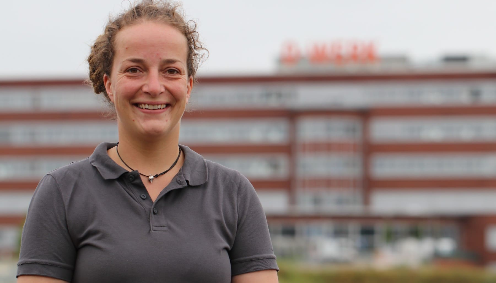

#### Anna-Lena Zinnhardt {: #anl }

=== "About Me"
	
	>"Hi, I'm Anna-Lena and you'll probably meet me most of the time in the [wood workshop](holzwerkstatt.en.md). I wanted to become a carpenter when I was a teenager, but I was a little longer in the orientation phase. I enjoy building and tinkering with all sorts of projects and look forward to helping you with your ideas. "It always seems impossible until it is accomplished" - Nelson Mandela. 

=== "Contact Us"

	- [Contact us as a team](kontakt.en.md)
	- [Personal contact information Anna-Lena Zinnhardt in RUB directory](https://einrichtungen.ruhr-uni-bochum.de/en/node/779)

=== "Background"

	- 1984-2004: baby, child, teenie, school, Abi and celebrations
	- 2004-2005: FÖJ at the Schutzstation Wattenmeer on the island of Föhr
	- 2005-2014: study, work, study, partying, study, side jobs, study, sleeping
	- 2014-2017: Apprenticeship as a carpenter at [timbercraft](https://www.timbercraft.de/en.html)
	- 2017-2020: carpenter at Gierse&Saße (http://tischlerei.nrw)
	- since 2021: Head of the wood workshop at the RUB-Makerspace
	- I am also a mother since 2018 and since then I try to balance job and family.