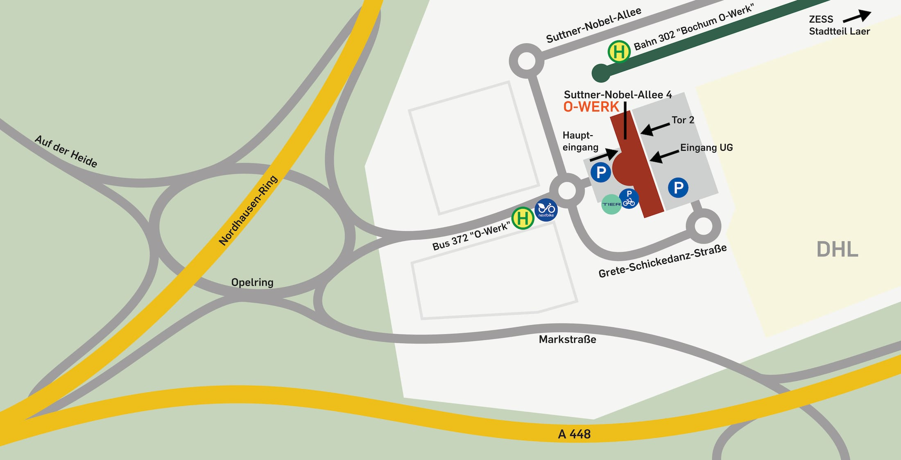

# Journey to the Makerspace

## Address for Arrival

        O-Werk, RUB-Makerspace  
        Suttner-Nobel-Allee 4  
        44803 Bochum  

!!! info "This is the correct address for navigating to your personal arrival. However, if you need an address for mailing, invoicing, or shipping deliveries, please refer to the information provided [here](#anschriften)."

## Please Ring the Bell

Please ring the bell labeled 'RUB-Makerspace' located on the pillars next to the front and back entrance doors if they are not open. These entrances are the main ones leading to the building.

## Map of the Surrounding Area

<small><a href="https://www.openstreetmap.org/#map=19/51.46539/7.25983">View larger map on openstreetmap.org</a></small>

## Arrival by Public Transport  

If you are arriving by public transport, you can take the tram or bus to stops located near our building. The O-Werk tram stop is located right next to our building, while the O-Werk bus stop is situated at the traffic circle in front of the building. The following lines serve these stops:

Tram line 302: O-Werk - BO-Hbf - Gelsenkirchen.
Bus line 372: BO-Querenburg - Laer - Langendreer West - Werne.
Call taxi (Anrufsammeltaxi) AST 72: RUB - Markstr. - O-Werk - Laer Mitte.
Please note that the call taxi must be booked at least 15 minutes before departure by calling [0234 33300333](tel:+4923433300333) and incurs an **additional charge**.

[Current departure times "O-Werk" on bahn.de](https://reiseauskunft.bahn.de/bin/bhftafel.exe/dn?ld=4329&country=DEU&protocol=https:&rt=1&input=O-Werk,%20Bochum%23375967&boardType=dep&time=actual&productsFilter=1111111111&start=yes&){ .md-button }

## Arrival by Bicycle

If you are arriving by bicycle, you can find racks to park your bike in the following locations:

- To the far right of the foyer in front of the building.
- On the right side of the building (when facing the front).
- In the parking lot behind the building, against the building wall.

!!! danger "Attention: industrial and construction traffic. Only partial bike lanes available!"

    Please be careful when cycling around the O-Werk! The traffic circle at Opelring is not entirely safe for people riding bicycles. Unfortunately, the markings of the bicycle lanes in the vicinity of the O-Werk are worn away again by the many truck traffic. The logistics center and numerous construction sites on Mark 51°7 result in a significant amount of delivery, industrial, and construction traffic, which can make cycling in the area challenging. Please plan your route accordingly and exercise caution.

## Arrival by Car

The RUB Makerspace is easily accessible for drivers, as it is located near major highways such as the A40, A43, and A44. From the A448, take the exit "Bochum-Altenbochum" to reach the Makerspace.

There are plenty of parking spaces available behind the building. While there are some parking spaces for guests in front of the building, these spaces are often occupied and some are reserved for the daycare center next door. We kindly ask that you park behind the building to ensure that there is sufficient parking for all visitors.

## Arrival as Video

To the main entrance at the front of the building: 

To the back of the building including driving through the parking lot, past the back main entrance (for guests) to Gate 2 (delivery for shipping companies): 

## Postal, Billing and Shipping Address {: #anschriften }

=== "Postal Address"

        Ruhr-Universität Bochum  
        Makerspace, O-Werk  
        Universitätsstr. 150  
        44780 Bochum

=== "Billing Address"

        Ruhr-Universität Bochum  
        Zentraler Rechnungseingang  
        Dez. 1, Makerspace, O-Werk  
        Postfach 102020  
        44720 Bochum 

=== "Address for Larger Shipping"

        Ruhr-Universität Bochum  
        Makerspace, O-Werk  
        Anlieferung - Tor 2  
        (Approach via parking lot at the rear of the building) 
        Suttner-Nobel-Allee 4  
        44803 Bochum 
