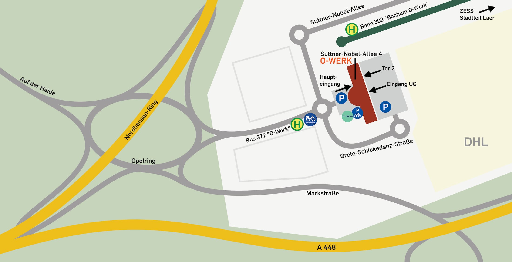
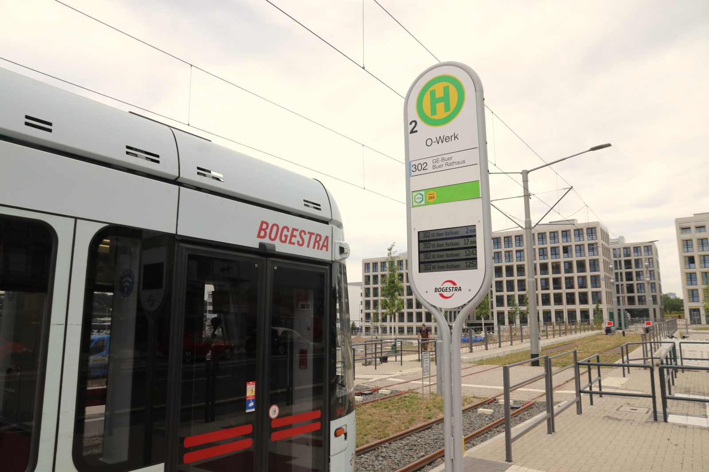

# Anreise zum Makerspace

## Anschrift für die Anreise

        RUB-Makerspace
        Suttner-Nobel-Allee 4
        44803 Bochum

!!! info "Dies ist ausschließlich die richtige Anschrift für die Navigation zur persönlichen Anreise. Für Anschriften für Post, Rechnungen und Speditionslieferungen [siehe hier](#anschriften)."   

## Bitte klingeln

An den beiden Haupteingängen vor und hinter dem Gebäude sind vor den Eingangstüren Säulen mit Klingeln. Bitte klingle bei "RUB-Makerspace", falls die Eingangstüren nicht geöffnet sind.

## Karte der Umgebung

<small><a href="https://www.openstreetmap.org/#map=19/51.46539/7.25983">Größere Karte auf openstreetmap.org anschauen</a></small>

## Anreise per ÖPNV  

Direkt neben unserem Gebäude liegt die Straßenbahn-Haltestelle *O-Werk* und am Kreisverkehr vor dem Gebäude die gleichnamige Bushaltestelle. Die Haltestellen werden von diesen Linien angefahren:

- *Straßenbahn Linie 302:* O-Werk - BO-Hbf - Gelsenkirchen.
- *Bus Linie 372:* BO-Querenburg - Laer - Langendreer West - Werne.
- *Anrufsammeltaxi AST 72*. Strecke: RUB - Markstr. - O-Werk - Laer Mitte.  
Das Anrufsammeltaxi muss mindestens 15min vor Abfahrt unter [0234 33300333](tel:+4923433300333) angemeldet werden und ist **aufpreispflichtig.**

[Aktuelle Abfahrtszeiten "O-Werk" auf bahn.de](https://reiseauskunft.bahn.de/bin/bhftafel.exe/dn?ld=4329&country=DEU&protocol=https:&rt=1&input=O-Werk,%20Bochum%23375967&boardType=dep&time=actual&productsFilter=1111111111&start=yes&){ .md-button }

## Anreise per Fahrrad

Fahrradständer befinden sich an folgenden Orten: 

- Vor dem Gebäude ganz rechts neben dem Foyer.
- Neben dem Gebäude auf der rechten Seite von vorn gesehen.
- Hinter dem Gebäude auf dem Parkplatz an der Gebäudewand.

!!! danger "Achtung: Industrie- und Baustellenverkehr. Nur teilweise Radwege vorhanden!"

    Seid bitte vorsichtig beim Radeln rund um das O-Werk! Der Kreisverkehr am Opelring ist für fahrradfahrende Menschen nicht ganz ungefährlich. Leider werden die Markierungen der Fahrradwege im Umfeld des O-Werks durch den vielen LKW-Verkehr wieder abgetragen. Überhaupt ist aufgrund des Logistikzentrums und der vielen Baustellen auf Mark 51°7 mit sehr viel Liefer-, Industrie- und Baustellenverkehr zu rechnen.

## Anreise mit dem Auto

Der RUB-Makerspace ist für Autofahrer\*innen sehr gut angebunden. Über die A40, A43 oder A44 kommst Du bequem auf die A448 und dort über die Ausfahrt "Bochum-Altenbochum" fast direkt zum Makerspace. 

Parkplätze gibt es in großer Zahl hinter dem Gebäude. Vor dem Gebäude sind zwar auch einige Gästeparkplätze - die sind aber oft belegt und ein Teil gehört der Kindertagesstätte neben uns. Daher bitte besser hinter dem Gebäude parken! Sollte die Schranke am hinteren Parkplatz geschlossen sein, zieh Dir bitte einfach ein Ticket - wir entwerten es Dir nach Deinem Aufenthalt im Makerspace gern. 

## Anreise als Video

Zum Haupteingang an der Vorderseite des Gebäudes: 

Zur Rückseite des Gebäudes inklusive Fahrt über den Parkplatz, vorbei am hinteren Haupteingang (Eingang für unsere Gäste) bis zu Tor 2 (Anlieferung für Speditionen):  

## Post-, Rechnungs- und Speditionsanschrift {: #anschriften }

=== "Postanschrift"

        Ruhr-Universität Bochum  
        Makerspace
        Universitätsstr. 150  
        44780 Bochum

=== "Rechnungsanschrift"

        Ruhr-Universität Bochum  
        Zentraler Rechnungseingang  
        Dez. 1 / RUB-Makerspace 
        Postfach 102020  
        44720 Bochum

=== "Speditionsanschrift"

        Ruhr-Universität Bochum  
        Makerspace / O-Werk  
        Anlieferung - Tor 2  
        (Über Parkplatz an Gebäuderückseite anfahren) 
        Suttner-Nobel-Allee 4  
        44803 Bochum
