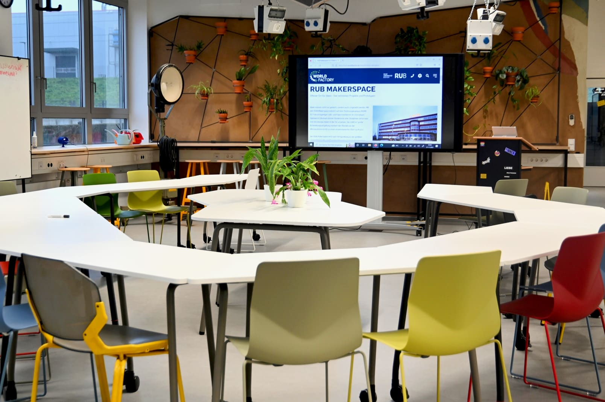
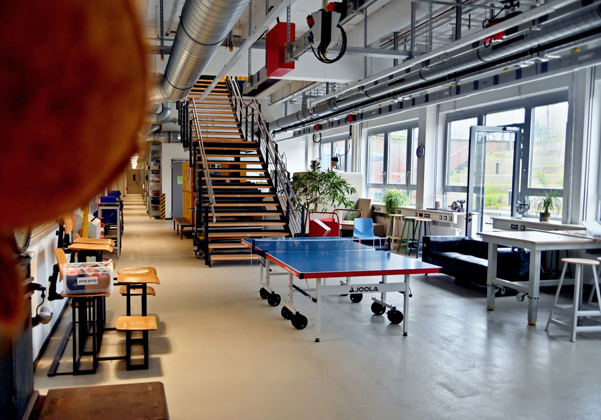
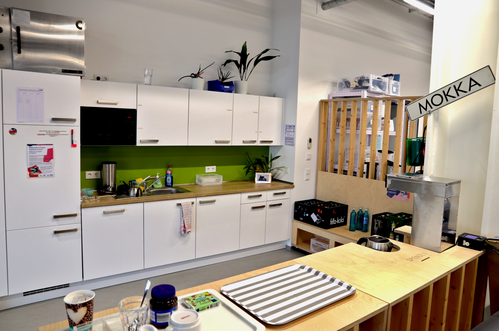
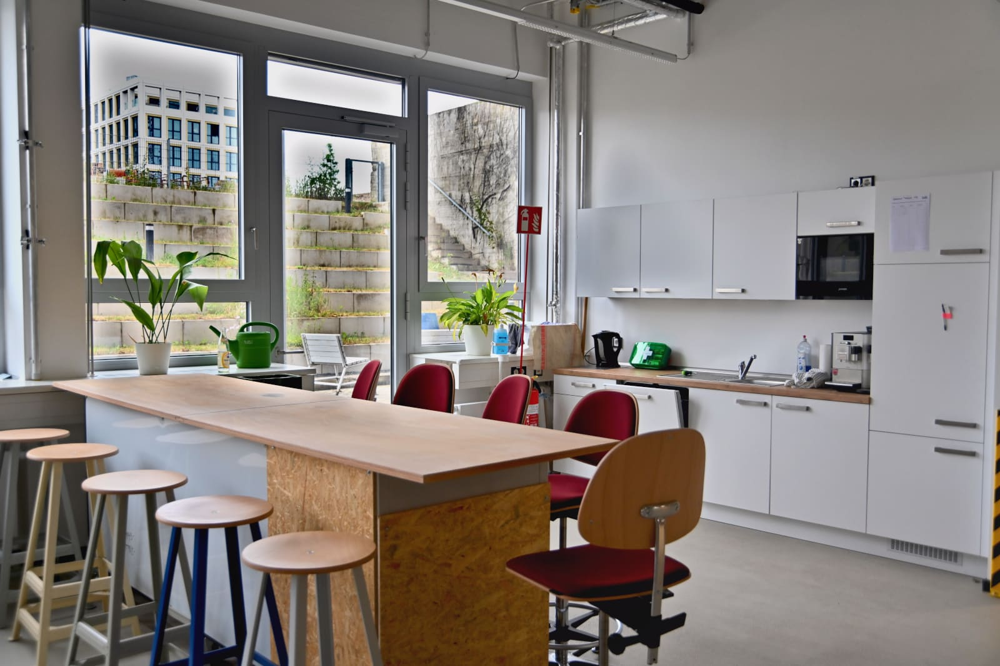
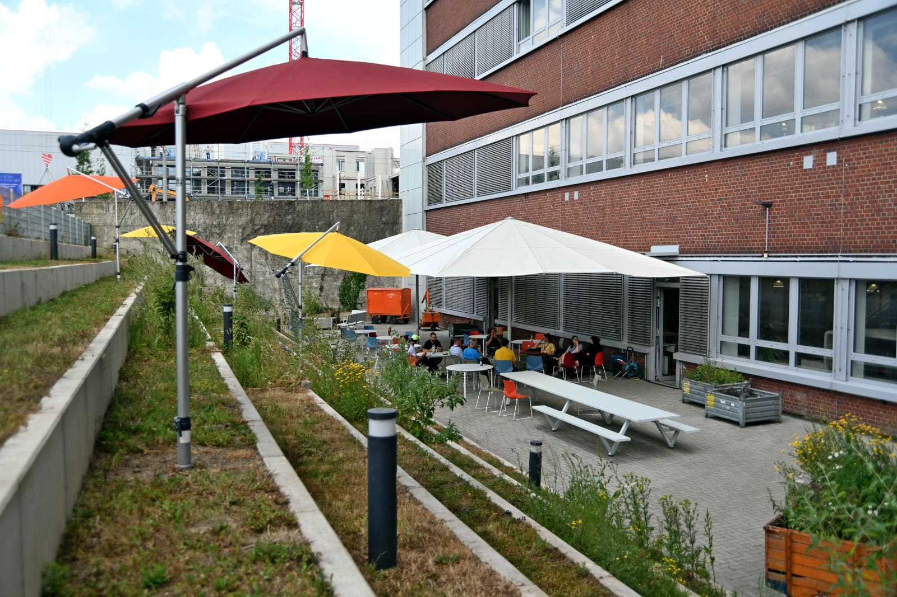

# Co-working Areas

## Co-working Area on the Ground Floor

Our open co-working zone on the first floor is our largest event space. It offers you a friendly space to develop your ideas or work on your projects. Here you can meet like-minded people, exchange ideas about "making" or simply think and create alone and collaboratively. The co-working zone is also very usable for [events](veranstaltungen.en.md), as we have set up our [stage](medienlabor.en.md#live) right here and the area can be completely furnished with chairs. Even larger consortium meetings, pitches or small trade fairs can be held here.

!!! info "If you lack any work equipment, we have notebooks that you can borrow for working in the Makerspace, depending on availability. Just talk to us!"

??? question "Who is the contact for the Co-Working Area??"
    
    --8<--
    gki.en.md
    --8<--

## Assembly Zone in the Basement {: #montagezone }

The Assembly Zone is located in the basement and is a co-working space for more hands-on work. Here you can, for example, work on larger projects or assemble things that you have made in the workshops.  

The space can also be booked for events and can be used as a co-working space in general.

!!! warning "Remember mutual consideration and safety!"

    The assembly zone is a shared co-working space and a transit area. Therfore special attention is required when working in this area. It is no allowed to do dangerous, particularly noisy, or highly dusty work in the assembly zone.

    However, this does not mean that you cannot use basic tools such as hammers, files, cordless screwdrivers, and similar tools to assemble and process your projects in the area. Please note that certain activities such as sanding down materials with a belt sander, flexing iron rods, welding, handling paints or resins, and other similar activities are not allowed in the assembly zone.        

**Equipment:** 

- Normal tables and chairs
- Work tables adjustable in height with vices and vacuum clamping devices for plate goods
- Various tools, machines and other work equipment (mobile and as needed)
- Sofa corner
- Material for creative work/design and whiteboards/flipcharts
- Mobile monitor (and beamer with mobile screen as required)

## Tea Kitchens {: #teekuechen }

If you get hungry or need coffee or tea to get your brain cells going, you are welcome to use one of our tea kitchens! There is one on each floor. Both are basically running on the principle of self-supply, although we also provide tea and coffee for the general public at irregular intervals if there are enough funds available through the [donation box](unterstuetzung.en.md#barspenden). In the future, there will also be a drinkable water dispenser per floor (tap water is already available, of course). 

## Outdoor Area in the Courtyard {: #aussenbereich }

??? warning "The outdoor area is under construction - click for more information"

    The courtyard and especially the plants and projects there will grow and flourish permanently - support us with pleasure! 
    Concrete activities are already underway related to the courtyard in terms of planting, urban gardening, wild bees and similar topics. Anyone who enjoys and is interested in such topics and in collaboration is welcome to [contact us or drop by](kontakt.en.md).

Our courtyard offers plenty of space, seating block steps, garden-typical infrastructure such as lighting, water connections and sockets on the house wall as well as on the lanterns at the steps (one connection has 400V). For your convenience, we also provide several small umbrellas that are distributed on the steps. On the flat area of the courtyard, we have two very large umbrellas that can be easily connected and converted into a large tent with side walls. 

 

## Further Premises for Startups

There are also [offices for start-ups](https://www.worldfactory.de/fokusthemen/team-spaces-co-working) at O-Werk that can be requested through the Worldfactory Start-up Center.

