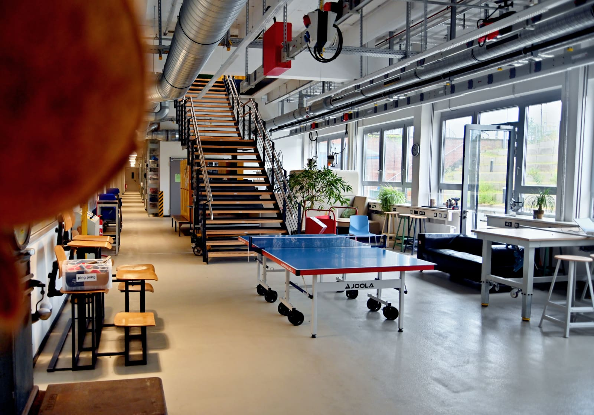
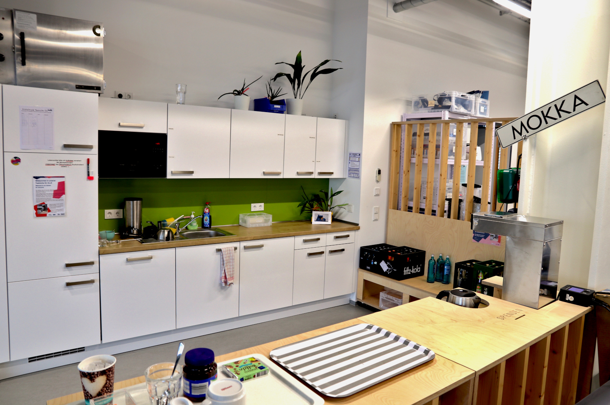
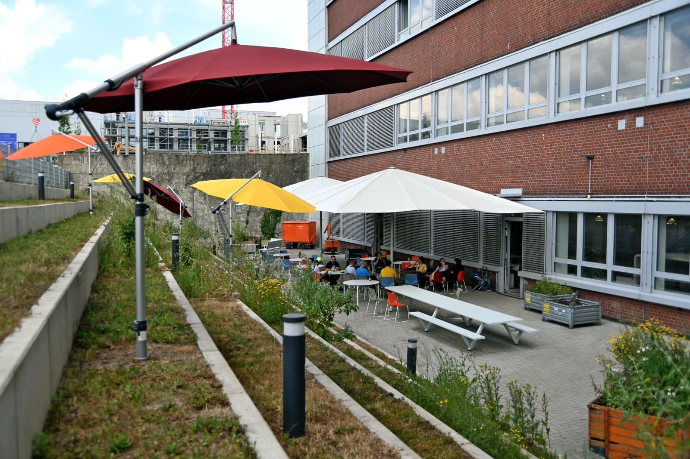

# Co-Working-Bereiche

## Co-Working-Zone im EG

Unsere offene Co-Working-Zone im Erdgeschoss ist unserer größte Veranstaltungsfläche. Sie bietet Dir einen freundlichen Raum, um Deine Ideen zu entwickeln oder an Deinen Projekten zu arbeiten. Hier kannst Du Gleichgesinnte kennenlernen, Dich übers "Maken" austauschen oder einfach allein und kollaborativ denken und schaffen. Auch für [Veranstaltungen](veranstaltungen.md) ist die Co-Working-Zone sehr gut nutzbar, da wir hier direkt unsere [Bühne](medienlabor.md#live) aufgebaut haben und sich der Bereich komplett bestuhlen lässt. Aber auch größere Konsortialsitzungen, Pitches oder kleine Messen lassen sich hier gut realisieren.

!!! info "Sollte es Dir an einem Arbeitsgerät fehlen, haben wir [Laptops](digitallabor.md#it), die Du je nach Verfügbarkeit für die Arbeit im Makerspace ausleihen kannst. Sprich uns einfach an!"

??? question "Wer ist die Ansprechperson fürs Co-Working?"
    
    --8<--
    gki.md
    --8<--

## Montagezone im UG {: #montagezone }

Die Montagezone liegt im Untergeschoss und ist eine Co-Working-Fläche, die auch für handfeste Arbeiten genutzt werden kann. Hier kannst Du zum Beispiel an größeren Projekten werkeln oder Dinge zusammensetzen, die Du in den Werkstätten gefertigt hast.   

Die Fläche ist aber auch für Veranstaltungen buchbar und ein allgemeiner Co-Working-Bereich.

!!! warning "Gegenseitige Rücksichtnahme und Sicherheit beachten!"

    Die Montagezone ist eine **gemeinsame** Co-Working-Fläche und ein Durchgangsbereich (zum Beispiel für alle, die aus dem EG ins UG kommen). Es ist daher besondere Rücksichtnahme erforderlich. In der Montagezone sind dementsprechend auch gefährliche, besonders laute oder stark staubende Arbeiten nicht erlaubt. 

    Das soll nicht heißen, dass bei der Montage und Bearbeitung eines Projektes nicht auch mal ein Hammer, eine Feile, ein Akkuschrauber und ähnliche Werkzeuge eingesetzt werden dürften und müssten. Nur ist es beispielsweise (dort) nicht erlaubt, mit dem Bandschleifer ordentlich Material abzuschleifen, Eisenstangen abzuflexen, zu schweißen, mit Lacken oder Harzen zu hantieren oder dergleichen mehr. 

**Ausstattung nach Bedarf:** 

- Normale Tische und Bestuhlung
- Arbeitstische höhenverstellbar mit Schraubstöcken, Vakuumspannmitteln, etc.
- Verschiedenes Werkzeug, Maschinen und andere Arbeitsmittel (mobil und nach Bedarf)
- Sofa-Ecke
- Kreativmaterial und Whiteboards/Flipcharts
- Rollbarer Monitor (und Beamer mit mobiler Leinwand nach Bedarf)

## Teeküchen {: #teekuechen }

Falls Dich der Hunger packt, oder Du Kaffee oder Tee brauchst, um Deine Gehirnzellen in Schwung zu bringen, bist Du in einer unserer Teeküchen herzlich willkommen! Pro Stockwerk gibt es eine davon. Beide laufen grundsätzlich nach dem Prinzip der Selbstversorgung, wobei wir in unregelmäßigen Abständen auch Tee und Kaffee für die Allgemeinheit bereitstellen, wenn über die [Spendenkasse](unterstuetzung.md#barspenden) genug Mittel zur Verfügung stehen. In Zukunft wird es pro Stockwerk außerdem noch einen Trinkwasserspender geben (Leitungswasser gibt es natürlich schon jetzt). 

## Innenhof {: #aussenbereich }

??? warning "Der Außenbereich befindet sich im Aufbau – Anklicken für mehr Informationen"

    Der Innenhof und insbesondere die Pflanzen und Projekte dort werden permanent wachsen und gedeihen – Unterstütze uns dabei gern! 
    Im Zusammenhang mit dem Innenhof laufen bereits konkrete Aktivitäten in Sachen Bepflanzung, Urban Gardening, Wildbienen und ähnlichen Themen. Wer Freude und Interesse an solchen Themen und an Zusammenarbeit hat, kann sich gerne bei uns [melden oder vorbeikommen](kontakt.md). 

In unserem Innenhof gibt es viel Fläche, Sitzblockstufen und  gartentypische Infrastruktur wie zum Beispiel Beleuchtung, Wasseranschlüsse, Steckdosen an der Hauswand sowie an den Säulen auf den Stufen (ein Anschluss hat 400V). Besonders praktisch sind auch unsere Schirme – es gibt mehrere kleine auf den Stufen verteilt. Auf der ebenen Fläche haben wir zwei sehr große Schirme, die sich verbinden und mit Seitenwänden zu einem großen Zelt umbauen lassen.

 

## Weitere Räumlichkeiten für Start-ups

Im O-Werk gibt es außerdem [Büros für Start-ups](https://www.worldfactory.de/fokusthemen/team-spaces-co-working) die über das Worldfactory Start-up Center angefragt werden können.

