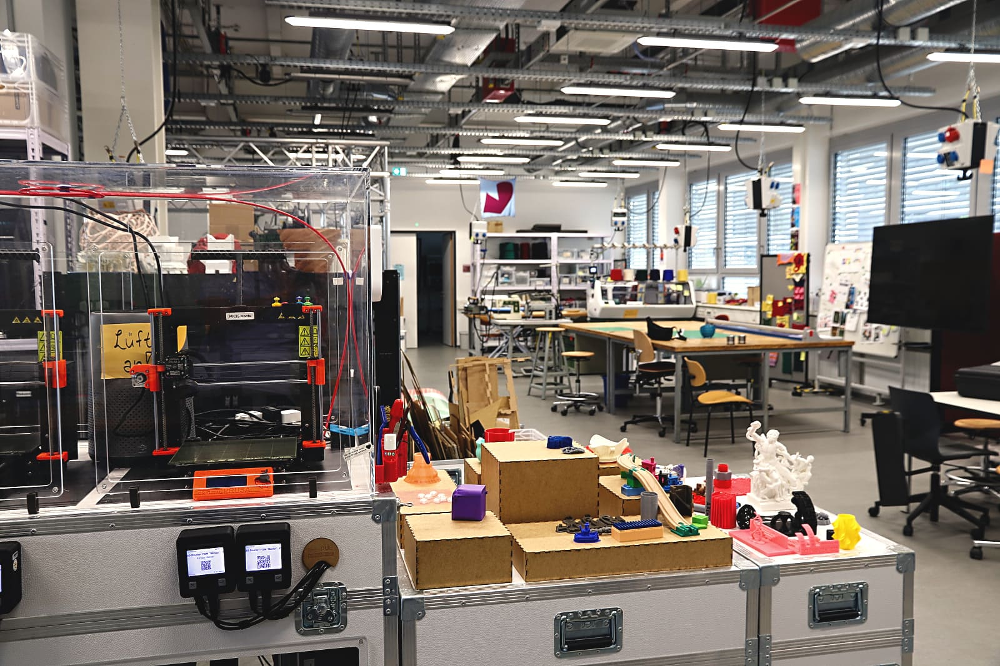
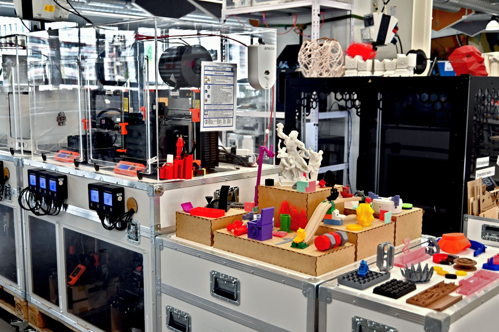
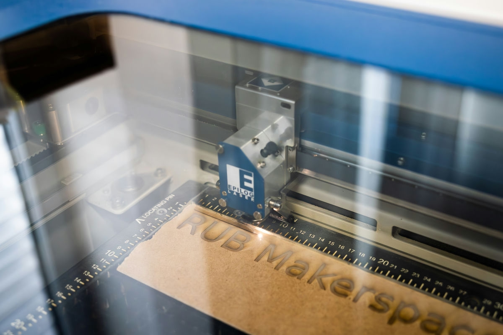
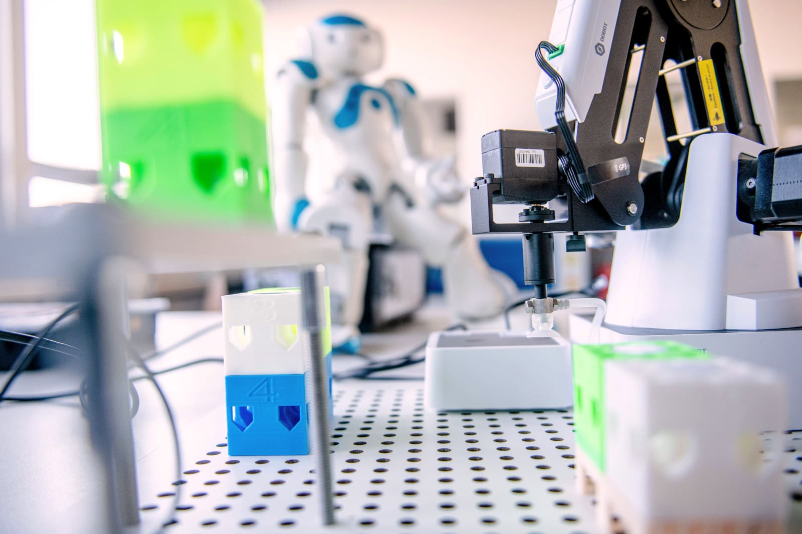
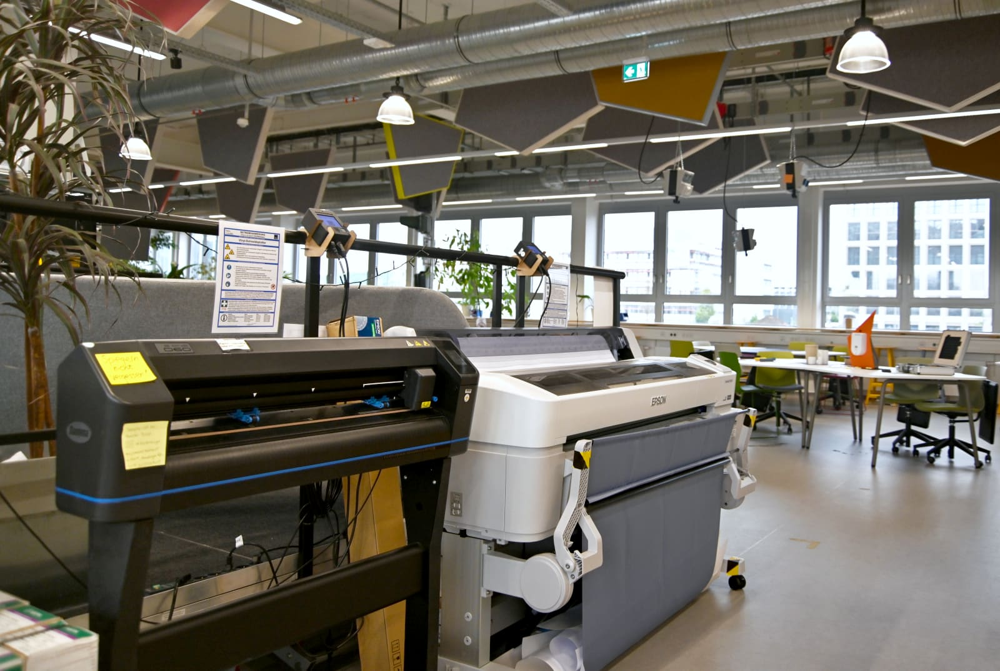

# Design Lab

!!! info "Availability of Machines and Devices" 

	From time to time, certain machines and equipment may not be available for use due to renovations, expansions, maintenance, repairs or other similar reasons. This may be because they are out of order or require initial commissioning. If you require the use of specific equipment for your project, we ask that you contact the relevant contacts by email or telephone in advance to ensure availability.

Our Design Lab is there to immerse yourself in the world of designing and creating things and prototypes. Whether it's 3D printing, laser cutting, robotics, or augmented and virtual reality, you'll find everything you need to experiment with different materials, manufacturing processes, shapes, and colors.

??? question "Who is the Design Lab contact?"
	
	--8<--
	fkb.en.md
	--8<--

## How to Use the Design Lab

To use the Design Lab, you must first complete the General Safety Instruction. After completing this instruction, you will also need specific training for the equipment you wish to use. Once you have received instruction for the equipment, you are allowed to work independently with most of the devices.

Please note that there are certain exceptions to this rule, including the laser cutter, the large-volume 3D printer, and the CoBot. For these pieces of equipment, please speak to a member of our team before use.

If you would like to receive training for a specific device, please let us know on-site or contact us via [email](kontakt.en.md).  

!!! info "[To the "Design Lab" work folder with additional documents](https://ruhr-uni-bochum.sciebo.de/s/VuFDh7eChe6z1v7?path=%2FDesignlabor)"

    In this folder you will find further documents for all areas of the design lab such as operating instructions, templates and samples, tutorials and other things to make your work easier. 
    As always: Together we are stronger - we are happy about every [contribution to the collection of knowledge and experience](feedback.en.md). 

## Here's What You Can Do in the Design Lab

- [3D-printing](#fdm) in the FDM process (Fused Deposition Modeling)
- [3D-scanning](#3d-scan), e.g. for reverse engineering
- [Laser Cutting](#laser) (no metals!)
- [Robotics](#robotik) testing and programming
- [Virtual and Augmented Reality](#mr) testing headsets
- [Printing and Plotting](#papier)

Below you will find a detailed description of each of these areas.

## 3D-Printer (Fused Deposition Modeling: FDM) {: #fdm }

In the fused deposition modeling (FDM) technique, plastic, which is usually provided rolled up in wire form (filament), is heated and applied to a building platform through a nozzle. The 3D object, which was previously created on the computer, is printed layer by layer in printed paths.  
FDM printing is particularly suitable for the production of 3D bodies in small quantities, lightweight components and complex geometries.  

**Our devices (*links lead to the manufacturer's website*):**

- [Makerbot Replicator+](https://support.makerbot.com/s/topic/0TO5b000000sXuAGAU/replicator) (Build Volume [mm]: 295x195x160) 

- [2x Prusa Mini+](https://www.prusa3d.com/de/produkt/original-prusa-mini-3/) (Build Volume [mm]: 180x180x180)
            
- [3x Prusa MK3S](https://www.prusa3d.com/de/produkt/original-prusa-i3-mk3s-drucker-3/) (Build Volume [mm]: 250x210x210)
            
- [Ultimaker 2+](https://support.ultimaker.com/hc/en-us/sections/360003548499-Ultimaker-2-) (Build Volume [mm]: 223x223x205)
            
- [Ultimaker 3](https://support.ultimaker.com/hc/en-us/sections/360003548399-Ultimaker-3) (Build Volume [mm]: 215x215x300)
            
- [Ultimaker S5](https://support.ultimaker.com/hc/en-us/sections/360003504180-Ultimaker-S5) (Build Volume [mm]: 330x240x300)
            
- [Raise3D Pro2 Plus](https://support.raise3d.com/list.html?cid=4&pid=-1) (Build Volume [mm]: 305x305x605)

- [ThinkIng Großformat 3D Printer](https://additive-thinking.de) (Build Volume [mm]: 1000x1000x1000)
            
- [Zortrax M200 Plus](https://support.zortrax.com/all-categories/?printers=m200-plus) (Build Volume [mm]: 200x200x180)

## 3D-Scanning {: #3d-scan }

Scanning real objects to save them as digital 3D objects is useful in various fields, e.g. for spare parts, reverse engineering, or in healthcare and architecture. 3D scans are especially useful when the exact shape of complex objects needs to be captured.  
In the Makerspace we offer you several 3D scanners and the necessary software and hardware to enable you to scan and digitize objects.
            

**Our devices (*links lead to the manufacturer's website*):**

- [Artec Eva](https://www.artec3d.com/de/portable-3d-scanners/artec-eva)

- [Artec Space Spider](https://www.artec3d.com/de/portable-3d-scanners/artec-spider)

- [HP-30-Streifenlichtscanner Pro S3](https://www.hp.com/de-de/campaign/3Dscanner/overview.html)

## Laser Cutting {: #laser }

With our laser cutters you can cut and/or engrave a variety of materials precisely and quickly. 
In lasercutting, a laser beam is focused through a lens on a tiny spot. The light energy from the laser becomes heat energy when it comes into contact with the surface. This heats the material to such an extent that it vaporizes or burns and can be removed in this way. With this technique, precise outlines or relief-like engravings can be cut in a short time.

**Our devices (*links lead to the manufacturer's website*):**

- [Epilog Fusion M2 40 CO2-Laser](https://www.epiloglaser.com) (Build Volume [mm]: 1016x711x362, Resolution: 75-1200 dpi)
- [Emblaser 2](https://darklylabs.com/emblaser2/) (Build Volume [mm]: 500x300x50, Resolution: 1200 dpi)

## Mixed Reality (Augmented and Virtual Reality) {: #mr }

Mixed reality describes situations in which our naturally perceived reality is supplemented by artificially computer-generated signals/elements. So far, these elements are mostly visual, often there are also audible ones.   In the mixed reality spectrum, we primarily distinguish between virtual reality (VR) and augmented reality (AR).  
VR describes a completely closed, virtual environment that at least replaces the visual signals of our natural surroundings. AR, on the other hand, adds additional information to our real field of vision with hologram-like visualizations.  

**Our devices (*links lead to the manufacturer's website*):**

- [2x Hololense I](https://docs.microsoft.com/de-de/hololens/hololens1-hardware)
- [2x Acer MR Kit](https://www.acer.com/ac/de/DE/content/model/VD.R05EE.003)
- [2x Valve Index VR Kit](https://www.valvesoftware.com/de/index)
- Powerful [Computer Workstations](LINK), in order to operate the MR devices appropriately.

## Robotics {: #robotik }

In our robotics area you have the opportunity to get to know, control and program different robots. 
You can easily start with our LEGO Mindstorms and work your way up to the DoBots or Naos and CoBot.

**Our devices (*links lead to the manufacturer's website*):**

- [3x DoBot Magician](https://www.dobot.cc/dobot-magician/product-overview.html)
- [Lego Mindstorms](https://education.lego.com/de-de/products/lego-mindstorms-education-ev3-set/5003400#ev3-set)
- [2x Nao-Roboter](https://www.softbankrobotics.com/emea/en/nao)
- [UR5 CoBot](https://www.universal-robots.com/products/ur5-robot/)

## Printing and Plotting {: #papier }

Here, you have both a large-format inkjet plotter and various small devices for laminating, punching or cutting at your disposal.

**Our devices (*links lead to the manufacturer's website*):**
	
- [Summa S One D60](https://www.summa.com/de/losungen/s-one-folienschneideplotter/) (Foil cutting plotter)
- [Epson SC-T7200](https://www.epson.de/products/printers/large-format-printers/surecolor-sc-t7200/)
- LMG Autolam Laminator 2630 (up to Din A3)
- Devices and accessories for ring binding
- Various knives, rulers, hand cutter, cutting mats etc. 
