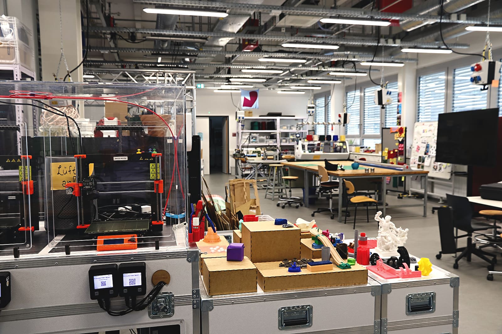
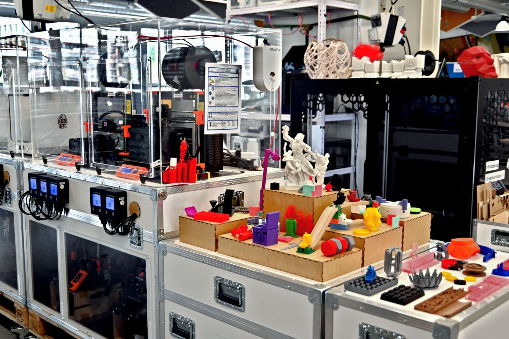
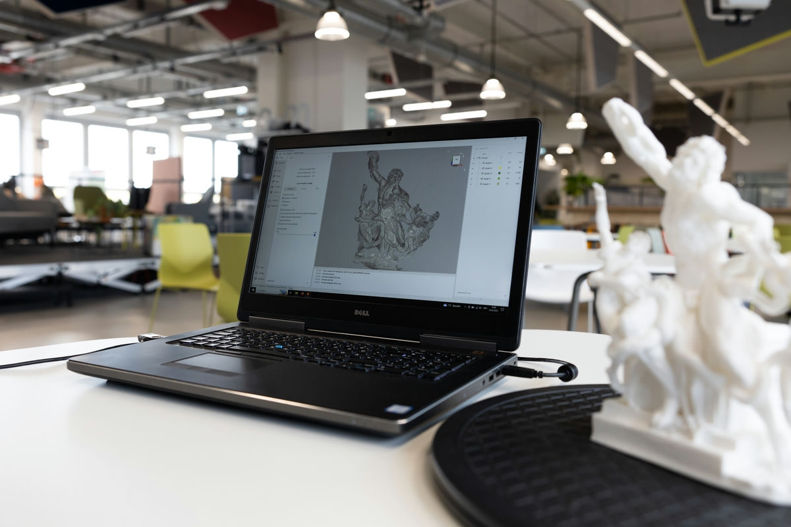
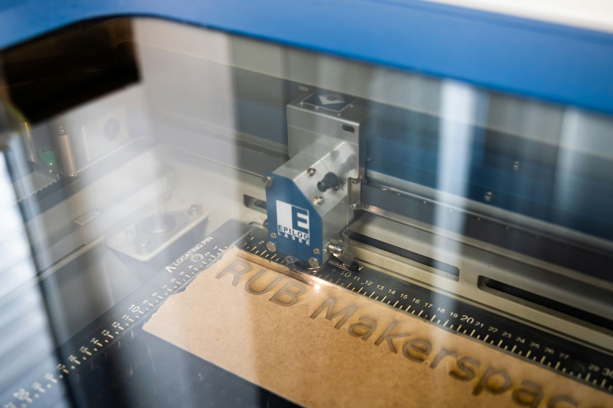
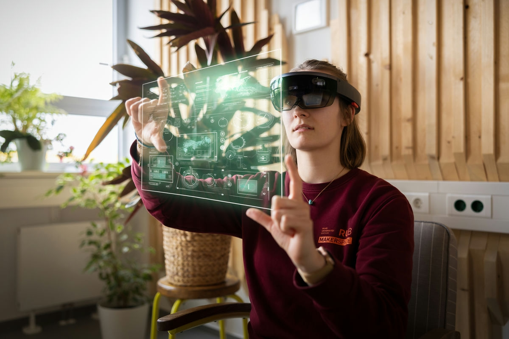
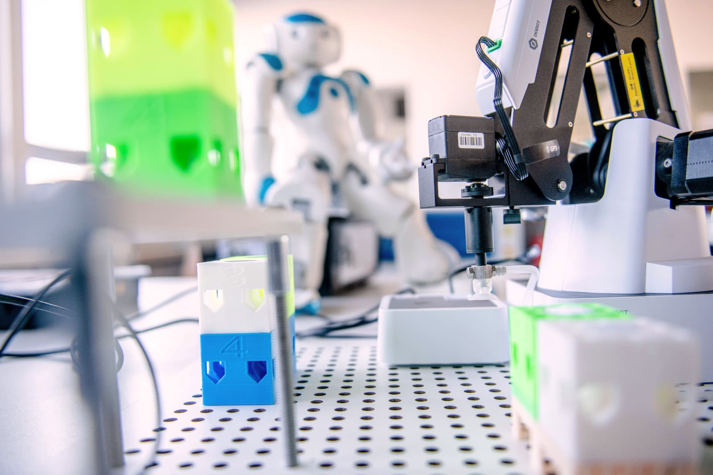
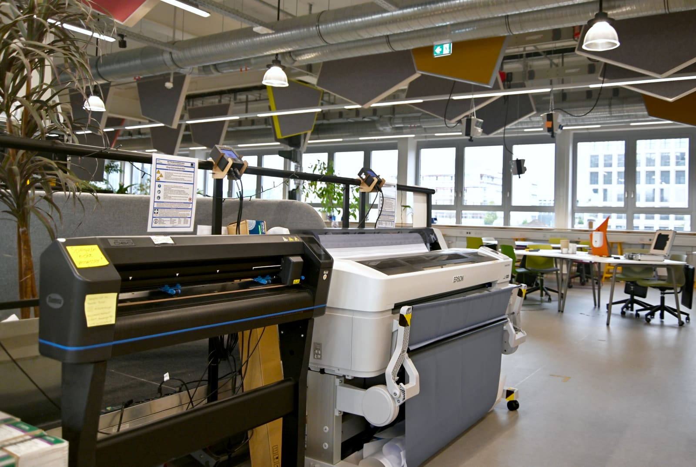

# Designlabor

Unser Designlabor ist dafür da, um in die Welt des Gestaltens und Entwerfens von Dingen und Prototypen einzutauchen. Ob 3D-Druck, Lasercutting, Robotik oder erweiterte und virtuelle Realität – hier findest Du alles, um mit verschiedenen Materialien, Fertigungsverfahren, Formen und Farben zu experimentieren. 

??? question "Wer ist die Ansprechperson für das Designlabor?"
	
	--8<--
	fkb.md
	--8<--

## So kannst Du das Designlabor nutzen 

Für das Designlabor selbst reicht es, neben der Allgemeinen Sicherheitsunterweisung, eine Unterweisung für das jeweilige Gerät zu erhalten, das Du nutzen möchtest. Mit den meisten Geräten darfst Du anschließend selbstständig arbeiten. Ausnahmen sind der Lasercutter, der Großvolumen-3D-Drucker und der CoBot; hierfür sprichst Du bitte vorher jemanden aus dem Team an. Wenn Du eine Unterweisung für ein Gerät machen möchtest, sag einfach vor Ort Bescheid oder schreib uns eine [E-Mail](kontakt.md). 

!!! info "[Zum Arbeitsordner 'Designlabor' mit weiteren Unterlagen](https://ruhr-uni-bochum.sciebo.de/s/VuFDh7eChe6z1v7?path=%2FDesignlabor)"

    In diesem Ordner findest Du weitere Unterlagen zu allen Bereichen des Designlabors wie zum Beispiel Bedienungsanleitungen, Betriebsanweisungen, Vorlagen und Muster, Tutorials und andere Dinge, die Dir die Arbeit erleichtern sollen. 
    Wie immer gilt: Gemeinsam sind wir stärker – wir freuen uns über jeden [Beitrag zur Wissens- und Erfahrungssamlung](feedback.md)

## Das kannst Du im Designlabor machen

- [3D-Drucken](#fdm) im FDM-Verfahren (Schmelzschicht)
- [3D-Scannen](#3d-scan), zum Beispiel für Reverse Engineering
- [Lasercutten](#laser) (keine Metalle!)
- [Roboter](#robotik) testen und programmieren
- [Virtual- und Augmented Reality](#mr) Brillen testen
- [Drucken und Plotten](#papier)

Im Folgenden findest Du eine ausführliche Beschreibung dieser einzelnen Bereiche.

## 3D-Drucker (Kunststoff-Schmelzschichtung: FDM) {: #fdm }

Beim Kunststoff-Schmelzschichtungs-Verfahren (FDM) wird Kunststoff, der zumeist aufgerollt in Drahtform bereitgestellt wird (Filament), erhitzt und durch eine Düse auf eine Bauplattform aufgetragen. Der Druck des zuvor am Computer erstellten 3D-Objekts erfolgt dabei Schicht für Schicht in gedruckten Bahnen.  
FDM-Druck eignet sich besonders für die Fertigung von 3D-Körpern in geringer Stückzahl, Leichtbauteilen und komplexen Geometrien.   

**Unsere Geräte (*Links führen zur Internetseite der Hersteller*):** 

- [Makerbot Replicator+](https://support.makerbot.com/s/topic/0TO5b000000sXuAGAU/replicator) (Bauraum [mm]: 295x195x160) 

- [6x Prusa Mini+](https://www.prusa3d.com/de/produkt/original-prusa-mini-3/) (Bauraum [mm]: 180x180x180)
            
- [3x Prusa MK3S](https://www.prusa3d.com/de/produkt/original-prusa-i3-mk3s-drucker-3/) (Bauraum [mm]: 250x210x210)
            
- [Ultimaker 2+](https://support.ultimaker.com/hc/en-us/sections/360003548499-Ultimaker-2-) (Bauraum [mm]: 223x223x205)
            
- [Ultimaker 3](https://support.ultimaker.com/hc/en-us/sections/360003548399-Ultimaker-3) (Bauraum [mm]: 215x215x300)
            
- [Ultimaker S5](https://support.ultimaker.com/hc/en-us/sections/360003504180-Ultimaker-S5) (Bauraum [mm]: 330x240x300)
            
- [Raise3D Pro2 Plus](https://support.raise3d.com/list.html?cid=4&pid=-1) (Bauraum [mm]: 305x305x605)

- [ThinkIng Großformat 3D Drucker](https://additive-thinking.de) (Bauraum [mm]: 1000x1000x1000)
            
- [Zortrax M200 Plus](https://support.zortrax.com/all-categories/?printers=m200-plus) (Bauraum [mm]: 200x200x180)

## 3D-Scan {: #3d-scan }

Reale Objekte zu scannen, um sie als digitale 3D-Objekte abzuspeichern, ist in verschiedenen Bereichen nützlich, zum Beispiel für Ersatzteile, Reverse Engineering, oder im Gesundheitswesen und der Architektur. 3D-Scans sind vor allem dann sinnvoll, wenn die genaue Form von komplexen Gegenständen erfasst werden muss.  
Im Makerspace bieten wir Dir mehrere 3D-Scanner und die nötige Soft- und Hardware an, damit Du Gegenstände scannen und digitalisieren kannst. 
            

**Unsere Geräte (*Links führen zur Internetseite der Hersteller*):** 

- [Artec Eva](https://www.artec3d.com/de/portable-3d-scanners/artec-eva)

- [Artec Space Spider](https://www.artec3d.com/de/portable-3d-scanners/artec-spider)

- [HP-30-Streifenlichtscanner Pro S3](https://www.hp.com/de-de/campaign/3Dscanner/overview.html)

## Lasercutting {: #laser }

Mit unseren Laserschneidern (Lasercutter) kannst Du eine Vielzahl von Materialien präzise und schnell zuschneiden und/oder gravieren. 
Beim Lasercutting wird ein Laserstrahl durch eine Linse auf einen winzigen Punkt fokussiert. Die Lichtenergie des Lasers wird beim Kontakt mit der Oberfläche zu Wärmeenergie. Diese erhitzt das Material so stark, dass es verdampft oder verbrennt und auf diese Weise abgetragen werden kann. So können in kurzer Zeit präzise Umrisse oder reliefartige Gravuren geschnitten werden. 

**Unsere Geräte (*Links führen zur Internetseite der Hersteller*):** 

- [Epilog Fusion M2 40 CO2-Laser](https://www.epiloglaser.com) (Bauraum [mm]: 1016x711x362, Auflösung: 75-1200 dpi)
- [Emblaser 2](https://darklylabs.com/emblaser2/) (Bauraum [mm]: 500x300x50, Auflösung: 1200 dpi)

## Mixed Reality (erweiterte und virtuelle Realität) {: #mr }

Mixed Reality beschreibt Situationen, in denen unsere natürlich wahrgenommene Realität um künstlich computergenerierte Signale/Elemente ergänzt wird. Diese Elemente sind bisher zumeist visuell, oft gibt es auch hörbare. Im Mixed-Reality-Spektrum unterscheiden wir vor allem zwischen Virtual Reality (VR) und Augmented Reality (AR).
VR beschreibt eine vollständig geschlossene, virtuelle Umgebung, die zumindest die visuellen Signale unserer natürlichen Umgebung ersetzt. AR dagegen ergänzt unser reales Sichtfeld mit hologrammartigen Visualisierungen um zusätzliche Informationen.

**Unsere Geräte (*Links führen zur Internetseite der Hersteller*):** 

- [2x Hololense I](https://docs.microsoft.com/de-de/hololens/hololens1-hardware)
- [2x Acer MR Kit](https://www.acer.com/ac/de/DE/content/model/VD.R05EE.003)
- [2x Valve Index VR Kit](https://www.valvesoftware.com/de/index)
- Leistungsstarke [Computer-Workstations](../digitallabor/#computer), um die MR-Geräte angemessen zu betreiben.

## Robotik {: #robotik }

In unserem Robotikbereich hast Du die Gelegenheit, verschiedene Roboter kennenzulernen, zu steuern und zu programmieren. 
Du kannst ganz einfach in das Thema einsteigen, beispielsweise mit unseren LEGO Mindstorms und Dich dann zu den DoBots oder Naos bishin zum CoBot vorarbeiten. 

**Unsere Geräte (*Links führen zur Internetseite der Hersteller*):** 

- [3x DoBot Magician](https://www.dobot.cc/dobot-magician/product-overview.html)
- [Lego Mindstorms](https://education.lego.com/de-de/products/lego-mindstorms-education-ev3-set/5003400#ev3-set)
- [2x Nao-Roboter](https://www.softbankrobotics.com/emea/en/nao)
- [UR5 CoBot](https://www.universal-robots.com/products/ur5-robot/)

## Drucken und Plotten {: #papier }

Hier stehen Dir sowohl ein großformatiger Inkjet-Plotter, als auch diverse kleine Geräte zum Laminieren, Stanzen oder Schneiden zu Verfügung.

**Unsere Geräte (*Links führen zur Internetseite der Hersteller*):** 
	
- [Summa S One D60](https://www.summa.com/de/losungen/s-one-folienschneideplotter/) (Folienschneideplotter)
- [Epson SC-T7200](https://www.epson.de/products/printers/large-format-printers/surecolor-sc-t7200/)
- LMG Autolam Laminator 2630 (bis A3)
- Geräte und Zubehör zur Ringbindung
- Diverse Messer, Lineale, Handschneidemaschine, Schneidmatten und so weiter 
