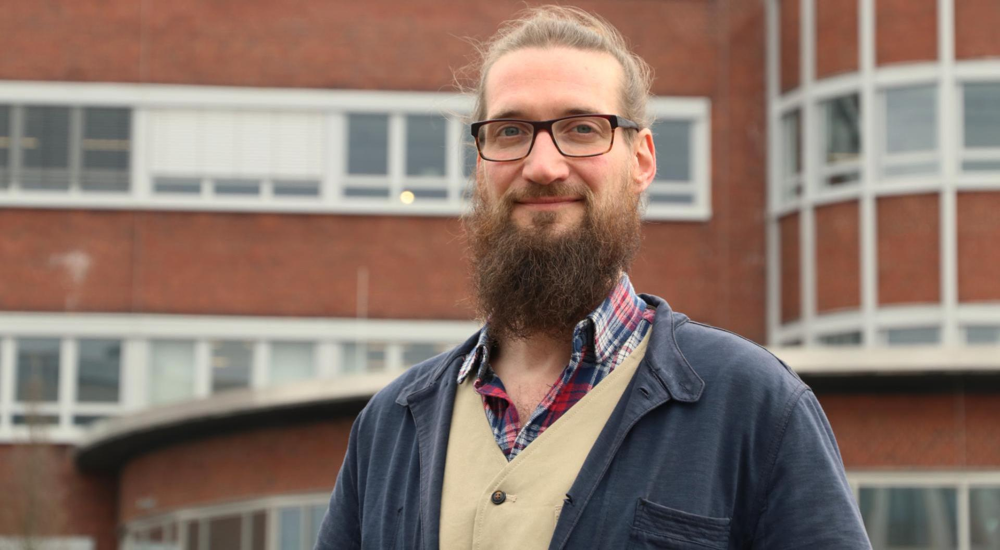

#### Dirk Hansmeier {: #dha }

!!! warning "Dirk ist derzeit in Eltern- und Teilzeit und wird teilweise durch [Florian](#fkb) vertreten."

=== "Über mich"
	
	>"Ich bin Dirk und leite den RUB-Makerspace. Damit kümmere ich mich seit 2016 um so gut wie all das, was nicht unmittelbar an den Maschinen und Geräten passiert: Statt G-Code zu produzieren, schreibe ich Textzeilen in E-Mails oder Projektanträgen; statt 3D-Modellen zu erstellen, arbeite ich an Netzwerken und PowerPoint-Präsentationen. Im Gegensatz zum Rest unseres großartigen Teams, das euch den Umgang mit unseren Geräten erklärt, euch anleitet und berät, stehe ich daher leider viel zu selten an den Maschinen. Stattdessen bin ich Ansprechperson für Kooperationen und auch mal Reiseführer durch unseren Makerspace – und lade hiermit jeden Menschen herzlich auf eine Entdeckungstour zu uns ein! 

=== "Kontakt"

	- [Kontaktiere uns als Team](kontakt.md)
	- [Persönliche Kontaktdaten Dirk W. Hansmeier im Verzeichnis der RUB](https://einrichtungen.ruhr-uni-bochum.de/de/dirk-w-hansmeier)
	- Vertretung bei Abwesenheit durch [Florian Krohm](#fkb)

=== "Hintergrund"

	- Studium an der RUB (SoWi und Kunstgeschichte) und an der TU Dortmund (Kulturarbeit und Kreativwirtschaft)
    - Drittmittelakquisition und Projektleitung am [Fachgebiet Maschinenelemente der TU Dortmund](https://www.me.mb.tu-dortmund.de/cms/de/home/fachgebiet/index.html)
    - Miterfinder und Wegbereiter des [Zukunftsfinders](https://zukunftsfinder.de/) der Stadt Dortmund.
	
