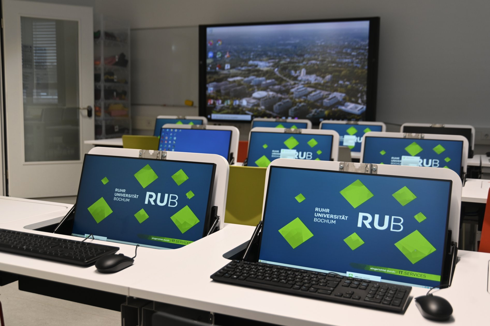
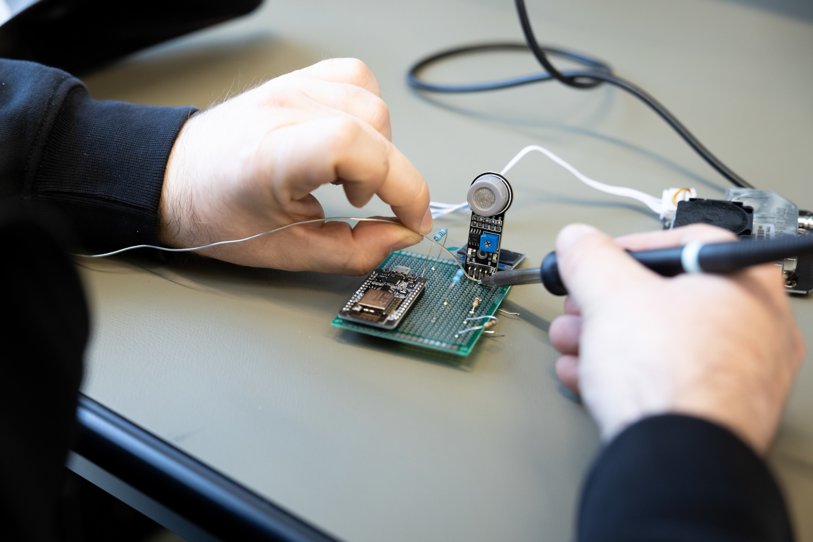
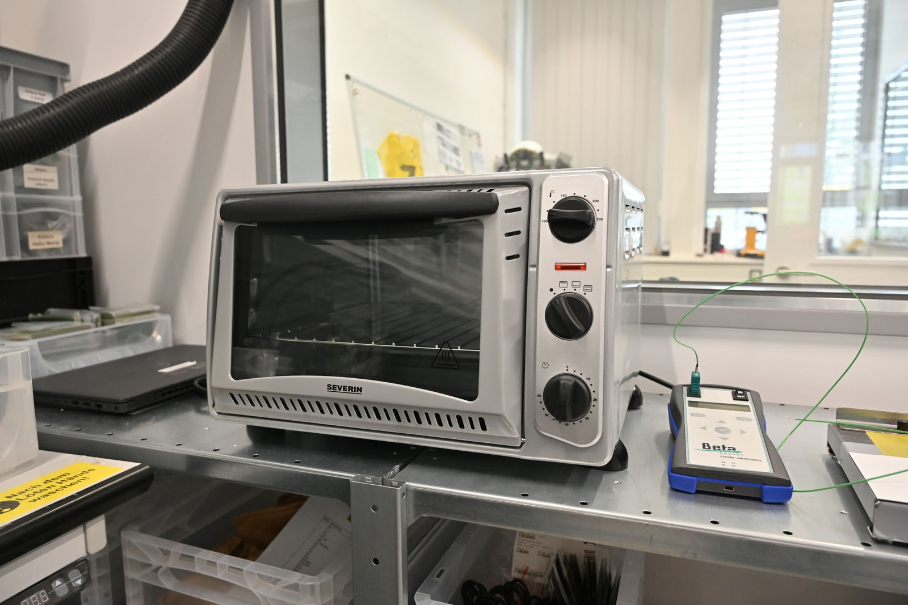
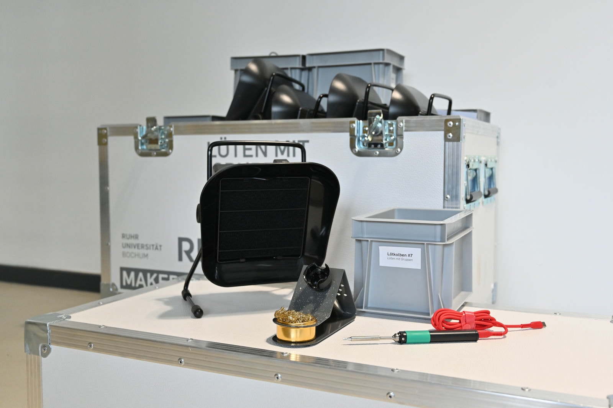
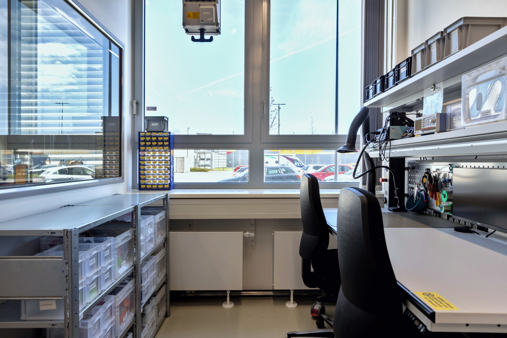

# Digital Lab

Our digital lab is your contact point for everything concerning [computers](#it), [soldering](#loeten), [measuring](#messen), [circuit boards](#platinen) and other aspects of digital matters. Here you will find everything you need for development work in IT and electrical engineering. 

??? question "Who is the contact for the digital lab?"
	
	--8<--
	th.en.md
	--8<--

## Use and Instruction

Participation in the [General Safety Instruction and the General Instruction "Digital Lab"](unterweisungen.en.md) is required for the use of the digital lab. To use the Makerspace computers you will only need the General Safety Instruction. 

=== "Instruction Slides"

	<iframe src="../../slides/unterweisung-digitallabor" width="100%" height="430px" style="border: 0.5px solid #003561"></iframe>

	:material-fullscreen:
	<small><a href="../../slides/unterweisung-digitallabor" target="_blank">Präsentation in neuem Tab groß anzeigen</a></small>   
	:material-printer:
	<small><a href="../../slides/unterweisung-digitallabor/?print-pdf" target="_blank">Druck-Ansicht, z.B. für PDF-Export (nur in Chromium-Browsern, ohne externe Inhalte)</a></small>  
	:material-file-edit: 
	<small><a href="https://git.noc.rub.de/makerspace/homepage/-/blob/main/slides/unterweisung-digitallabor/slides.md" target="_blank">Quelldatei "slides.md" zu den Folien auf Gitlab</a></small>

	--8<--
	howto-slides.en.md
	--8<--

=== "Operating Instructions"

	--8<--
	sicherheit/ba-digitallabor.md
	--8<--

=== "Work Material"

	!!! info "[To the 'Digital Lab' work folder with additional documents](https://ruhr-uni-bochum.sciebo.de/s/VuFDh7eChe6z1v7?path=%2FDigitallabor)"

    	In this folder you will find further documents on all areas of the digital lab such as operating instructions, templates and samples, tutorials and other things to make your work easier. 
		As always: We are stronger together - we are happy about every [contribution to the pool of knowledge and experience](feedback.en.md).

## Computers and IT {: #it }

Out of the digital lab (partly in cooperation with [IT.Services](https://it-services.ruhr-uni-bochum.de/)) the different computers in the Makerspace are maintained.

In addition to the hardware, we also take care of various software topics such as this website (e.g. our [source code on Gitlab](https://git.noc.ruhr-uni-bochum.de/makerspace/homepage)), the IT-infratructure as well as the working equipment of our team, our user and safety instruction management via [Fabman](faq.en.md##fabman). Also we take care of the licenses for the software on the above-mentioned computers or also our license for the [Arduino IoT Cloud](https://docs.arduino.cc/arduino-cloud/), with which we (and you) can bring electronics projects online quite easily (for "Dashboards", Fernsteuerugen, u.v.m.). Please [contact us](kontakt.en.md) if you need it! 

=== "Hardware"

	- [Computer room](projektraeume.en.md#computerraum) with 21 workstations on the ground floor.
	- Laptops: 5x Microsoft Surface with pen, several 14" laptops for general work, 2x 17" Dell "workstation" laptop (1x for 3D scanning and 1x for VR/AR).
	- On demand: An iPad (incl. Apple Pencil) and a Wacom One (graphics tablet with display) and an older Wacom graphics tablet are each available upon request. 
	- Desktops: multiple 27" Apple iMac (10-core i9, 64GB RAM, Radeon Pro 5700 XT), 2x Windows (dual 4214 12 core, 64GB RAM, RTX 5000).
	- Some of the desktops are mounted on rollable tables and can be used at different locations in the Makerspace as needed. 

=== "Software"

	!!! warning "Software Licenses for Educational Use Only!"
		All of the commercial software mentioned below may be used for educational and research purposes only. Commercial use is prohibited. For applications with a commercial background, separate licenses must be purchased. These can also be installed on the Makerspace hardware if required and after consultation with the team. 

	**Software on Various Workstations and Laptops:**

	- Apple Pro Apps (Final Cut Pro, Logic Pro, Motion, Compressor, MainStage)
	- Affinity Suite (Designer, Photo, Publisher)
	- Various area-, device- and machine-specific applications (e.g. Artec Studio for 3D-scanning on the workstation-laptops)
	- Steam with various (VR) content on VR computer in the design lab and on the workstation-laptops
	- Various software that is also installed in our computer room (see below)

	**Software in the Computer Room:**

	- Inkscape und InkStitch
	- Arduino IDE
	- Autodesk Inventor Professional, Inventor CAM, Fusion 360, Sketchbook, Meshmixer (*all Autodesk products require a separate Autodesk account with (educational) license. Otherwise they are not usable.)*
	- Estlcam
	- Vectric Aspire
	- Rhino
	- GIMP 
	- PrusaSlicer
	- Cura
	- Fritzing
	- DoBot Studio
	- GIMP
	- KiCAD
	- Unity
	- Blender
	- Shotcut
	- Anroid Studio 
	- Lego EV3 Classroom Lego Education 
	- Lego Mindstorms Robot Inventor
	- In addition, the "standard software for PC pools" is available from IT.Services (Office, 7zip, Firefox, VLC, LaTeX, Matlab, etc.) 

	!!! info "Subsequent Installation of Software"

		- In the computer room, a subsequent installation of software is only possible with longer advance notice. Current versions of the software are not necessarily always installed. The workstations are virtualized and a RUB loginID or an event account for external users (only with advance notice!) is required for use. 
		- On the other workstations and laptops in the Makerspace, a subsequent installation of software is possible by prior arrangement.

=== "Operating Instructions"

	--8<--
	sicherheit/ba-computerraum.md
	sicherheit/ba-it-edv.md
	--8<--

=== "Work Material"

	!!! info "[To the work folder "Computer and IT" with further documents](https://ruhr-uni-bochum.sciebo.de/s/VuFDh7eChe6z1v7?path=%2FDigitallabor%2FComputer-und-IT)"

		In this file you can find further documents about the computers at Makerspace, for example operation manuals, operation instuctions, notes about the preinstalled software and other things, that might help you with your project. As always: Together we are stronger - we are happy about every [contribution to the collection of knowledge and experience!](feedback.en.md)

## Soldering and General Electrical Lab Work

One of the most common activities in the digital lab is [soldering](https://de.wikipedia.org/wiki/L%C3%B6ten). The equipment includes several classic soldering stations, solder fume extractors, a hot air soldering station and various soldering tools, such as a third hand with illuminated magnifier. These things are mainly set up on two large mobile lab tables (see photo at the top of this page), which can be used for various electrical work. Mobile soldering irons with small exhaust, work mat and so on for location-flexible soldering with groups are also available. 

=== "Our Devices"

	*links lead to the website of the manufacturer*

	- [3x Weller WR2 - Soldering station](https://www.weller-tools.com/professional/EUR/de/Professional/Loettechnik/Loetstationen/Entloetstationen/WR+2)

	- [2x Weller Zero Smog EL - Solder fume extraction](https://www.weller-tools.com/professional/EUR/de/Filtertechnik/Loetrauch/Flaechenabsaugung/1-2+Arbeitsplaetze/Zero+Smog+EL+Kit+1)

	- [RND-560 - Hot air soldering device](http://www.rnd-electronics.com)

	- [Weller DSX 80 - Desoldering unit](https://www.weller-tools.com/professional/EUR/de/Professional/Loettechnik/Loetkolben/Entloetkolben/DSX+80)

	- [2x R&S NGE100 - Laboratory power supply unit](https://www.rohde-schwarz.com/de/produkte/messtechnik/dc-netzgeraete/rs-nge100-netzgeraeteserie_63493-387267.html)

=== "Operating Instructions"

	--8<--
	sicherheit/ba-loeten.md
	sicherheit/ba-gefahrstoffe.md
	--8<--
	
=== "Work Material"

	- [Grundlagen Löten - YouTube-Playlist](https://www.youtube.com/watch?v=Arj34uQoLdM&list=PLXod-KSvITpIYLLHx45ajUlle3YH2IGN9)
	- PDF-Comic [Löten ist einfach](https://mightyohm.com/files/soldercomic/translations/DE_SolderComic.pdf) von von Mitch Altman, Andie Nordgen, Jeff Keyzer, Alexander Bodora und Richard Meinsen	
	
	!!! info "[To the work folder "Soldering" with further documents](https://ruhr-uni-bochum.sciebo.de/s/VuFDh7eChe6z1v7?path=%2FDigitallabor%2FL%C3%B6ten)"

	    In this folder you will find other documents for soldering such as instruction manuals, operating instructions, templates and patterns, tutorials and other things to make your work easier.  
		As always: We are stronger together - we are happy about every [contribution to the pool of knowledge and experience](feedback.en.md).

## Measuring and Checking

To support the manufacturing process, to check their functionality or to find errors, there are various measuring devices in the Makerspace on the subject of electricity - but also on other measured values. 

=== "Our Devices" 

	*links lead to the website of the manufacturer*

	- [AMPROBE 520 - Multimeter](https://www.amprobe.com/product/am-520/) and various other multimeters
	- [Rhode&Schwarz RTB2002 - Oscilloscope](https://www.rohde-schwarz.com/de/produkte/messtechnik/oszilloskope/rs-rtb2000-oszilloskop_63493-266306.html)
	- [RND lab - digital wireless microscope](http://www.rnd-electronics.com)
	- Thermal imaging camera Fluke Ti401 Pro
	- PH meter PEAKTECH 5307
	- PEAKTECH 9035 Energy cost measuring device
	- PEAKTECH 5200 Moisture meter
	- UT 333BT Humidity meter for air humidity
	- TFA 30505302 Thermo-Hygrometer
	- Precision scale
	- Digital wall scanner Testboy TV 700
	- Microscopes (2x USB, 1x optical), Endoscopes

=== "Operating Instructions"

	--8<--
	sicherheit/ba-digitallabor.md
	--8<--

=== "Work Material"
		
	- [Multimeter - Wikipedia](https://de.wikipedia.org/wiki/Multimeter)
	- [Oszilloskop - Wikipedia](https://de.wikipedia.org/wiki/Oszilloskop)
	- [Multimeter-Tutorial - Youtube](https://www.youtube.com/watch?v=_ojBTpmCVJ0&list=PLcjOhSiDq35dRdtlHF_yxtqDqVXqxclI6&index=2)
	- [Oszilloskop-Einführung - Youtube](https://www.youtube.com/watch?v=aRun6Ku-mno)

	!!! info "[To the "Measuring and Testing" work folder with additional documents](https://ruhr-uni-bochum.sciebo.de/s/VuFDh7eChe6z1v7?path=%2FDigitallabor%2FMessen-und-Pr%C3%BCfen)"

		In this folder you will find additional documents for measuring such as operating instructions, operating instructions, templates and samples, tutorials and other things to make your work easier.  
		As always: We are stronger together - we are happy about every [contribution to the pool of knowledge and experience](feedback.en.md).

## Manufacture Circuit Boards

With our circuit board printer you can print, solder, bake and drill circuit boards. The printing plate offers you a space of up to 128mm x 116mm to print your PCB drawing on a printed circuit board, drill the necessary holes and apply components directly. 

In addition it is possible to use the [desktop milling machine](kunststoffwerkstatt.en.md#cnc-machining) from the plastics workshop for [insulation milling](https://wiki.edu.vn/wiki10/2020/12/11/leiterplattenfrasen-wikipedia/). The milling machine provides a workspace up to 203,2mm x 152,4mm x 60,5mm as well as various milling tools such as milling cutters, gravers and drills. 

??? abstract "Particularities Voltera platinum printer"

   	Although the aim of the device is the rapid prototyping of printed circuit boards, our experience to date shows that the machine is quite temperamental and that printing with liquid ink and the further process steps certainly carry some potential for error. Unfortunately, this is sometimes the case with new types of equipment and processes. We therefore do not currently recommend relying on the device for time-critical applications and see it more as an interesting research device and certainly as an alternative application, for example in the high-precision dispensing of liquids.

=== "Our Devices" 

	*links lead to the manufacturer's website*
	
	- [Voltera V-One](https://www.voltera.io/store/v-one)
	- [Roland SRM-20 Desktop CNC Milling Machine](https://www.rolanddg.eu/de/produkte/3d/srm-20-small-milling-machine) (Workspace 203,2 x 152,4 x 60,5mm)

=== "Operating Instructions"

	--8<--
	sicherheit/ba-platinendrucker.md
	sicherheit/ba-gefahrstoffe.md
	--8<--

=== "Work Material"

	- [Platinendrucker Voltera V-One Support / Manual](https://support.voltera.io/)
	- [Workshop "Platinendrucker"](#ws-platinendrucker)
	- For platinum printing, data in [Gerber format - Wikipedia](https://en.wikipedia.org/wiki/Gerber_format) is required, which can be generated with all common tools for designing circuit boards ([KiCad](https://www.kicad.org) is an open source software for circuit board design). 
	- For consumable material see ["Consumables" in Voltera-Store](https://www.voltera.io/store/consumables)

	!!! info "[To the working folder "PCB Printer" with further documents](https://ruhr-uni-bochum.sciebo.de/s/VuFDh7eChe6z1v7?path=%2FDigitallabor%2FPlatinen-Drucker%20Voltera%20V-One)"

	    In this folder you will find other documents related to the PCB Printer, such as user manuals, operating instructions, templates and samples, tutorials and other things that will make your work easier.  
		As always: We are stronger together - we are happy about every [contribution to the pool of knowledge and experience](feedback.en.md).

	!!! info "[To the "Desktop CNC Milling" work folder with additional documentation](https://ruhr-uni-bochum.sciebo.de/apps/files/?dir=/RUB-Makerspace%20%C3%96FFENTLICH/Kunststoffwerkstatt/Desktop-CNC_Roland_SRM-20&fileid=997380343)"

	    In this folder you will find additional documentation for our desktop CNC mills such as instruction manuals, operating instructions, templates and samples, tutorials and other things to make your work easier.  
		As always: We are stronger together - we are happy about every [contribution to the pool of knowledge and experience](feedback.en.md). 

## Pick and Place - Assembling Circuit Bards
In the digital lab it will soon be possible to assamble circuit boards automatically. The required Pick and Place Machine for this process is being purchased right now. Attachments for applying solder paste on circuit boards via patterns are already available and we are currently considering to purchase or build a manually operated placement tool for components.

**Our devices (*links lead to the manufacter's website*):**

- [Opulo LumenPnP](https://opulo.io/products/lumenpnp) (purchased right now)
- 10x automatic Feeder

## Reflow Oven
In our small, digitally operated oven circuit boards can be soldered with the [reflow-soldering method](https://en.wikipedia.org/wiki/Reflow_soldering). During this process the different components are not being soldered indivually with common solder but they are being soldered all at once with soldering paste. The soldering paste is applied to the circuit board as well as the remaining components and then - completely equiped - it will be soldered in the oven.  
The reflow oven can also be usefull to repair circuit boards, in case there is the assumption that the problem is caused by broken soldering points. 

**Our Devices (*links lead to the manufacter's website*):**

- [Beta Layout Reflow Kit V3 Pro](https://de.beta-layout.com/elektronik-shop/reflow-loeten/10590-reflow-kit-v3-pro/) 

## Borrowing and Class/Group sets
Besides the general possibility to [borrow](ausleihe.en.md) equipment from the digital lab we also have some special offers. 

On the one hand we can provide members of Ruhr University Bochum with mobile data hotspot ["Freifunk-in-a-Box"](https://freifunk.net/en/) with a flat rate. 
On the other hand we offer various sets of hardware for classes or groups to work with. On demand we can also offer safety instructions for teachers or workshop leaders: "train the trainers".

**Our class and group sets (*links lead to the manufacter's website*):**

- Mobile Soldering: 11x [Soldering irons "Pinecil"](https://pine64.com/product/pinecil-smart-mini-portable-soldering-iron/), fume extractors and various accessories in wheeled box.
- Laptops: Our at [Computer and IT](#it) listed laptops with solid case on wheels, in witch they can also be charged. 
- [Calliope Mini](https://calliope.cc/): 1x [class set primary school](https://cornelsen-experimenta.de/shop/de/Grundschule/Coding%20-%20Robotik/Microcontroller%20Calliope%20mini/21820-Calliope+mini+Klassensatz+Grundschule.html): 20 pieces. Can be expanded with further components for the needs of other/higher classes on demand.  
- [Adafruit Circuit Playground Express](https://learn.adafruit.com/adafruit-circuit-playground-express/): 10 Pieces including USB-Cables and further components on demand. For 10-30 persons. 
- On demand further sets can be compiled individually as required.

## Material, Parts and Supplies

The digital lab usually keeps needed materials from computer and electrical engineering in stock. This concerns in particular 

- Consumables (stranded wire, soldering material, ...)
- IT accessories (adapters, cables, storage media, ...)
- Standard components (LEDs, resistors, power supplies, ...)
- Microcontrollers and single board computers (e.g. various Arduinos, Raspberry Pis, BBC micro:bit, Adafruit Circuit Playground Express, D1, ESP8266, ESP32, ...)
- Various "breakout" boards and accessories for microcontrollers
- Various sensors and actuators, e.g. for connection to microcontrollers
- Various hardware for cannibalization. There is also a "Learn to Solder" box for broken things, but still good for learning/trying different soldering jobs.

## Workshops 
Here you can find some of our workshops for groups that we offer on demand. We also have other workshopconcepts e.g. about [CAD](https://en.wikipedia.org/wiki/Computer-aided_design) or about soldering in a software that we will provide little by little on this website as an [open educational ressource](https://en.wikipedia.org/wiki/Open_educational_resources). Furthermore you can [contact us](kontakt.en.md) if you want a new workshop concept developed by us as a [service](dienstleistungen.en.md) or if you want to collaborate in another form of [cooperation](zielgruppen.en.md).

### Building Air Data Sensors

=== "About the Workshop" 

	During this workshop, which is aboult half a day long, people can build their own air data senor based on the project [Sensor.community](https://sensor.community) and take it home with them. 
	The workshop can be performed [on demand](kontakt.en.md) for groups up to 20 people. There are costs for the hardware and, depending on the [target group](zielgruppen.en.md), also for the [teaching itself](dienstleistungen.en.md). 

=== "Workshop Documents"

	<iframe src="../../slides/ws-luftdaten" width="100%" height="430px" style="border: 0.5px solid #003561"></iframe>

	:material-fullscreen:
	<small><a href="../../slides/ws-luftdaten" target="_blank">Präsentation in neuem Tab groß anzeigen</a></small>   
	:material-printer:
	<small><a href="../../slides/ws-luftdaten/?print-pdf" target="_blank">Druck-Ansicht, z.B. für PDF-Export (nur in Chromium-Browsern, ohne externe Inhalte)</a></small>  
	:material-file-edit: 
	<small><a href="https://git.noc.rub.de/makerspace/homepage/-/blob/main/slides/ws-luftdaten/slides.md" target="_blank">Quelldatei "slides.md" zu den Folien auf Gitlab</a></small>

	--8<--
	howto-slides.en.md
	--8<--

### Basics Microcontroller

=== "About the Workshop"

	An introduction in (micro-) electronics and programming based on [Arduino](https://arduino.cc) and similar educational systems for the development of hard- and software. 

	The workshop can be performed [on demand](kontakt.en.md) for groups up to 20 people. There are costs for the hardware and, depending on the [target group](zielgruppen.en.md), also for the [teaching itself](dienstleistungen.en.md). 

=== "Workshop Documents"	

	<iframe src="../../slides/ws-microcontroller" width="100%" height="430px" style="border: 0.5px solid #003561"></iframe>

	:material-fullscreen:
	<small><a href="../../slides/ws-microcontroller" target="_blank">Präsentation in neuem Tab groß anzeigen</a></small>   
	:material-printer:
	<small><a href="../../slides/ws-microcontroller/?print-pdf" target="_blank">Druck-Ansicht, z.B. für PDF-Export (nur in Chromium-Browsern, ohne externe Inhalte)</a></small>  
	:material-file-edit: 
	<small><a href="https://git.noc.rub.de/makerspace/website/-/blob/main/slides/ws-microcontroller/slides.md" target="_blank">Quelldatei "slides.md" zu den Folien auf Gitlab</a></small>

	--8<--
	howto-slides.en.md
	--8<--

## Sensor Data 

We installed (environmental) sensors on different locations of the makerspace. The most of them are air data sensors based on [sensor.community](https://sensor.community) (particle pollution, humidity, temperature)

!!! imoprtant "About the Quality of the Data" 
The collected data is recorded automatically. The data are unadjusted based on diy solutions with low priced components - the data is not inspected. The displayed data about temperature for example are generally higher than the actual ambient temperature, which is caused by the lost heat of the electronic components. Furthermore, the sensors are not activated permanently, they maybe temporary lose the connection or get accidentally unplugged. Please keep this in mind while you view the data. 

#### Design Lab (Tea Kitchen-Corner)

??? info "Temperature and Humidity" 
	<iframe src="https://api-rrd.madavi.de/grafana/d/q87EBfWGk/temperature-humidity-pressure?var-chipID=esp8266-13861846&var-type=DHT22&var-query0=sensors&orgId=1&kiosk=tv" width="100%" height="430px" frameBorder="0"></iframe>  

	[Link to this Dashboard](https://api-rrd.madavi.de/grafana/d/q87EBfWGk/temperature-humidity-pressure?var-chipID=esp8266-13861846&var-type=DHT22&var-query0=sensors&orgId=1)

??? info "Particle Pollution" 
	<iframe src="https://api-rrd.madavi.de/grafana/d/GUaL5aZMz/pm-sensors?orgId=1&theme=light&var-chipID=esp8266-13861846&kiosk=tv" width="100%" height="430px" frameBorder="0"></iframe> 

	[Link to this Dashboard](https://api-rrd.madavi.de/grafana/d/GUaL5aZMz/pm-sensors?orgId=1&theme=light&var-chipID=esp8266-13861846)

In the design lab there is also a multifunctional sensor (particles, CO, temperature, humidity, luminousity, level of sound). The collected data can be found [here based on the Arduino IoT-Cloud](https://create.arduino.cc/iot/dashboards/507eadcf-834f-43e2-840b-7aa5938c01a0). Unfortunately the access is only given if you create an account and you have also been invited by us. 

#### Wood Workshop 

??? info "Temperature and Humidity" 
	<iframe src="https://api-rrd.madavi.de/grafana/d/q87EBfWGk/temperature-humidity-pressure?var-chipID=esp8266-3532227&var-type=DHT22&var-query0=sensors&orgId=1&kiosk=tv" width="100%" height="430px" frameBorder="0"></iframe>  

	[Link to this Dashboard](https://api-rrd.madavi.de/grafana/d/q87EBfWGk/temperature-humidity-pressure?var-chipID=esp8266-3532227&var-type=DHT22&var-query0=sensors&orgId=1)

??? info "Particle Pollution" 
	<iframe src="https://api-rrd.madavi.de/grafana/d/GUaL5aZMz/pm-sensors?orgId=1&theme=light&var-chipID=esp8266-3532227&kiosk=tv" width="100%" height="430px" frameBorder="0"></iframe>  	

	[Link to this Dashboard](https://api-rrd.madavi.de/grafana/d/GUaL5aZMz/pm-sensors?orgId=1&theme=light&var-chipID=esp8266-3532227)

#### Metal Workshop (welding corner)

??? info "Temperature and Humidity" 
	<iframe src="https://api-rrd.madavi.de/grafana/d/q87EBfWGk/temperature-humidity-pressure?var-chipID=esp8266-3502148&var-type=DHT22&var-query0=sensors&orgId=1&kiosk=tv" width="100%" height="430px" frameBorder="0"></iframe>  

	[Link to this Dashboard](https://api-rrd.madavi.de/grafana/d/q87EBfWGk/temperature-humidity-pressure?var-chipID=esp8266-3502148&var-type=DHT22&var-query0=sensors&orgId=1)

??? info "Particle Pollution" 
	<iframe src="https://api-rrd.madavi.de/grafana/d/GUaL5aZMz/pm-sensors?orgId=1&theme=light&var-chipID=esp8266-3502148&kiosk=tv" width="100%" height="430px" frameBorder="0"></iframe>  	

	[Link to this Dashboard](https://api-rrd.madavi.de/grafana/d/GUaL5aZMz/pm-sensors?orgId=1&theme=light&var-chipID=esp8266-3502148)

#### Platics Workshop

??? info "Temperature and Humidity" 
	<iframe src="https://api-rrd.madavi.de/grafana/d/q87EBfWGk/temperature-humidity-pressure?var-chipID=esp8266-651719&var-type=DHT22&var-query0=sensors&orgId=1&kiosk=tv" width="100%" height="430px" frameBorder="0"></iframe>  

	[Link to this Dashboard](https://api-rrd.madavi.de/grafana/d/q87EBfWGk/temperature-humidity-pressure?var-chipID=esp8266-651719&var-type=DHT22&var-query0=sensors&orgId=1)

??? info "Particle Pollution" 
	<iframe src="https://api-rrd.madavi.de/grafana/d/GUaL5aZMz/pm-sensors?orgId=1&theme=light&var-chipID=esp8266-651719&kiosk=tv" width="100%" height="430px" frameBorder="0"></iframe>  

	[Link to this Dashboard](https://api-rrd.madavi.de/grafana/d/GUaL5aZMz/pm-sensors?orgId=1&theme=light&var-chipID=esp8266-651719)

#### Outside Area - Courtyard

??? info "Temperature and Humidity" 
	<iframe src="https://api-rrd.madavi.de/grafana/d/q87EBfWGk/temperature-humidity-pressure?var-chipID=esp8266-5431914&var-type=DHT22&var-query0=sensors&orgId=1&kiosk=tv" width="100%" height="430px" frameBorder="0"></iframe>  

	[Link to this Dashboard](https://api-rrd.madavi.de/grafana/d/GUaL5aZMz/pm-sensors?orgId=1&theme=light&var-chipID=esp8266-5431914&var-type=DHT22&var-query0=sensors&orgId=1)

??? info "Particle Pollution" 
	<iframe src="https://api-rrd.madavi.de/grafana/d/GUaL5aZMz/pm-sensors?orgId=1&theme=light&var-chipID=esp8266-5431914&kiosk=tv" width="100%" height="430px" frameBorder="0"></iframe> 

	[Link to this Dashboard](https://api-rrd.madavi.de/grafana/d/GUaL5aZMz/pm-sensors?orgId=1&theme=light&var-chipID=esp8266-5431914)

## Maybe in the Future...

!!! question "Do you have [feedback](https://makerspace.io.noc.ruhr-uni-bochum.de/homepage/en/feedback/) for the topics listed here? Do you want to support the development of the things mentioned here? Are you a manufacturer for THE device par excellence in one of the areas mentioned and interested in a [test or demo site](https://makerspace.io.noc.ruhr-uni-bochum.de/homepage/en/unterstuetzung/#demozentrum)? Do you have other thoughts on the topic? [Talk to us](https://makerspace.io.noc.ruhr-uni-bochum.de/homepage/en/kontakt/)!" 

