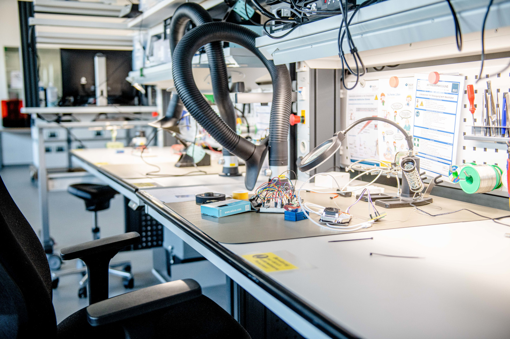

# Digitallabor

Unser Digitallabor ist Deine Anlaufstelle für alles, was [Computer](#it), [Löten](#loeten), [Messen](#messen), [Platinen](#platinen) und andere Digital-Themen betrifft. Hier findest Du, was Du für Entwicklungsarbeiten aus der Informations- und Elektrotechnik brauchst. 

??? question "Wer ist die Ansprechperson fürs Digitallabor?"
	
	--8<--
	th.md
	--8<--

## Das Digitallabor nutzen 

Für die Nutzung des Digitallabors wird die Teilnahme an der [Allgemeinen Sicherheitsunterweisung](unterweisungen.md) und der u.g. Unterweisung ins Digitallabor vorausgesetzt. Für die Nutzung der Computer im Makerspace reicht die Allgemeine Sicherheitsunterweisung aus. 

=== "Unterweisungs-Folien"

	<iframe src="../slides/unterweisung-digitallabor" width="100%" height="430px" style="border: 0.5px solid #003561"></iframe>

	:material-fullscreen:
	<small><a href="../slides/unterweisung-digitallabor" target="_blank">Präsentation in neuem Tab groß anzeigen</a></small>   
	:material-printer:
	<small><a href="../slides/unterweisung-digitallabor/?print-pdf" target="_blank">Druck-Ansicht, z.B. für PDF-Export (nur in Chromium-Browsern, ohne externe Inhalte)</a></small>  
	:material-file-edit: 
	<small><a href="https://git.noc.rub.de/makerspace/homepage/-/blob/main/slides/unterweisung-digitallabor/slides.md" target="_blank">Quelldatei "slides.md" zu den Folien auf Gitlab</a></small>

	--8<--
	howto-slides.md
	--8<--

=== "Betriebsanweisung"

	--8<--
	sicherheit/ba-digitallabor.md
	--8<--

=== "Arbeitsmaterial"

	!!! info "[Zum Arbeitsordner 'Digitallabor' mit weiteren Unterlagen](https://ruhr-uni-bochum.sciebo.de/s/VuFDh7eChe6z1v7?path=%2FDigitallabor)"

	    In diesem Ordner findest Du weitere Unterlagen zum Digitallabor wie z.B. Bedienungsanleitungen und Betriebsanweisungen sowie alle u.g. (Unter-)Arbeitsordner zur Ausstattung im Digitallabor.  
	    Wie immer gilt: Gemeinsam sind wir stärker - wir freuen uns über jeden [Beitrag zur Wissens- und Erfahrungssamlung!](feedback.md)    	

## Computer und IT {: #it }

Ausgehend vom Digitallabor werden - teilweise in Zusammenarbeit mit [IT.Services](https://it-services.ruhr-uni-bochum.de/) - die verschiedenen Computer im Makerspace betreut.

Außerdem kümmert sich das Digitallabor um verschiedene IT-Aufgaben wie diese Website (siehe auch unser [Quellcode auf Gitlab](https://git.noc.ruhr-uni-bochum.de/makerspace/homepage)), die IT-Infrastruktur sowie die Arbeitsgeräte des [Teams](team.md), unser Nutzenden- und [Unterweisungs](unterweisungen.md)management über [Fabman](faq.md#was-ist-fabman), die Software auf den oben genannten Computern oder auch um unsere Lizenz für die [Arduino IoT-Cloud](https://docs.arduino.cc/arduino-cloud/), mit der Du und wir Elektronikprojekte recht einfach online bringen können. Sprich uns bei Bedarf [bitte an](kontakt.md)!

=== "Hardware"

	- [Computerraum](../projektraeume#computerraum) mit 21 Arbeitsplätzen im EG.
	- Laptops: 5x Microsoft Surface mit Stift, mehrere 14" Laptops für allgemeine Arbeiten, 2x 17" Dell "Workstation"-Laptops für 3D-Scan und VR/AR.
	- Auf Anfrage sind jeweils ein iPad (inkl. Apple Pencil) sowie ein Wacom One (Grafiktablet mit Display) und ein älteres Wacom-Grafiktablet verfügbar.
	- Desktops: 5x 27" iMac (10-Core i9, 64GB RAM, Radeon Pro 5700 XT mit Windows 10 via Parallels), 2x Windows Workstations (Dual 4214 12 Core, 64GB RAM, RTX 5000).
	- Einige Desktops sind auf rollbaren Tischen montiert und können an verschiedenen Orten im Makerspace eingesetzt werden.

=== "Software"

	!!! warning "Softwarelizenzen nur für den Bildungsbereich!"
		Alle der unten genannten kommerziellen Softwares dürfen ausschließlich für für Bildungs- und Forschungszwecke verwendet werden. Kommerzielle Nutzung ist untersagt. Für Anwendungen mit kommerziellem Hintergrund müssen eigene Lizenzen angeschafft werden. Diese können nach Bedarf und Absprache mit dem Team auch auf der Makerspace-Hardware installiert werden. 

	**Software auf unterschiedlichen Workstations und Laptops:**

	- Apple Pro Apps (Final Cut Pro, Logic Pro, Motion, Compressor, MainStage).
	- Affinity Suite (Designer, Photo, Publisher).
	- Diverse bereichs-, geräte- und maschinenspezifische Anwendungen (z.B. Artec Studio zum 3D-Scannen auf den Workstation-Laptops).
	- Steam mit diversem (VR-)Content auf der Windows-Workstation im Designlabor und den Workstation-Laptops.
	- Verschiedene der Anwendungen, die auch in unserem Computerraum installiert sind.

	**Software im Computerraum:**

	- Inkscape und InkStitch
	- Arduino IDE v1
	- Autodesk Inventor Professional, Inventor CAM, Fusion 360, Sketchbook, Meshmixer. (*Für alle Autodesk-Produkte ist ein eigener Autodesk-Account mit (Bildungs-)Lizenz erforderlich; sie sind sonst nicht nutzbar.)*
	- Estlcam
	- Vectric Aspire
	- Rhino	
	- PrusaSlicer
	- Cura
	- Fritzing
	- DoBot Studio
	- GIMP 
	- KiCAD
	- Unity
	- Blender
	- Shotcut
	- Android Studio
	- Lego EV3 Classroom Lego Education
	- Lego Mindstorms Robot Inventor
	- Zusätzlich steht die "Standard-Software für PC-Pools" von IT.Services zur Verfügung (Office, 7zip, Firefox, VLC, LaTeX, Matlab und so weiter) 

	!!! info "Nachinstallation von Software"

		- Im Computerraum ist eine Nachinstallation von Software nur mit längerfristiger Voranmeldung möglich. Es sind nicht notwendigerweise immer aktuelle Versionen der Softwares installiert. Die Arbeitsplätze sind virtualisiert und es wird eine RUB-LoginID oder ein Veranstaltungsaccount für Externe (nur mit Vorlauf!) zur Nutzung benötigt. 
		- Auf den weiteren Workstations und Laptops im Makerspace ist eine Nachinstallation von Software nach Absprache möglich.  

=== "Betriebsanweisungen"

	--8<--
	sicherheit/ba-computerraum.md
	sicherheit/ba-it-edv.md
	--8<--

=== "Arbeitsmaterial"

	!!! info "[Zum Arbeitsordner "Computer und IT" mit weiteren Unterlagen](https://ruhr-uni-bochum.sciebo.de/s/VuFDh7eChe6z1v7?path=%2FDigitallabor%2FComputer-und-IT)"

	    In diesem Ordner findest Du weitere Unterlagen zu Computern im Makerspace wie z.B. Bedienungsanleitungen, Betriebsanweisungen, Notizen zu vorinstallierter Software und andere Dinge, die Dir die Arbeit erleichtern sollen.  
	    Wie immer gilt: Gemeinsam sind wir stärker - wir freuen uns über jeden [Beitrag zur Wissens- und Erfahrungssamlung!](feedback.md)

## Löten und allgemeine Elektrolaborarbeiten {: #loeten }

Eine der häufigsten Arbeiten im Digitallabor ist das [Löten](https://de.wikipedia.org/wiki/L%C3%B6ten). Zur Ausstattung gehören mehrere klassische Lötstationen, Lötrauchabsaugungen, eine Heißluft-Lötstation und verschiedenes Lötwerkzeug, wie beispielsweise eine dritte Hand mit beleuchteter Lupe. Aufgebaut sind diese Dinge hauptsächlich auf zwei großen, mobilen Labortischen (siehe Foto oben auf dieser Seite), die für verschiedenste Elektroarbeiten verwendet werden können. Ein "[Klassensatz](#saetze)" von Lötkolben mit kleiner Absaugung, Arbeitsmatte und so weiter zum ortsflexiblen Löten mit Gruppen sind ebenfalls vorhanden. 

=== "Geräte"
	
	- [3x Weller WR2 – Lötstation](https://www.weller-tools.com/professional/EUR/de/Professional/Loettechnik/Loetstationen/Entloetstationen/WR+2)

	- [2x Weller Zero Smog EL – Lötrauchabsaugung](https://www.weller-tools.com/professional/EUR/de/Filtertechnik/Loetrauch/Flaechenabsaugung/1-2+Arbeitsplaetze/Zero+Smog+EL+Kit+1)

	- [RND-560 – Heißluftlötgerät](http://www.rnd-electronics.com)

	- [Weller DSX 80 – Entlötgerät](https://www.weller-tools.com/professional/EUR/de/Professional/Loettechnik/Loetkolben/Entloetkolben/DSX+80)

	- [2x R&S NGE100 – Labornetzgerät](https://www.rohde-schwarz.com/de/produkte/messtechnik/dc-netzgeraete/rs-nge100-netzgeraeteserie_63493-387267.html)

=== "Betriebsanweisungen"

	--8<--
	sicherheit/ba-loeten.md
	sicherheit/ba-gefahrstoffe.md
	--8<--
	
=== "Arbeitsmaterial"

	- [Grundlagen Löten - YouTube-Playlist](https://www.youtube.com/watch?v=Arj34uQoLdM&list=PLXod-KSvITpIYLLHx45ajUlle3YH2IGN9)
	- PDF-Comic [Löten ist einfach](https://mightyohm.com/files/soldercomic/translations/DE_SolderComic.pdf) von von Mitch Altman, Andie Nordgen, Jeff Keyzer, Alexander Bodora und Richard Meinsen	
	
	!!! info "[Zum Arbeitsordner "Löten" mit weiteren Unterlagen](https://ruhr-uni-bochum.sciebo.de/s/VuFDh7eChe6z1v7?path=%2FDigitallabor%2FL%C3%B6ten)"

	    In diesem Ordner findest Du weitere Unterlagen zum Löten wie z.B. Bedienungsanleitungen, Betriebsanweisungen, Vorlagen und Muster, Tutorials und andere Dinge, die Dir die Arbeit erleichtern sollen.  
	    Wie immer gilt: Gemeinsam sind wir stärker - wir freuen uns über jeden [Beitrag zur Wissens- und Erfahrungssamlung!](feedback.md)

## Messen und Prüfen

Um den Fertigungsprozess zu unterstützen, ihre Funktionalität zu überprüfen oder Fehler zu finden, gibt es bei uns verschiedenste Messgeräte. 

=== "Unsere Geräte"

	*Links führen zur Internetseite des Geräte-Herstellers*

	- [AMPROBE 520 - Multimeter](https://www.amprobe.com/product/am-520/) und diverse weitere Multimeter
	- [Rohde&Schwarz RTB2002 - Oszilloskop](https://www.rohde-schwarz.com/de/produkte/messtechnik/oszilloskope/rs-rtb2000-oszilloskop_63493-266306.html)
	- Wärmebildkamera [Fluke Ti401 Pro](https://www.fluke.com/de-de/produkt/waermebildkameras/ti401-pro)
	- Verschiedenste Messgeräte (PH-Wert, Energiekosten, Feuchtigkeit, Waagen, ...)
	- Mikroskope (USB und optisch) und Endoskope

=== "Betriebsanweisungen"

	--8<--
	sicherheit/ba-digitallabor.md
	--8<--

=== "Arbeitsmaterial"
	
	- [Multimeter - Wikipedia](https://de.wikipedia.org/wiki/Multimeter)
	- [Oszilloskop - Wikipedia](https://de.wikipedia.org/wiki/Oszilloskop)
	- [Multimeter-Tutorial - Youtube](https://www.youtube.com/watch?v=_ojBTpmCVJ0&list=PLcjOhSiDq35dRdtlHF_yxtqDqVXqxclI6&index=2)
	- [Oszilloskop-Einführung - Youtube](https://www.youtube.com/watch?v=aRun6Ku-mno)

	!!! info "[Zum Arbeitsordner "Messen und Prüfen" mit weiteren Unterlagen](https://ruhr-uni-bochum.sciebo.de/s/VuFDh7eChe6z1v7?path=%2FDigitallabor%2FMessen-und-Pr%C3%BCfen)"

	    In diesem Ordner findest Du weitere Unterlagen zum Messen wie z.B. Bedienungsanleitungen, Betriebsanweisungen, Vorlagen und Muster, Tutorials und andere Dinge, die Dir die Arbeit erleichtern sollen.  
	    Wie immer gilt: Gemeinsam sind wir stärker - wir freuen uns über jeden [Beitrag zur Wissens- und Erfahrungssamlung!](feedback.md)

## Platinen herstellen {: #platinen }

Mit unserem Platinendrucker kannst Du Leiterplatten bedrucken, löten, backen und bohren. Die Druckplatte bietet Dir einen Raum von bis zu 128mm x 116mm, um Deine Platinenzeichnung auf eine Leiterplatte zu drucken, notwendige Bohrungen durchführen zu lassen und Bauteile zu verlöten. 

Außerdem ist es möglich, die [Desktop-Fräse](kunststoffwerkstatt.md#cnc-bearbeitung) aus der Kunststoffwerkstatt zum [Isolationsfräsen](https://wiki.edu.vn/wiki10/2020/12/11/leiterplattenfrasen-wikipedia/) zu nutzen. Hierbei stehen Dir ein Arbeitsraum von 203,2 x 152,4 x 60,5mm sowie passende Fräser, Gravierstichel und Bohrer zur Verfügung.

??? abstract "Besonderheiten Voltera-Platinendrucker"

   	Ziel des Gerätes ist zwar das Rapid Prototyping von Platinen, allerdings zeigt unsere bisherige Erfahrung, dass die Maschine durchaus temperamentvoll ist und das Drucken mit flüssiger Tinte sowie die weiteren Prozessschritte durchaus einiges an Fehlerpotenzial in sich tragen. So ist das leider manchmal mit neuartigen Geräten und Verfahren. Wir empfehlen daher momentan nicht, sich für zeitkritische Anwendungen auf das Gerät zu verlassen und sehen es eher als interessantes Forschungsgerät und durchaus auch für alternative Anwendungen, zum Beispiel beim hochpräzisen Dosieren von Flüssigkeiten.

=== "Geräte"

	*Links führen zur Internetseite des Geräte-Herstellers*
	
	- [Voltera V-One](https://www.voltera.io/store/v-one)
	- [Roland SRM-20 Desktop-CNC-Fräse](https://www.rolanddg.eu/de/produkte/3d/srm-20-small-milling-machine)

=== "Betriebsanweisungen"

	--8<--
	sicherheit/ba-platinendrucker.md
	sicherheit/ba-gefahrstoffe.md
	--8<--

=== "Arbeitsmaterial"

	- [Platinendrucker Voltera V-One Support / Anleitung](https://support.voltera.io/)
	- [Workshop "Platinendrucker"](#ws-platinendrucker)
	- Für den Platinendruck werden Daten im [Gerber-Format - Wikipedia](https://de.wikipedia.org/wiki/Gerber-Format) benötigt, die mit allen gängigen Werkzeugen zum Entwickeln von Platinen erzeugt werden können ([KiCad](https://www.kicad.org) ist eine quelloffene Software zum Platinendesign) 
	- Für Verbrauchsmaterial siehe ["Consumables" im Voltera-Store](https://www.voltera.io/store/consumables)

	!!! info "[Zum Arbeitsordner "Platinendrucker" mit weiteren Unterlagen](https://ruhr-uni-bochum.sciebo.de/s/VuFDh7eChe6z1v7?path=%2FDigitallabor%2FPlatinen-Drucker%20Voltera%20V-One)"

	    In diesem Ordner findest Du weitere Unterlagen zum Platinendrucker wie z.B. Bedienungsanleitungen, Betriebsanweisungen, Vorlagen und Muster, Tutorials und andere Dinge, die Dir die Arbeit erleichtern sollen.  
	    Wie immer gilt: Gemeinsam sind wir stärker - wir freuen uns über jeden [Beitrag zur Wissens- und Erfahrungssamlung!](feedback.md)

	!!! info "[Zum Arbeitsordner "Desktop-CNC-Fräsen" mit weiteren Unterlagen](https://ruhr-uni-bochum.sciebo.de/apps/files/?dir=/RUB-Makerspace%20%C3%96FFENTLICH/Kunststoffwerkstatt/Desktop-CNC_Roland_SRM-20&fileid=997380343)"

	    In diesem Ordner findest Du weitere Unterlagen zu unseren Desktop-CNC-Fräsen wie z.B. Bedienungsanleitungen, Betriebsanweisungen, Vorlagen und Muster, Tutorials und andere Dinge, die Dir die Arbeit erleichtern sollen.  
	    Wie immer gilt: Gemeinsam sind wir stärker - wir freuen uns über jeden [Beitrag zur Wissens- und Erfahrungssamlung!](feedback.md)	 

## Platinen bestücken

Mittelfristig wird es möglich sein, Platinen im Digitallabor automatisiert mit Bauteilen zu bestücken. Die dafür erforderliche Pick-and-Place-Maschine ist in Beschaffung. Zubehör zum Aufbringen von Lotpaste auf Platinen mittels Schablonen ist bereits vorhanden und wir ziehen in Erwägung, noch eine manuelle Platzierhilfe für Bauteile zu beschaffen oder zu bauen. 

**Unsere Geräte (*Links führen zur Internetseite der Hersteller*):** 

 - [Opulo LumenPnP](https://opulo.io/products/lumenpnp) (in Beschaffung)
 - 10x automatische Feeder

## Reflow-Ofen

In unserem kleinen, digital gesteuerten Ofen können Platinen mit dem [Reflow-Lötverfahren](https://de.wikipedia.org/wiki/Reflow-L%C3%B6ten) verlötet werden. Bei diesem werden Bauteile nicht mit Lötzinn in Drahtform einzeln aufgelötet, sondern mit Lotpaste auf eine Platine aufgebracht und dann - komplett bestückt - im Ofen verlötet. Auch für Reparatur-Arbeiten an existierenden Platinen, bei denen der Verdacht besteht, dass sich Lötstellen gelöst haben, kann sich ein Reflow-Ofen eignen.

**Unsere Geräte (*Links führen zur Internetseite der Hersteller*):** 

- [Beta Layout Reflow Kit V3 Pro](https://de.beta-layout.com/elektronik-shop/reflow-loeten/10590-reflow-kit-v3-pro/)

## Ausleihe und Klassen-/Gruppensätze {: #saetze }

Neben der grundsätzlichen Möglichkeit der [Ausleihe](ausleihe.md) des Digitallabor-Equipments haben wir noch einige Spezialitäten im Angebot. 

Zum einen können wir für Workshops und Veranstaltungen unseren **mobilen Daten-Hotspot** "[Freifunk](https://freifunk.net/)-in-a-Box" mit Flatrate verleihen - dies jedoch nur für Hochschulangehörige.  

Außerdem bieten wir verschiedene Hardware als **Klassen- beziehungsweise Gruppensätze** zur Ausleihe an. Nach [Absprache](kontakt.md) können auch passende Einweisungen für lehrende oder gruppenleitende Personen nach dem Motto *train the trainers* erfolgen.

**Unsere Klassen- und Gruppensätze:**

- Mobiles Löten: 11x [Lötkolben "Pinecil"](https://pine64.com/product/pinecil-smart-mini-portable-soldering-iron/), Absaugung und diverses Zubehör in rollbarer Kiste.
- Laptops: Unsere unter [Computer und IT](#it) gelisteten Laptops in einem stabilen Rollkoffer, in dem sie auch geladen werden können.
- [Calliope Mini](https://calliope.cc/): 1x [Klassensatz Grundschule](https://cornelsen-experimenta.de/shop/de/Grundschule/Coding%20-%20Robotik/Microcontroller%20Calliope%20mini/21820-Calliope+mini+Klassensatz+Grundschule.html) bestehend aus 20 Stück. Kann nach Bedarf mit zusätzlichen Komponenten für andere Klassenstufen erweitert werden.
- [Adafruit Circuit Playground Express](https://learn.adafruit.com/adafruit-circuit-playground-express/): 10 Stück inkl. USB-Kabel und weiteren Komponenten nach Bedarf für 10 - 30 Personen.
- Weitere Sätze können nach Bedarf individuell zusammengestellt werden.

## Material, Teile und Zubehör

Im Digitallabor sind oft benötigte Materialien aus der Computer- und Elektrotechnik vorrätig. Dies betrifft insbesondere 

- Verbrauchsmaterial (Litze, Lötmaterial...).
- IT-Zubehör (Adapter, Kabel, Speichermedien...).
- Standardbauteile (LEDs, Widerstände, Netzteile...).
- Microcontroller und Einplatinencomputer (zum Beispiel diverse Arduinos, Raspberry Pis, BBC micro:bit, Adafruit Circuit Playground Express, D1, ESP8266, ESP32...).
- Verschiedenste "Breakout"-Boards und Zubehörteile für Microcontroller.
- Verschiedenste Sensorik und Aktorik, zum Beispiel zum Anschluss an Microcontroller.
- Diverse Hardware zum Ausschlachten. Es gibt auch eine "Löten Lernen"-Kiste für defekte Dinge, die sich aber noch gut zum Lernen/Ausprobieren verschiedener Lötarbeiten eignen.

## Workshops

Hier findest Du einige unserer Workshops, die wir auf Anfrage für Gruppen anbieten können. Wir haben weitere Formate, z.B. zu [CAD](https://de.wikipedia.org/wiki/CAD) oder zum Löten im Programm, die wir nach und nach auch hier auf der Website als [offene Bildungsressourcen](https://de.wikipedia.org/wiki/Open_Educational_Resources) abbilden werden. Außerdem kannst Du uns gern in Sachen Entwicklung neuer Workshop-Formate als [Dienstleistung](dienstleistungen.md) oder im Rahmen einer anderen Form der [Kooperation](zielgruppen.md) [ansprechen](kontakt.md). 

### Luftdatensensor bauen {: #ws-luftdaten }

=== "Über den Workshop"

	Ein ca. halbtägiges Format, in dem Menschen sich ihren eigenen Luftdaten-Sensor auf Basis des Projektes [Sensor.community](https://sensor.community) bauen und diesen dann mit nach Hause nehmen können. 

	Der Workshop kann auf [Anfrage](kontakt.md) für Gruppen von bis zu 20 Personen durchgeführt werden. Es entstehen Kosten für die Hardware und je nach [Zielgruppe](zielgruppen.md) auch für die [Durchführung](dienstleistungen.md). 

=== "Unterlagen zum Workshop"

	<iframe src="../slides/ws-luftdaten" width="100%" height="430px" style="border: 0.5px solid #003561"></iframe>

	:material-fullscreen:
	<small><a href="../slides/ws-luftdaten" target="_blank">Präsentation in neuem Tab groß anzeigen</a></small>   
	:material-printer:
	<small><a href="../slides/ws-luftdaten/?print-pdf" target="_blank">Druck-Ansicht, z.B. für PDF-Export (nur in Chromium-Browsern, ohne externe Inhalte)</a></small>  
	:material-file-edit: 
	<small><a href="https://git.noc.rub.de/makerspace/homepage/-/blob/main/slides/ws-luftdaten/slides.md" target="_blank">Quelldatei "slides.md" zu den Folien auf Gitlab</a></small>

	--8<--
	howto-slides.md
	--8<--

### Basics Microcontroller {: #ws-microcontroller }

=== "Über den Workshop"

	Eine Einführung in (Mikro-)Elektronik und Programmierung auf der Basis von [Arduino](https://arduino.cc) und anderen auf den Bildungsbereich zugeschnittenen Ökosystemen für Hard- und Software-Entwicklung.

	Der Workshop kann auf [Anfrage](kontakt.md) für Gruppen von bis zu 20 Personen durchgeführt werden. Es entstehen je nach [Zielgruppe](zielgruppen.md) Kosten für die [Durchführung](dienstleistungen.md). 

=== "Unterlagen zum Workshop"	

	<iframe src="../slides/ws-microcontroller" width="100%" height="430px" style="border: 0.5px solid #003561"></iframe>

	:material-fullscreen:
	<small><a href="../slides/ws-microcontroller" target="_blank">Präsentation in neuem Tab groß anzeigen</a></small>   
	:material-printer:
	<small><a href="../slides/ws-microcontroller/?print-pdf" target="_blank">Druck-Ansicht, z.B. für PDF-Export (nur in Chromium-Browsern, ohne externe Inhalte)</a></small>  
	:material-file-edit: 
	<small><a href="https://git.noc.rub.de/makerspace/website/-/blob/main/slides/ws-microcontroller/slides.md" target="_blank">Quelldatei "slides.md" zu den Folien auf Gitlab</a></small>

	--8<--
	howto-slides.md
	--8<--

## Sensordaten

Wir haben im Makerspace an verschiedenen Stellen (Umwelt-)Sensoren ausgebracht beziehungsweise arbeiten daran. Es handelt sich hauptsächlich um Luftdatensensoren nach [sensor.community](https://sensor.community) (Partikelbelastung, Luftfeuchtigkeit, Temperatur).

!!! important "Zur Datenqualität"
	Es handelt sich hier um automatisiert erfasste, völlig unbereinigte Daten auf Basis von Do-It-Yourself-Lösungen mit günstigen Bauteilen, nicht um geprüfte Messwerte! Ein Beispiel: Die angezeigten Temperaturmesswerte sind grundsätzlich höher als die tatsächliche Raumtemperatur, was an der Abwärme der verbauten Elektronik liegt. Außerdem laufen die Sensoren nicht dauerhaft, verlieren auch mal die Verbindung oder werden versehentlich ausgesteckt. Behalte dies bitte bei der Betrachtung dieser Daten im Hinterkopf!

#### Designlabor (Ecke Teeküche)

??? info "Temperatur und Luftfeuchtigkeit" 
	<iframe src="https://api-rrd.madavi.de/grafana/d/q87EBfWGk/temperature-humidity-pressure?var-chipID=esp8266-13861846&var-type=DHT22&var-query0=sensors&orgId=1&kiosk=tv" width="100%" height="430px" frameBorder="0"></iframe>  

	[Link zu diesem Dashboard](https://api-rrd.madavi.de/grafana/d/q87EBfWGk/temperature-humidity-pressure?var-chipID=esp8266-13861846&var-type=DHT22&var-query0=sensors&orgId=1)

??? info "Partikelbelastung" 
	<iframe src="https://api-rrd.madavi.de/grafana/d/GUaL5aZMz/pm-sensors?orgId=1&theme=light&var-chipID=esp8266-13861846&kiosk=tv" width="100%" height="430px" frameBorder="0"></iframe> 

	[Link zu diesem Dashboard](https://api-rrd.madavi.de/grafana/d/GUaL5aZMz/pm-sensors?orgId=1&theme=light&var-chipID=esp8266-13861846)

Im Designlabor ist außerdem ein Multifunktionssensor ausgebracht (Partikel, CO, Temperatur, Luftfeuchtigkeit, Helligkeit, Geräuschpegel). Messdaten gibt es [hier über die Arduino IoT-Cloud](https://create.arduino.cc/iot/dashboards/507eadcf-834f-43e2-840b-7aa5938c01a0). Leider ist der Zugriff nur mit Account und Einladung durch uns möglich.

#### Holzwerkstatt

??? info "Temperatur und Luftfeuchtigkeit" 
	<iframe src="https://api-rrd.madavi.de/grafana/d/q87EBfWGk/temperature-humidity-pressure?var-chipID=esp8266-3532227&var-type=DHT22&var-query0=sensors&orgId=1&kiosk=tv" width="100%" height="430px" frameBorder="0"></iframe>  

	[Link zu diesem Dashboard](https://api-rrd.madavi.de/grafana/d/q87EBfWGk/temperature-humidity-pressure?var-chipID=esp8266-3532227&var-type=DHT22&var-query0=sensors&orgId=1)

??? info "Partikelbelastung" 
	<iframe src="https://api-rrd.madavi.de/grafana/d/GUaL5aZMz/pm-sensors?orgId=1&theme=light&var-chipID=esp8266-3532227&kiosk=tv" width="100%" height="430px" frameBorder="0"></iframe>  	

	[Link zu diesem Dashboard](https://api-rrd.madavi.de/grafana/d/GUaL5aZMz/pm-sensors?orgId=1&theme=light&var-chipID=esp8266-3532227)

#### Metallbauwerkstatt (Schweißecke)

??? info "Temperatur und Luftfeuchtigkeit" 
	<iframe src="https://api-rrd.madavi.de/grafana/d/q87EBfWGk/temperature-humidity-pressure?var-chipID=esp8266-3502148&var-type=DHT22&var-query0=sensors&orgId=1&kiosk=tv" width="100%" height="430px" frameBorder="0"></iframe>  

	[Link zu diesem Dashboard](https://api-rrd.madavi.de/grafana/d/q87EBfWGk/temperature-humidity-pressure?var-chipID=esp8266-3502148&var-type=DHT22&var-query0=sensors&orgId=1)

??? info "Partikelbelastung" 
	<iframe src="https://api-rrd.madavi.de/grafana/d/GUaL5aZMz/pm-sensors?orgId=1&theme=light&var-chipID=esp8266-3502148&kiosk=tv" width="100%" height="430px" frameBorder="0"></iframe>  	

	[Link zu diesem Dashboard](https://api-rrd.madavi.de/grafana/d/GUaL5aZMz/pm-sensors?orgId=1&theme=light&var-chipID=esp8266-3502148)

#### Kunststoffwerkstatt

??? info "Temperatur und Luftfeuchtigkeit" 
	<iframe src="https://api-rrd.madavi.de/grafana/d/q87EBfWGk/temperature-humidity-pressure?var-chipID=esp8266-651719&var-type=DHT22&var-query0=sensors&orgId=1&kiosk=tv" width="100%" height="430px" frameBorder="0"></iframe>  

	[Link zu diesem Dashboard](https://api-rrd.madavi.de/grafana/d/q87EBfWGk/temperature-humidity-pressure?var-chipID=esp8266-651719&var-type=DHT22&var-query0=sensors&orgId=1)

??? info "Partikelbelastung" 
	<iframe src="https://api-rrd.madavi.de/grafana/d/GUaL5aZMz/pm-sensors?orgId=1&theme=light&var-chipID=esp8266-651719&kiosk=tv" width="100%" height="430px" frameBorder="0"></iframe>  

	[Link zu diesem Dashboard](https://api-rrd.madavi.de/grafana/d/GUaL5aZMz/pm-sensors?orgId=1&theme=light&var-chipID=esp8266-651719)

#### Außenbereich Innenhof

??? info "Temperatur und Luftfeuchtigkeit" 
	<iframe src="https://api-rrd.madavi.de/grafana/d/q87EBfWGk/temperature-humidity-pressure?var-chipID=esp8266-5431914&var-type=DHT22&var-query0=sensors&orgId=1&kiosk=tv" width="100%" height="430px" frameBorder="0"></iframe>  

	[Link zu diesem Dashboard](https://api-rrd.madavi.de/grafana/d/GUaL5aZMz/pm-sensors?orgId=1&theme=light&var-chipID=esp8266-5431914&var-type=DHT22&var-query0=sensors&orgId=1)

??? info "Partikelbelastung" 
	<iframe src="https://api-rrd.madavi.de/grafana/d/GUaL5aZMz/pm-sensors?orgId=1&theme=light&var-chipID=esp8266-5431914&kiosk=tv" width="100%" height="430px" frameBorder="0"></iframe> 

	[Link zu diesem Dashboard](https://api-rrd.madavi.de/grafana/d/GUaL5aZMz/pm-sensors?orgId=1&theme=light&var-chipID=esp8266-5431914)
	

## Vielleicht in Zukunft...

!!! question "Hast Du [Feedback](feedback.md) zum Ausbau des Digitallabors? Möchtest Du den Aufbau der hier genannten Dinge [unterstützen](unterstuetzung.md)? Bist Du ein Hersteller für DAS Gerät schlechthin in einem unserer Arbeitsbereiche und bist interessiert an einem  [Test- oder Demo-Standort](unterstuetzung.md#demozentrum)? Hast Du andere Gedanken zum Thema? [Sprich uns an!](kontakt.md)"
