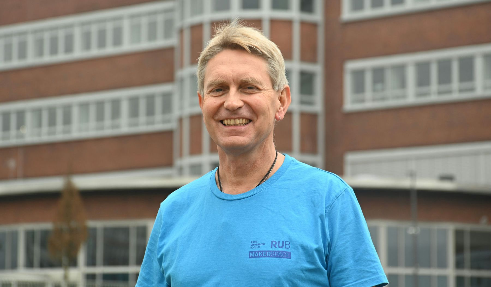

#### Dietmar Krukowski {: #dk }

=== "Über mich"

	>"Hi, mein Name ist Dietmar. Im Makerspace der RUB bin ich Werkstattleiter der [Metallbauwerkstatt](metallbauwerkstatt.md). Wenn es um das Thema Metall geht bin ich gern Euer Ansprechpartner. Als ehemaliger Opelaner hier auf dem Gelände habe ich die Entwicklung der Industrie hautnah miterlebt und viele Erfahrungen in Technik und später in der Ausbildung sammeln können. Ich freue mich schon darauf Euch bei Euren Projekten zu unterstützen und voranzubringen."

=== "Kontakt"

	- [Kontaktiere uns als Team](kontakt.md)
	- [Persönliche Kontaktdaten Dietmar Krukowski im Verzeichnis der RUB](https://einrichtungen.ruhr-uni-bochum.de/de/dietmar-krukowski)

=== "Hintergrund"

	- Ausbilder von Umschüler\*innen Metallbereich beim BFZ in Essen [BFZ Essen GmbH](https://bfz-essen.de)
	- Prüfungsausschussmitglied der IHK Essen für Industriemechaniker\*innen und Zerspanungsmechaniker\*innen
	- Ausbilder für Industriemechaniker\*innen in der Lehrwerkstatt der Adam Opel AG
	- langjährige Erfahrungen als Instandhaltungsmitarbeiter der Adam Opel AG
	- viel Erfahrung in CNC- und konventionellem Fräsen
	- Tool Experte der TCM International Tool Consulting und Management 
