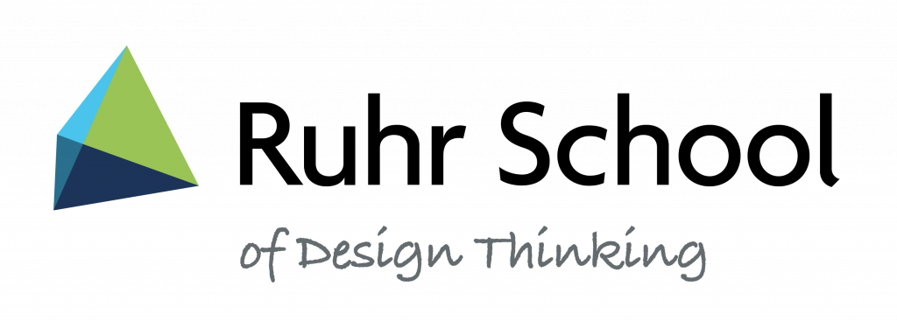

# Projects and Third-Party Funding

The Makerspace is actively engaged in project work and acts as a partner in third-party projects for teaching, research, and transfer. If you are interested in collaborating with us on a project, please do not hesitate to [contact us](kontakt.en.md)!

## Worldfactory Startup Center {: #worldfactory }

The RUB has reoriented its transfer area and consolidated new forms of cooperation between business and science, as well as specific support for student projects and start-up activities under the umbrella concept of ['Worldfactory'](https://www.worldfactory.de/en/). The Worldfactory Start-up Center is funded by the state of NRW as an ['Excellenz Start-up Center'](https://www.exzellenz-start-up-center.nrw/) until the end of 2024, and has various sub-projects. The establishment of the large Makerspace in the O-Werk is the largest [sub-project of the Worldfactory](https://www.worldfactory.de/fokusthemen/makerspace).

[{ width="45%" }](https://www.worldfactory.de/fokusthemen/makerspace)
[{ width="40%" }](https://www.exzellenz-start-up-center.nrw/)

## Maker in Residence

Our own project *[Maker in Residence](mir.en.md)* aims to bring innovative multipliers to the Ruhr region, who will then work as "residents" at the Makerspace for a certain period of time and offer workshops and other educational formats, create works together with our users, and "bring fresh ideas". The project is funded by donations - once enough funds have been raised, there will be a call for "residents".

## MentorInn {: #mentorinn }

The MentorInn project arose from good cooperation between the University of Duisburg-Essen, the Technical University of Dortmund, and the Ruhr-University on the topic of [Design Thinking](https://en.wikipedia.org/wiki/Design_thinking) in teaching. Under the brand name [Ruhr School of Design Thinking](http://ruhrschool.de/), MentorInn gives the three universities the opportunity to think further and open up their innovative teaching together.

## MakerForum

The project "MakerForum" in the UFO on campus was the precursor to the large RUB Makerspace. It was funded by [Hochschulpaktmittel zur Verbesserung von Studium und Lehre (Higher Education Pact-funds for the improvement of studies and teaching)](https://www.land.nrw/pressemitteilung/hochschulvereinbarung-gibt-planungssicherheit-250-millionen-euro-fuer-nrw). 
