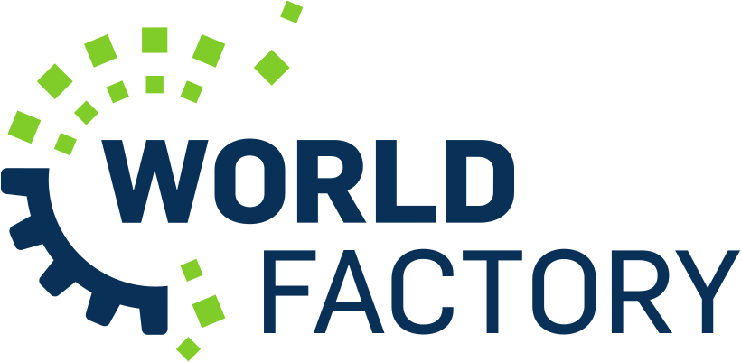
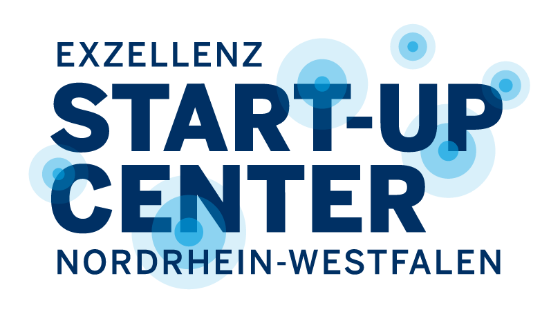
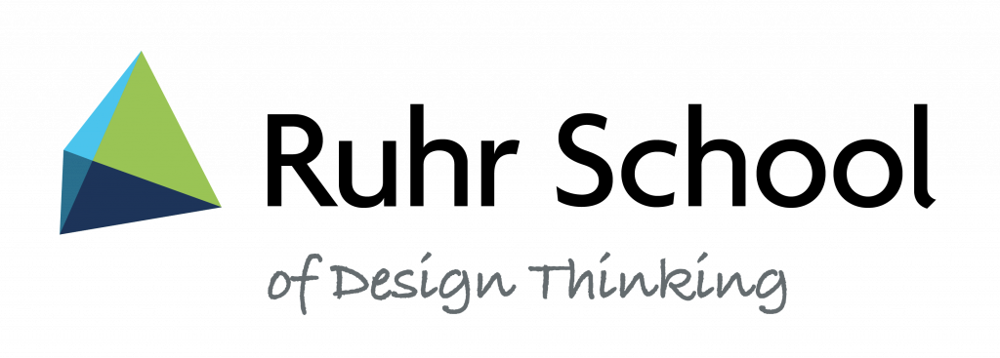

# Projekte und Drittmittel

Der Makerspace ist im Projektbereich aktiv und tritt zum Beispiel als Partner in Drittmittelprojekten aus Lehre, Forschung und Transfer auf. Sprich uns bei Kooperationsinteresse zu einem Projektvorhaben [gerne jederzeit an](kontakt.md)!

## Worldfactory Start-up Center {: #worldfactory }

Die RUB hat ihren Transferbereich neu ausgerichtet und unter dem Dachkonzept ['Worldfactory'](https://www.worldfactory.de) neue Formen der Kooperation zwischen Wirtschaft und Wissenschaft, der spezifischen Unterstützung studentischer Projekte sowie von Gründungsaktivitäten gebündelt. Das Worldfactory Start-up-Center wird als konkretes Projekt noch bis Ende 2024 vom Land NRW als ['Excellenz Start-up Center'](https://www.exzellenz-start-up-center.nrw/) gefördert und hat verschiedene Teilprojekte. Der Aufbau des großen Makerspaces im O-Werk ist das größte [Teilprojekt der Worldfactory](https://www.worldfactory.de/fokusthemen/makerspace). 

[{ width="45%" }](https://www.worldfactory.de/fokusthemen/makerspace)
[{ width="40%" }](https://www.exzellenz-start-up-center.nrw/)

## Maker in Residence

Unser eigenes Projekt *[Maker in Residence](mir.md)* soll innovative Multiplikatoren ins Ruhrgebiet bringen, die dann als "residents" eine gewisse Zeit im Makerspace tätig sind und von dort aus zum Beispiel Workshops und andere Bildungsformate anbieten, Werke gemeinsam mit unseren Nutzenden schaffen und "frischen Wind reinbringen". Gefördert wird das Projekt durch Spendenmittel – sobald genug davon zusammengekommen sind, findet jeweils eine Ausschreibung für "residents" statt. 

## MentorInn {: #mentorinn }

Das Projekt MentorInn ist aus guter Zusammenarbeit der Universität Duisburg-Essen, der TU Dortmund und der Ruhr-Universität zum Thema [Design Thinking](https://de.wikipedia.org/wiki/Design_Thinking) in der Lehre entstanden. Unter der Marke [Ruhr School of Design Thinking](http://ruhrschool.de/) gibt *MentorInn* den drei Hochschulen die Möglichkeit, ihre innovative Lehre noch weiter gemeinsam zu denken und zu öffnen. 

## MakerForum

Das Projekt "MakerForum" im UFO auf dem Campus war die Vorstufe zum großen RUB-Makerspace. Gefördert wurde es durch [Hochschulpaktmittel zur Verbesserung von Studium und Lehre](https://www.land.nrw/pressemitteilung/hochschulvereinbarung-gibt-planungssicherheit-250-millionen-euro-fuer-nrw). 
