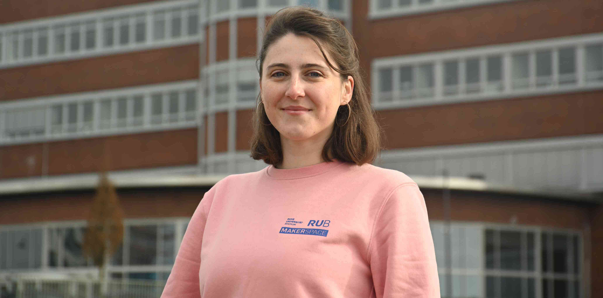

#### Elena Blazquez {: #eb }

=== "About Me"
	
	>"I'm Elena and I'm responsible for the [Textile Lab](textillabor.en.md) and the [Kitchen Lab](kuechenlabor.en.md). As a designer, I am available to advise you on your projects and help you to think outside the box in the process. 
	> 
	> My design focus is mainly on the conception and creation of experimental objects, mostly linked with textile techniques. Thanks to my industrial design studies I am familiar with different materials and approaches in the design process. I also feel at home in graphic design due to my bachelor's degree in communication design, and I provide support in the area of public relations."

=== "Contact"

	- [Contact us as a team](kontakt.en.md)
	- [Personal contact information of Elena Blazquez in the RUB directory](https://einrichtungen.ruhr-uni-bochum.de/en/node/774)

=== "Background"

	- B.A. Communication Design at the Folkwang University of Arts
	- M.A. Industrial Design at the Folkwang University of Arts
	- Freelance designer - more info at [www.elenablazquez.de](https://elenablazquez.de/)

