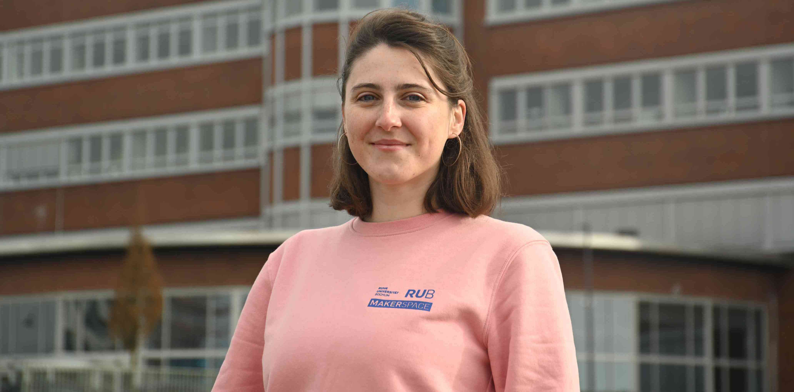

#### Elena Blazquez {: #eb }

=== "Über mich"
	
	>"Ich bin Elena und bin für das [Textillabor](textillabor.md) und das [Küchenlabor](kuechenlabor.md) zuständig. Als Designerin stehe ich Dir beratend bei deinen Projekten zur Seite und helfe Dir dabei, im Prozess auch mal um die Ecke zu denken. 
	> 
	> Mein gestalterischer Schwerpunkt liegt vor allem  in der Konzeption und Erstellung experimenteller Objekte, meist verknüpft mit textilen Techniken. Durch mein Industriedesignstudium bin ich mit verschiedenen Materialien und Herangehensweisen im Designprozess vertraut. Auch im Grafikdesign fühle ich mich durch den Bachelor im Fach Kommunikationsdesign zuhause und bin unterstützend im Bereich Öffentlichkeitsarbeit tätig."

=== "Kontakt"

	- [Kontaktiere uns als Team](kontakt.md)
	- [Persönliche Kontaktdaten Elena Blazquez im Verzeichnis der RUB](https://einrichtungen.ruhr-uni-bochum.de/de/elena-blazquez)

=== "Hintergrund"

	- B.A. Kommunikationsdesign an der Folkwang Universität der Künste
	- M.A. Industriedesign an der Folkwang Universität der Künste
	- Freiberufliche Designerin – mehr Infos unter [www.elenablazquez.de](https://elenablazquez.de/)

