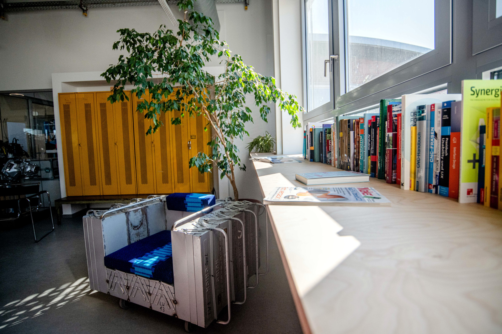
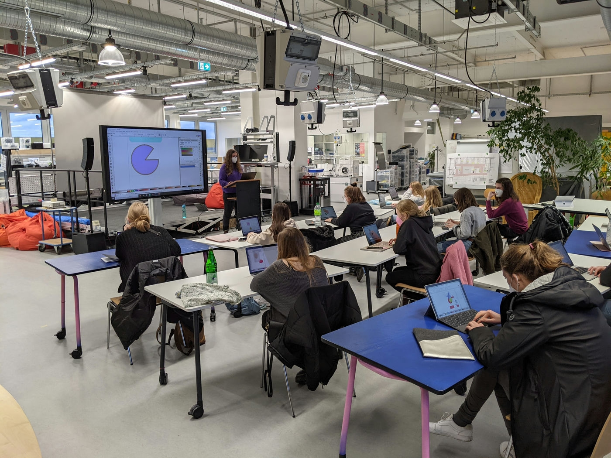

# FAQ - Frequently Asked Questions

 

### Open to Everyone? 

The RUB Makerspace is an open space for creative work. We want everyone to feel welcome and safe (regardless of origin, religion, sexual orientation, gender identity, physical or mental conditions or education - the Makerspace is colorful). Therefore, we ask all our visitors to help us create an atmosphere where everyone feels comfortable and safe. 

### What Exactly Can I Do in the Makerspace?

The RUB Makerspace is a place for (idea) development, exchange and creative DIY. Here you can meet like-minded people, learn together, work collaboratively or independently on projects and create things. We offer you space, tools, machines, materials as well as advice and support for hands-on work. In our cozy co-working spaces, you can also become part of the creative maker community without the workshop-like work. 

 

#### Examples of Possible Projects

In the Makerspace I can...

- potter a vase or 3D print from clay,
- produce a film or take professional product photos,
- print or embroider a t-shirt
- knit a fan scarf,
- program a microcontroller and use it to control a motor or display,
- build a prototype for the business idea of the next super start-up,
- improve ideas in a design thinking workshop,
- make a casting mold,
- digitize an artifact from a museum collection via 3D scan,
- program a VR application that always shows me the nearest kiosk,
- conduct an experiment for my bachelor thesis,
- ...
- think through and implement countless other projects! 

If you are interested in what has been created in the Makerspace so far, check out our [project page](projekte.en.md)!

### Which Subject Areas Are Represented in the Makerspace?

The Makerspace has a large number of different areas, all of which are being put into operation piece by piece. Under [work areas and equipment](ort.en.md) you can find more details - the most important areas in short:

- Design Lab - with, for example, 3D printers and laser cutters for rapid prototyping but also robotics, virtual and augmented reality technology.
- Media Lab - with the possibility to take and edit photos or produce films, also with a 360° camera or a drone.
- Textile Lab - for sewing, embroidery, knitting and a transfer press for fabric printing.
- Stage - for lectures, events, fashion shows or pitches.
- Co-Working Area and various project rooms - where work can be done individually or in groups.
- Wood Workshop - with, for example, the possibility to work wood with a milling machine or to press panels.
- Metal Workshop - where you can do some welding, turning or milling.
- Digital Lab - where you can learn, for example, soldering or how to use microcontrollers.
- Computer Room - for events or for learning CAD software, for example, as well as a seminar room for teaching or workshops.
- Various other smaller workshop areas - for example, for pottery, screen printing, plastic thermoforming, or vacuum casting.
- Two mobile Makerspaces - with which we will also be on the road in Bochum and the surrounding area to bring making to the people.
- A large outdoor area - for everything from events to working to chilling out.

### Are All Rooms and Workshops Available for Use? 

No, the development of the Makerspace is an ongoing project, and only certain areas are currently available for use. [Structual circumstances](wasserschaden.en.md) have also impacted the availability of our facilities. Additionally, the development of the Makerspace is being carried out in stages, with a focus on creating common areas and space for basic, relatively safe procedures first, before moving on to larger, more complex, and expensive procedures and areas.

This approach ensures that we can prioritize the safety of our users and provide them with the necessary support and resources for their projects. As we gain more experience with the equipment and procedures in our Makerspace, we can make adjustments to our plans and improve our facilities accordingly. We are committed to creating a safe and supportive environment for makers of all levels, and we appreciate your understanding as we continue to build and improve the Makerspace.

More information at [status](status.en.md).

### Am I Part of Your "Target Group"?

If you've made it this far, the answer is YES. Makerspaces, Fab Labs and similar places see themselves as open workshops. Accordingly, the target group of the RUB Makerspace also includes all people in and outside the Ruhr-Universität who want to build, make or have something to do with the community, the infrastructure, the devices and machines or the creative environment of the Makerspace.  

### Children and Young People in the Makerspace?

Children and young people are also welcome to visit us in the Makerspace in the future. They can already participate in events as guests. However, they may only be in the Makerspace in the presence of a parent or guardian. Activities in the workshops are only possible in individual cases and also only after individual consultation with the staff. 

### Can I bring my pets to the Makerspace?

Unfortunately, pets such as dogs and cats are not allowed in the Makerspace, except for guide dogs that assist people with disabilities. 

### How much does it cost to use the Makerspace?

Currently, there is no charge for using the Makerspace as we are funded by the state of North Rhine-Westphalia. However, please note that the funding will eventually expire, and fees may be introduced in the future for using the Makerspace or other services. We will provide ample notice before any changes are made to our pricing structure. We remain committed to providing an affordable and accessible space for makers of all levels, and we will do our best to keep our fees reasonable and transparent.

### Can I Use the Makerspace for My Teaching/Research?

Yes! After consultation with us, we are happy to offer you our space, equipment and support for your seminar or research. 

### Can I operate the equipment and machines at the Makerspace myself?

Absolutely! That is the primary purpose of the Makerspace. However, please note that working with our equipment and machines can be dangerous if not used properly, and could potentially harm you or others in the Makerspace. For this reason, we require all makers to attend [safety instructions](unterweisungen.en.md) before working independently with the equipment. Depending on the area you wish to work in, you may also need to meet other requirements, which will be explained during the safety instructions.

It is important to note that the meaning of "independent" may vary depending on the context. For example, independent use of a screwdriver may require less preparation than independent use of a large milling machine. We prioritize the safety of our makers and want to ensure that everyone can work in a safe and supportive environment.

### Can I Bring My Own Machines?

For safety reasons, bringing your own machines to the Makerspace is only permitted in exceptional cases and with prior notification to and approval from our staff. Before you can use your own machine in our facilities, it will need to be inspected and tested by our staff to ensure that it is safe to operate and will not pose a risk to you or others in the Makerspace. 

### What is "Fabman"? {: #fabman }

[Fabman](https://fabman.io/) is a makerspace management system. We use it to control access to certain equipment and machines so that only instructed people can use them, and so that we can record machine run times and the like for maintenance purposes. This helps us ensure the safety of everyone in the makerspace. Fabman consists of a software system for management and so called "bridges" - the little black boxes with displays that you can see on various of our machines.

Once you have completed your General Safety Training, you will receive a ID card that will allow you to use the "Bridges" to turn on all the machines and devices for which you have completed the appropriate training. 

### Are there rules that I need to follow at the Makerspace??

Yes, in order to maintain a safe and productive environment for all makers, we have established certain ground rules. These rules are outlined in our [User Guidelines](sicherheit.en.md#nutzendenordnung), which cover important topics such as safety, equipment use, and proper conduct in the Makerspace.

Additionally, we provide other important information about rules and safety on our website under the [Safety and Rules](sicherheit.en.md) section. This includes an overview flyer on safety and a map that shows the locations of important items such as first aid supplies and fire alarms. We ask all makers to familiarize themselves with these guidelines and follow them at all times to help ensure a safe and positive experience for everyone in the Makerspace.

### What About Internet in the Makerspace? {: #wlan }

- In the Makerspace there is wifi [Eduroam](https://noc.rub.de/web/wlan) like at all locations of the Ruhr-Universität.
- (Almost) all network sockets in the Makerspace are [HIRN ports](https://noc.rub.de/web/anleitungen/hirn) and can be unlocked by anyone according to the linked instructions with a RUB loginID.
- For events, [event accounts](https://www.it-services.ruhr-uni-bochum.de/services/gz/veranstaltungsaccounts.html.de) can be applied for (with advance notice!), which entitle e.g. access to the RUB WLAN, the CIP pool, etc.
- In and around the Makerspace there is a [Freifunk network](https://freifunk.net/), which is openly accessible. This network is not part of the standard services of the RUB, there are no availability guarantees and the network is used at your own responsibility. 

### Can I Have "XYZ" Produced in the Makerspace?

No, but you can produce it *yourself* with us. More about that [here](dienstleistungen.en.md#selbermachen).

### Can I Produce a Product Line in the Makerspace?

As a rule, no. For this topic, the *Fab Charter* reflects the usual position of Fab Labs and Makerspaces well: Prototypes can and should be produced (this can also include small series for development purposes, especially for startups). In principle, however, for series production and for all other regular needs of one's own company, recourse must be made to the free market or one's own infrastructure. In addition, commercial activities must not interfere with other activities (learning, research, experimentation, etc.) in a Makerspace. 

>  **How Can Businesses Use a Fab Lab?** Commercial activities can be prototyped and incubated in a fab lab, but they must not conflict with other uses, they should grow beyond rather than within the lab, and they are expected to benefit the inventors, labs, and networks that contribute to their success.
>
>*Auszug aus der "Fab Charter" von [https://fab.cba.mit.edu/about/charter/](https://fab.cba.mit.edu/about/charter/)*

