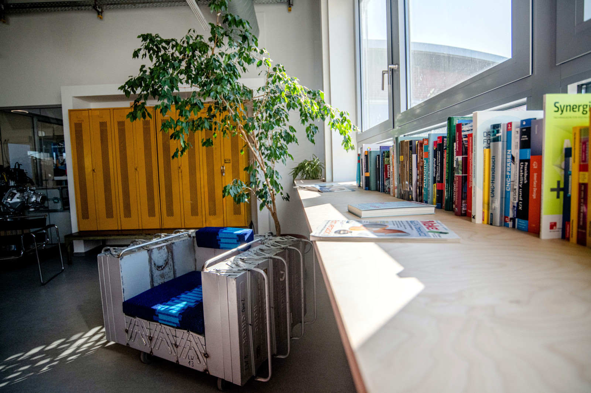
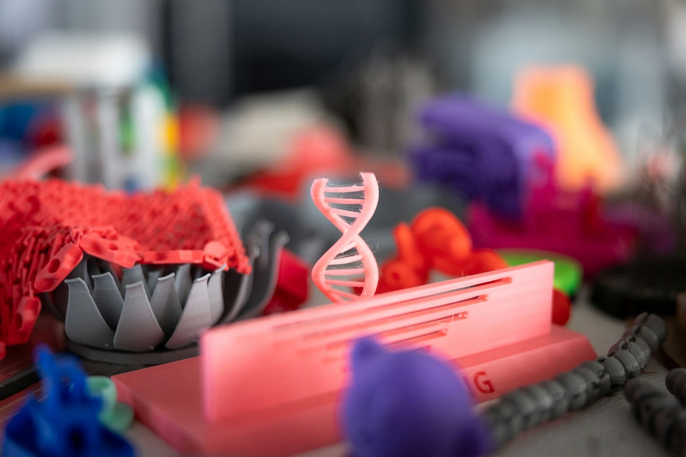
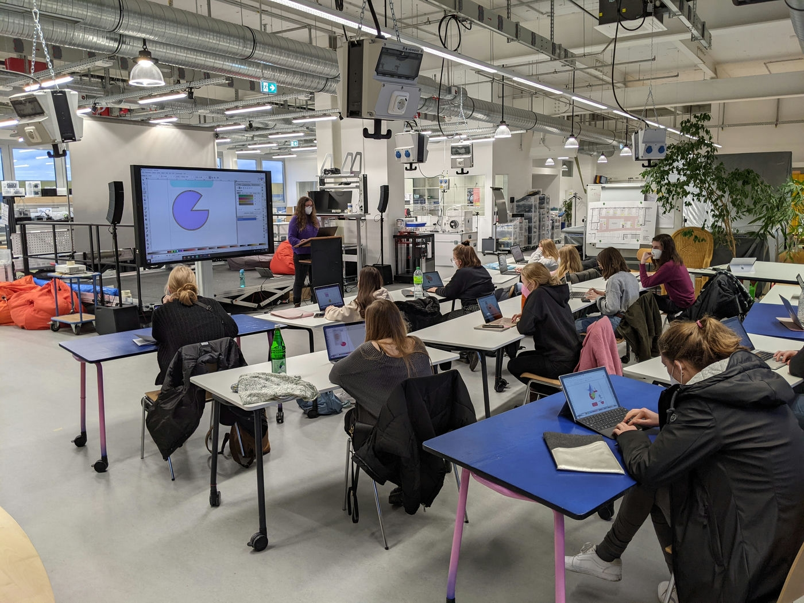

# FAQ – Oft gefragt

 

### Offen für alle? 

Der RUB-Makerspace ist ein offener Raum für kreatives Arbeiten. Bei uns soll sich jede\*r willkommen und sicher fühlen können (völlig unabhängig von Herkunft, Religion, sexueller Orientierung, Geschlechtsidentität, körperlichen oder geistigen Voraussetzungen oder Bildung – der Makerspace ist bunt!). Daher bitten wir all unsere Besucher\*innen, uns dabei zu helfen, eine Atmosphäre zu schaffen, in der sich alle wohl und sicher fühlen. 

### Was genau kann ich im Makerspace tun?

Der RUB-Makerspace ist ein Ort der (Ideen-)Entwicklung, des Austausches und des kreativen Selbermachens. Hier kannst Du Gleichgesinnte treffen, gemeinsam lernen, kollaborativ oder auch eigenständig an Projekten arbeiten und Dinge erstellen. Wir bieten Dir Raum, Werkzeug, Maschinen, Material sowie Beratung und Untersstützung für das praktische Arbeiten. In unseren gemütlichen Co-Working-Flächen kannst Du außerdem auch ganz ohne das werkstatt-artige Arbeiten Teil der kreativen Maker-Community werden. 

 

#### Beispiele für mögliche Projekte

Im Makerspace kannst Du...

- eine Vase töpfern oder aus Ton 3D-Drucken,
- einen Film produzieren oder professionelle Produktfotos machen,
- ein T-Shirt bedrucken oder besticken,
- einen Fanschal stricken,
- einen Mikrocontroller programmieren und damit einen Motor oder ein Display steuern,
- einen Prototyp für die Geschäftsidee vom nächsten Super-Start-up bauen,
- Ideen in einem Design-Thinking-Workshop verbessern,
- eine Gussform herstellen,
- ein Artefakt aus der Museums-Sammlung per 3D-Scan digitalisieren,
- eine VR-Anwendung programmieren, die mir immer den nächstgelegenen Kiosk anzeigt,
- einen Versuch für meine Bachelorarbeit durchführen,
- ...
- unzählige weitere Projekte durchdenken und umsetzen! 

Falls Du Dich dafür interessierst, was bisher im Makerspace geschaffen wurde, schau doch auf unserer [Projekt-Seite](projekte.md) vorbei!

### Welche Themenbereiche sind im Makerspace vertreten?

Der Makerspace hat eine große Anzahl verschiedener Bereiche, die alle Stück für Stück in Betrieb genommen werden. Unter [Arbeitsbereiche und Ausstattung](ort.md) findest Du mehr Details – die wichtigsten Bereiche in Kürze:

- Designlabor – mit beispielsweise 3D-Druckern und Lasercuttern für das Rapid Prototyping aber auch mit Robotik, Virtual- und Augmented Reality-Technologie.
- Medienlabor – mit der Möglichkeit Fotos zu machen und zu bearbeiten oder Filme zu produzieren, auch mit einer 360°-Kamera oder einer Drohne.
- Textillabor – zum Nähen, Sticken, Stricken und einer Transferpresse für Stoffdruck.
- Bühne – für Vorträge, Events, Modenschauen oder Pitches.
- Co-Working-Bereich und verschiedene Projekträume – in denen einzeln oder in Gruppen gearbeitet werden kann.
- Holzwerkstatt – mit beispielsweise der Möglichkeit Holz mit einer Fräse zu bearbeiten oder Platten zu verpressen.
- Metallbauwerkstatt – in der Du etwas Schweißen, Drehen oder Fräsen kann.
- Digitallabor – in dem Du beispielsweise Löten oder auch dem Umgang mit Mikrocontroller erlernen kann.
- Computerraum – für Veranstaltungen oder zum Beispiel zum Erlernen von CAD-Software sowie ein Seminarraum für Lehre oder Workshops.
- Verschiedene andere kleinere Werkstattbereiche – beispielsweise zum Töpfern, für Siebdruck, Kunststofftiefziehen oder Vakuumgießen.
- Zwei mobile Makerspaces – mit denen wir auch in Bochum und Umgebung unterwegs sein werden, um das Machen zu den Menschen zu bringen.
- Ein großer Außenbereich – für alles von Events über Arbeiten bis zum Chillen

### Kann ich schon alle Bereiche im Makerspace nutzen? 

Nein. Der Aufbau des Makerspace ist ein laufendes Projekt. Zum einen gibt es [bauliche](wasserschaden.md) Umstände, die dafür sorgen, dass nur ein Teil der Flächen überhaupt nutzbar ist. Neben solchen äußeren Umständen ist der etappenweise Aufbau auch methodisch begründet: Es ergibt einfach mehr Sinn, erst Allgemeinflächen und Raum für grundlegende und relativ sichere Verfahren zu schaffen, bevor man größere, gefährlichere und teurere Verfahren und Bereiche aufbaut. Dieses Vorgehen ermöglicht auch Anpassungen von (theoretischen) Planungen auf Basis (praktischer) Erfahrungen.  

Mehr Informationen unter [Status](status.md).

### Bin ich Teil eurer Zielgruppe?

Wenn Du es bis hierhin geschafft hast, lautet die Antwort: JA. Makerspaces, Fab Labs und ähnliche Orte verstehen sich als offene Werkstätten. Dementsprechend umfasst auch die Zielgruppe des RUB-Makerspace alle Menschen in und außerhalb der Ruhr-Universität, die mit der Community, der Infrastruktur, den Geräten und Maschinen oder der kreativen Umgebung des Makerspace etwas bauen, machen oder zu tun haben möchten.  

### Kinder und Jugendliche im Makerspace?

Auch Kinder und Jugendliche sind grundsätzlich eingeladen, uns im Makerspace zu besuchen - allerdings gibt es [für Minderjährige bestimmte Regeln](sicherheit.md#minderjaehrige) und Du musst uns auf jeden Fall vorher [kontaktieren](kontakt.md).

### Hunde und Katzen und überhaupt Tiere im Makerspace?

Hunde und andere Haustiere können leider nicht in den Makerspace mitgenommen werden - das gibt die übergeordnete Hausorordnung der RUB vor. Ausgenommen von dieser Regel sind natürlich Blindenführhunde.

### Was kostet mich der Makerspace? {: #kosten }

Die Nutzung des Makerspace als Maker\*in kostet Dich zunächst kein Geld, denn im Moment haben wir durch die [Worldfactory-Projektförderung](drittmittelprojekte.md#worldfactory) das große Glück, den Makerspace  kostenfrei *aufbauen* zu können. Eine unserer Aufgaben im Projekt ist jedoch ausdrücklich auch die Entwicklung eines Geschäftsmodells zur (Teil-)Refinanzierung. 

Wir beginnen daher bereits innerhalb unserer Projektlaufzeit, Einnahmequellen zu erschließen, beispielsweise in Form von [Mieteinnahmen für Veranstaltungen](veranstaltungen.md), Entgelten für Unternehmen, die einen Workshop buchen möchten oder anderen [Dienstleistungen](dienstleistungen.md). Aber auch Nutzende werden auf absehbare Zeit für die Nutzung bezahlen müssen. 

!!! info "Gemeinschaft und Wissen sind die wichtigsten 'Währungen'"

    Das aktive Teilen von Wissen und das voneinander lernen ist die eigentliche und damit wichtigste Währung für die [Community](community.md). Wir versuchen ausdrücklich, dies in der Geschäftsmodellentwicklung soweit wie möglich zu berücksichtigen. Versuche auch Du bitte, unabhängig von allen monetären Fragen, offen zu sein, andere Maker\*innen zu unterstützen und dokumentiere Dein Projekt für die Öffentlichkeit.

### Kann ich den Makerspace für meine Lehre/Forschung nutzen?

Ja! Nach Absprache mit uns bieten wir Dir gerne unsere Räumlichkeiten, Geräte und Unterstützung für Dein Seminar oder Deine Forschung an. 

### Darf ich selbst an den Maschinen und Geräten arbeiten?

Natürlich! Das ist der hauptsächliche Sinn und Zweck des Makerspace. Aber: Die Arbeit mit unseren Geräten und Maschinen kann bei unsachgemäßem Gebrauch gefährlich für Dich und alle anderen im Makerspace sein. Daher musst Du zunächst [Sicherheitsunterweisungen](unterweisungen.md) besuchen und je nach Bereich gegebenenfalls weitere Auflagen erfüllen (die werden Dir in den Unterweisungen erklärt), bevor Du komplett selbstständig arbeiten darfst. ‘Selbstständig'‚ hängt dabei außerdem auch vom Kontext ab und hat zum Beispiel für einen Schraubendreher eine etwas andere Bedeutung als für eine große Fräsmaschine.

### Darf ich eigene Maschinen mitbringen?

Aus Gründen der Arbeitssicherheit geht das nur im Ausnahmefall, mit vorheriger Voranmeldung und mit Sichtung/Prüfung der Maschinen durch das Personal des Makerspaces.

### Was ist ‘Fabman‘? {: #fabman}

[Fabman](https://fabman.io/) ist ein Makerspace-Management-System. Wir nutzen es, um den Zugriff auf bestimmte Geräte und Maschinen zu kontrollieren, damit nur unterwiesene Personen diese benutzen können und damit wir Maschinenlaufzeiten und Ähnliches für Wartungszwecke erfassen können. Dies hilft uns, die Sicherheit aller im Makerspace zu gewährleisten. Fabman besteht aus einem Software-System zur Verwaltung und aus sogenannten ‘Bridges‘ – den kleinen schwarzen Kästen mit Display, die Du an verschiedenen unserer Geräte sehen kannst

Wenn Du Deine Allgemeine Sicherheitsunterweisung abgeschlossen hast, erhältst Du eine Ausweiskarte, mit der Du über die ‘Bridges‘ alle Maschinen und Geräte einschalten kannst, für die Du die entsprechende Unterweisung absolviert hast. 

### Gibt es Regeln, an die ich mich halten muss?

Um einen sicheren Raum zu schaffen, an dem alle gerne und produktiv arbeiten können, ist es unerlässlich, bestimmte Grundregeln aufzustellen. Zentral ist unsere [Nutzendenordnung](sicherheit.md#nutzendenordnung), außerdem findest Du unter [Sicherheit](sicherheit.md) weitere wichtige Informationen zu Regeln und Sicherheit. Insbesondere gibt es dort unseren Übersichts-Flyer zum Thema Sicherheit und eine Karte, die die Standorte von Erste-Hilfe-Zubehör, Brandmeldern und ähnlichen wichtigen Dingen aufzeigt. 

### Wie ist es mit Internet im Makerspace? {: #wlan}

- Im Makerspace gibt es wie an allen Standorten der Ruhr-Universität das WLAN [Eduroam](https://noc.rub.de/web/wlan).
- Fast alle Netzwerkdosen im Makerspace sind [HIRN-Ports](https://noc.rub.de/web/anleitungen/hirn) und können von allen Personen entsprechend der verlinkten Anleitung mit einer RUB-LoginID freigeschaltet werden.
- Für Veranstaltungen können (mit Vorlauf!) [Veranstaltungsaccounts](https://www.it-services.ruhr-uni-bochum.de/services/gz/veranstaltungsaccounts.html.de) beantragt werden, die zum Beispiel den Zugang zum WLAN der RUB, zum CIP-Pool und so weiter ermöglichen.
- Im und um den Makerspace gibt es ein [Freifunk-Netzwerk](https://freifunk.net/), das offen zugänglich ist. Dieses Netz gehört nicht zu den Standarddiensten der RUB, es gibt keine Verfügbarkeitsgarantien und das Netz wird auf eigene Verantwortung genutzt. 

### Kanns ich ‘XYZ‘ im Makerspace produzieren lassen?

Nein, aber Du kannst es *selbst* bei uns produzieren. Mehr dazu [hier](dienstleistungen.md#selbermachen). 

### Kann ich eine Serie im Makerspace produzieren?

Im Regelfall nicht, nein. Für dieses Thema gibt die *Fab Charta* die übliche Position von Fab Labs und Makerspaces gut wieder: Es können und sollen Prototypen produziert werden (darunter können gerade für Start-ups fallweise auch Kleinstserien für Entwicklungszwecke fallen). Grundsätzlich muss für Serienfertigung und für alle anderen regelmäßigen Bedarfe der eigenen Firma jedoch auf den freien Markt oder eigene Infrastruktur zurückgegriffen werden. Außerdem dürfen kommerzielle Aktivitäten die anderen Aktivitäten (Lernen, Forschen, Experimentieren und so weiter) in einem Makerspace nicht stören. 

>  **How can businesses use a fab lab?** Commercial activities can be prototyped and incubated in a fab lab, but they must not conflict with other uses, they should grow beyond rather than within the lab, and they are expected to benefit the inventors, labs, and networks that contribute to their success.
>
>*Auszug aus der "Fab Charter" von [https://fab.cba.mit.edu/about/charter/](https://fab.cba.mit.edu/about/charter/)*

