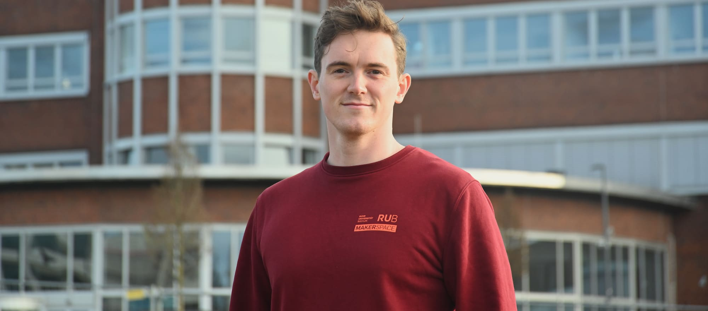

#### Florian Krohm {: #fkb }

=== "Über mich"

	>"Ich bin Flo. Ich vertrete Dirk als Gesamtleitung in seiner Abwesenheit und bin im Makerspace für das [Designlabor](designlabor.md) zuständig. Dort befinden sich viele Dinge, die auch in den meisten anderen Fab Labs und Makerspaces stehen, wie FDM-3D-Drucker, Lasercutter oder VR-Equipment. Außerdem bin ich unsere Schnittstelle in die Start-up- und Gründungsberatung der [Worldfactory](https://www.worldfactory.de/beratung/gruendungsberatung).
	Durch mein Studium in Industrial Design unterstütze ich dort Gründer\*innen mit produktionstechnischem Know-How und Methoden aus dem Design Thinking bei der Entwicklung ihrer forschungsbasierten Produkte und Services.
	Während meines Studiums habe ich außerdem die Stadtteilfabrik gegründet und bin dadurch ab und zu auch selbstständig mit Vorträgen, Installationen und Workshops zu Design, Gründung und Design Thinking unterwegs."

=== "Kontakt"
	
	- [Kontaktiere uns als Team](kontakt.md)
	- [Persönliche Kontaktdaten Florian Krohm im Verzeichnis der RUB](https://einrichtungen.ruhr-uni-bochum.de/de/florian-krohm-brauckmann)

=== "Hintergrund" 

	- Gründer der [Stadtteilfabrik](https://stadtteilfabrik.de)
	- M.A. Industrial Design an der [Folkwang Universität der Künste](https://id.folkwang-uni.de)