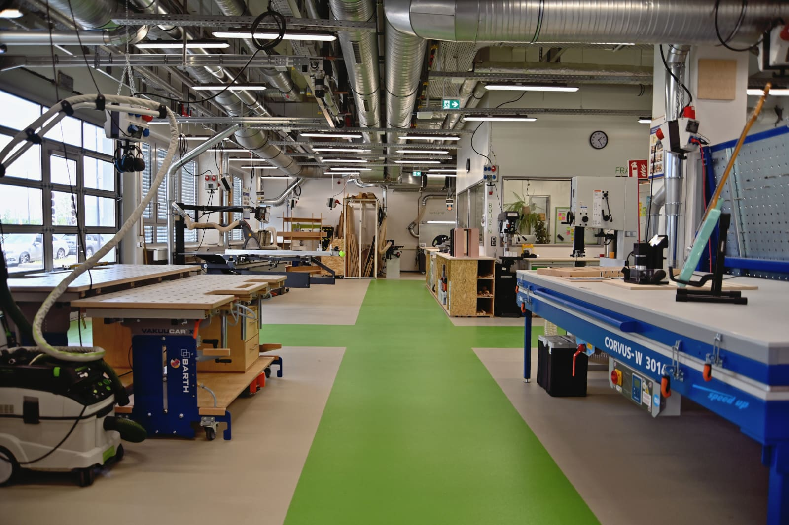
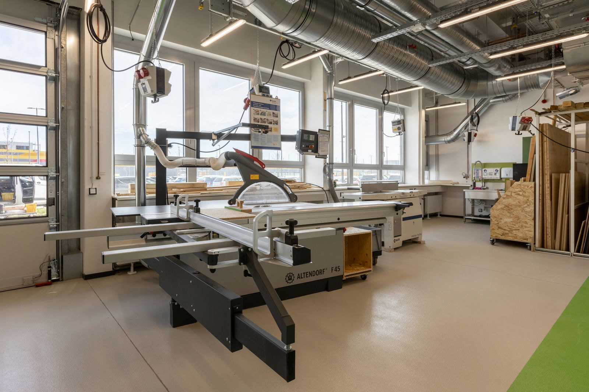
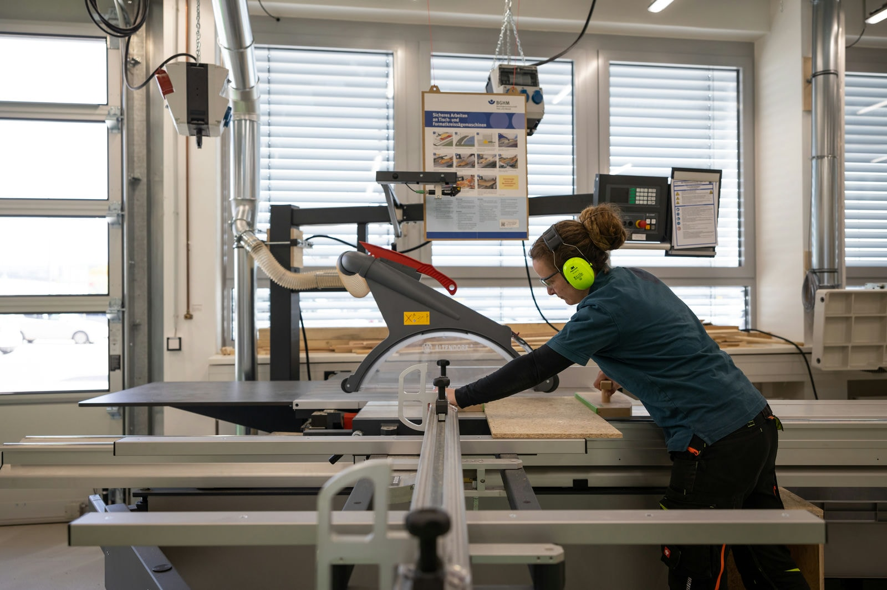
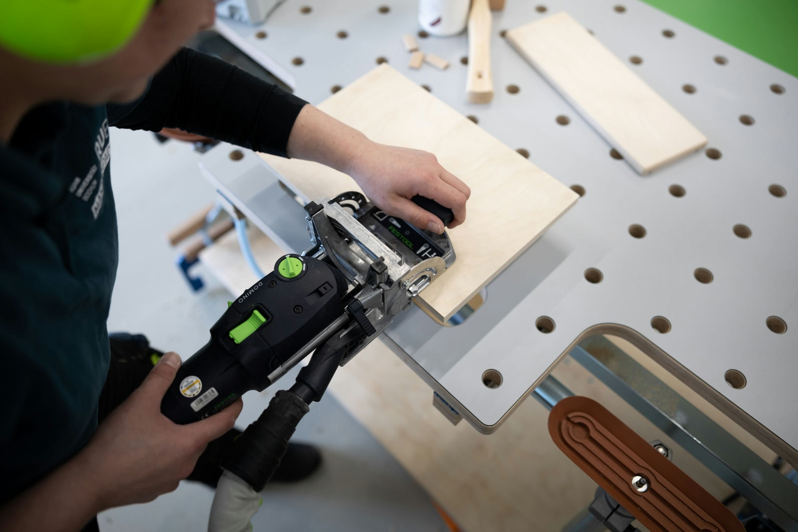
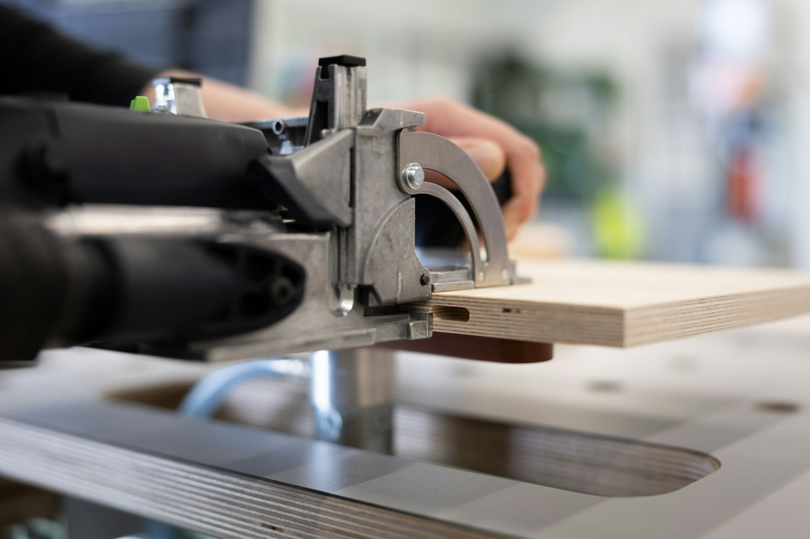
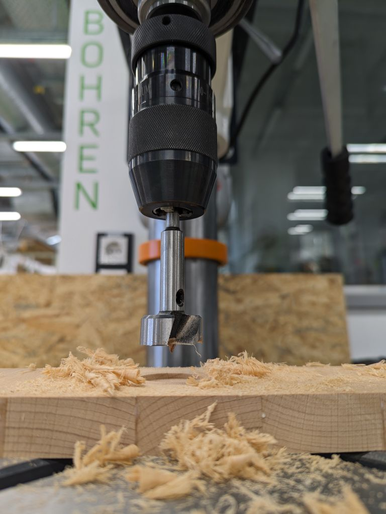
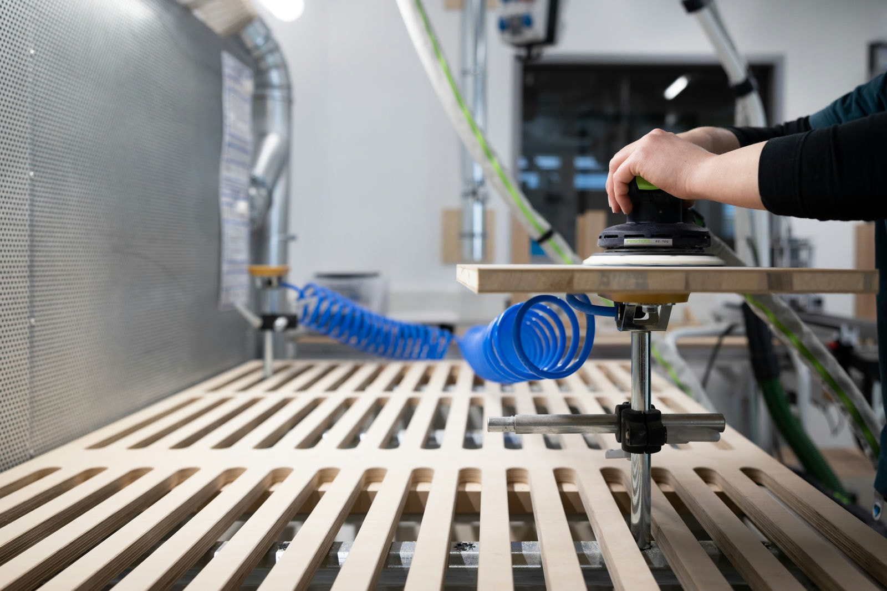
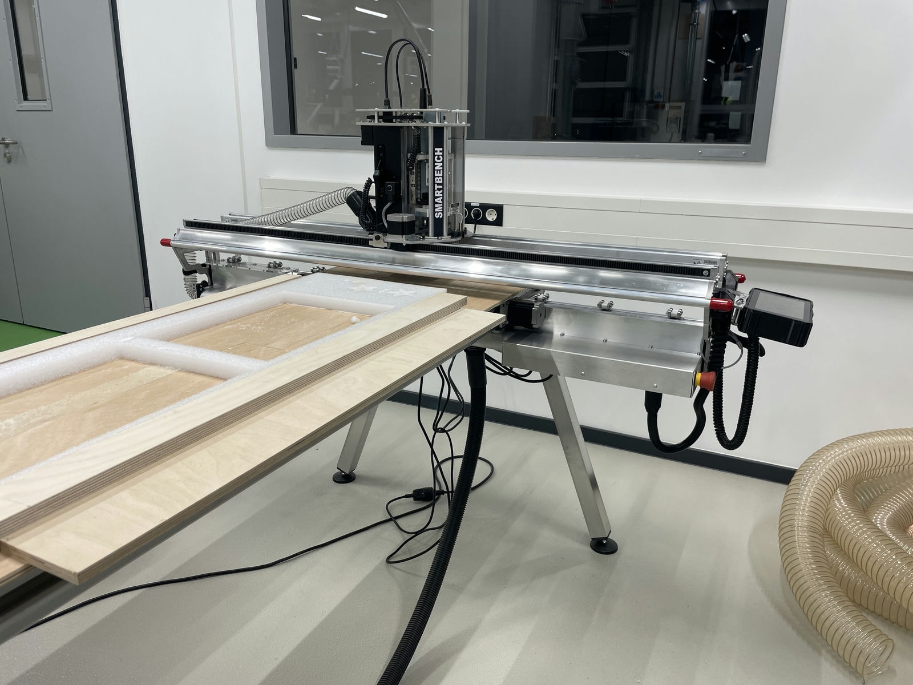
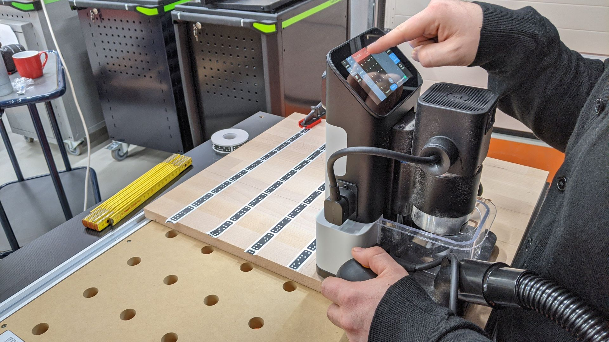
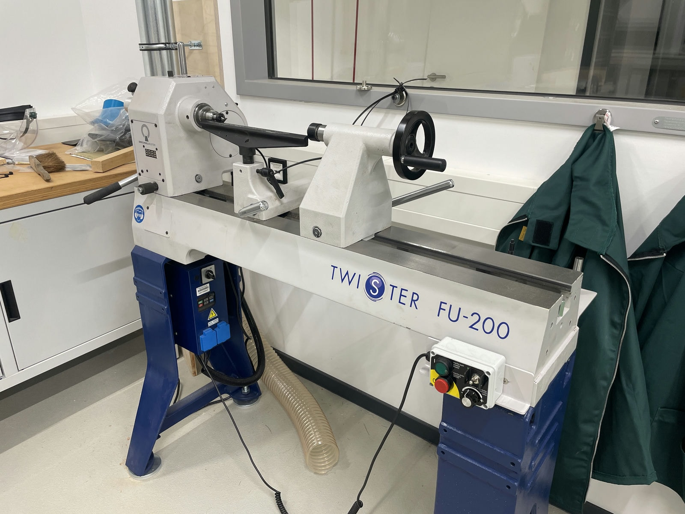

# Wood Workshop

!!! info "The Wood Workshop is still under construction" 

	Many parts of the Wood Workshop are already available to work with - but not everything. Wood turning for example is not possible yet and a few things are still being procured or are in the process of being brought into service. Please contact us as soon as possible with your request! 

In our [Wood Workshop](https://en.wikipedia.org/wiki/Woodworking), as the name suggests, everything revolves around wood. Here you can use our machines to [carpenter](https://en.wikipedia.org/wiki/Joinery) and "carve" your idea into life. Among other things, we offer you equipment for drilling, milling, sawing and sanding, so that you can, for example, make a guitar body, a housing for your prototype or decorations. 

??? question "Who is the contact for Wood Workshop?"
    
    --8<--
    anl.en.md
    --8<--

## This is How You Can Use the Wood Workshop

Have you completed the General Safety Training for the Makerspace? Excellent, you're off to a good start!  

After completing a brief workshop orientation, you are welcome to explore the workshop and make use of the various manual hand tools available at the designated workstations. If you want to participate in the workshop orientation or get an additional instrucion for a specific device, please don't hesitate to inform us on site or reach out to us via [email](kontakt.en.md). 

Following the [Safety Instruction for Handheld Machines](unterweisungen.en.md), you may work on all kinds of materials with certain handheld machines. In addition to [wood](https://en.wikipedia.org/wiki/Wood), [wood-based materials](https://en.wikipedia.org/wiki/Engineered_wood), some [plastics](https://en.wikipedia.org/wiki/Plastic), [solid surface material](https://de.wikipedia.org/wiki/Acrylstein) and many more are possible.

When it comes to bringing your ideas to life, everyone has their own unique vision and expectations. It's important to carefully consider which materials will suit your project best, and we highly recommend **obtaining them in advance**. If you're uncertain about which materials to use, our team is always happy to provide guidance and support.

In some cases, we might be able offer a variety of smaller items such as stencil-making supplies or screws from an everyday changing selection of supplies available in our [#Schatzkiste](lager.en.md#schatzkiste).

!!! info "[To the work folder "Wood Workshop" with further documents](https://ruhr-uni-bochum.sciebo.de/s/VuFDh7eChe6z1v7?path=%2FHolzwerkstatt)"

    In this folder you will find everything you need to know about our machines and equipment and their safe use. Here you can also find all operating manuals and instructions, tutorials and other interesting things. As always: Together we are stronger - we are happy about every [contribution to the collection of knowledge and experience!](feedback.en.md)

## This is What You Can Do in the Wood Workshop

In the Wood Workshop you can work on our [workbenches](https://en.wikipedia.org/wiki/Workbench_(woodworking)) with everything you need to build. If your project is too big or you want to work overlooking our [courtyard](coworking.en.md#aussenbereich), you can of course also realize your project in the [Assembly Zone](coworking.en.md#montagezone). Otherwise you will find every tool you need for woodworking in the Wood Workshop. From the roughing bench to the drilling jig, everything is there. 

- [Sawing](#saegen) - Sizing saw, hand-held and plunge-cut circular saws, jigsaws
- [Milling](#fraesen) - Router, edge milling machine, dowel milling machine
- [Drilling](#bohren) - pillar drilling machine
- [Sanding](#schleifen) - Random orbital sander, delta sander, sanding table
- [CNC Machining](#CNC) - almost automatic or still a bit of manual work
- [Planing](#hobeln) or also dressing
- [And much more.](#mehr) - Let yourself be inspired!

!!! danger "To operate our large machinery, more in-depth [instructions](unterweisungen.en.md) are required to ensure your safety. Once we've confirmed that you've completed the required instruction and are familiar and comfortable with proper operation, you're good to go!"

Below you will find a detailed description of each of these areas.

## Sawing {: #saegen }

The [panel saw](https://en.wikipedia.org/wiki/Panel_saw) is the heart of every carpenter's workshop. This also applies to us. Depending on the project, you also have a band saw, plunge cut saw, crosscut saw or scroll saw at your disposal.

**Our Devices (*Links lead to the manufacturer's website*):** 

- [Altendorf F45](https://www.altendorfgroup.com/machines/altendorf-f-45/)
Whether large panels, narrow moldings or miter cuts. This saw can do it.

- [Plunge saw Festool TS 55 FEBQ-Plus](https://www.festool.de/produkte/saegen/tauchsaegen/576703---ts-55-febq-plus)

- [Chop and miter saw Festool Kapex KS 120 REB](https://www.festool.de/produkte/saegen/kapp-zugsaegen/575302---ks-120-reb)

- [Jigsaws](https://www.festool.de/produkte/akku-werkzeug/akku-pendelstichsaegen/576523---psc-420-hpc4,0-ebi-set)

- [Band saw: ⁣HBS 433 Aktionsset Holzbandsäge](https://www.stuermer-maschinen.de/holzbearbeitung/holzbearbeitungsmaschinen-holzbandsaegen/hbs-433-aktionsset-5154303set/)

- [Scroll saw: Hegner Multicut SE](https://www.hegner-gmbh.com/index.cfm?contentid=21&gclid=Cj0KCQiA0oagBhDHARIsAI-BbgdaCdCGZZT8K9igw6-HzbAxAuCDsYYO22B3yFwnla8FzHGQBJxLMkIaAhlnEALw_wcB)

## Milling {: #fraesen }

You want to [mill out](https://en.wikipedia.org/wiki/Milling_(machining)) a contour or need connections for your piece of furniture? Then you have various milling machines at your disposal in our workshop. With the router you can cut out circular shapes or process edges with the edge router. With the dowel router you can connect your workpieces. For more complex projects, you have the option of working with the [CNC router](#CNC) or our [shaper](#shaper). You can find more information about this in the section below.

**Our Devices (*Links lead to the manufacturer's website*):** 

- [Router – Festool OF1010](https://www.festool.de/produkte/fraesen/oberfraesen/576919---of-1010-ebqr-plus#%C3%9Cbersicht)

- [Dowel Router – Domino DF 500 Q](https://www.festool.de/produkte/domino-verbindungssystem/duebelfraesen/576420---df-500-q-set#%C3%9Cbersicht)

- [Edge Router – Bosch GKF](https://www.bosch-professional.com/de/de/products/gkf-12v-8-06016B0002)

## Drilling {: #bohren }

Whether you are looking for a cordless drill or a drill press, we have a wide range of machines, tools and accessories for drilling.

**Our Devices (*Links lead to the manufacturer's website*):** 

- [Cordless Drill and Screw Driver – Festool C 18 HPC](https://www.festool.de/produkte/akku-werkzeug/akku-bohrschrauber/577617---c-18-hpc4,0-i-set)

- [Column Drilling Machine: OPTIdrill DQ 32](https://www.stuermer-maschinen.de/marken/optimum/kategorie/produkt/optimum-bohrmaschinen/optidrill-dq-32-3191049/)

## Sanding {: #schleifen }

Before you can begin to paint, oil, or stain your workpiece, it is essential to properly sand it first. We provide a range of hand-held sanding tools that you can use on our vacuumed sanding table. The table is equipped with vacuum clamps, which allow you to securely fix your workpiece and easily access all sides while sanding. 

**Our Devices (*Links lead to the manufacturer's website*):** 

- [Random Orbital Sander – Festool](https://www.festool.de/produkte/schleifen/exzenterschleifer/576080---ets-1505-eq-plus#%C3%9Cbersicht)

- [Delta Sander – Festool DTS 400](https://www.festool.de/produkte/schleifen/deltaschleifer/577518---dts-400-req-plus#%C3%9Cbersicht)

- [Battery Angle Sander Festool AGC 18](https://www.festool.de/produkte/holzbau/akku-winkelschleifer/576825---agc-18-125-eb-basic)
Eigentlich eher für die [Metallverarbeitung](metallbauwerkstatt.md) , aber im Ausnahmefall auch bei uns.

- [Edge Sanding Machine: KSO 1500](https://www.stuermer-maschinen.de/holzbearbeitung/holzbearbeitungsmaschinen-schleifmaschinen-fuer-holz/kso-1500-5368150/)

- or by hand.

Either way, it's best to do it on our vacuumed sanding table.

## CNC {: #CNC }

[CNC](https://en.wikipedia.org/wiki/Numerical_control) milling is a specific type of Computerized Numerical Control manufacturing. Milling uses a cylindrical cutting tool that can rotate in multiple directions. Unlike traditional drilling, a milling cutter can move along multiple axes.  
In general, CNC milling is very efficient when it comes to [prototyping](https://en.wikipedia.org/wiki/Prototype), small-batch production of complex parts, and manufacturing precision parts and components.

To be able to work on our SmartBench (Yeti), you need intensive instruction regarding the handling, because speed and milling cutter have to be adjusted exactly to your intention and workpiece.  
Furthermore you need a digital design of the desired part, which you create with the help of a suitable [CAD](https://en.wikipedia.org/wiki/Computer-aided_design)/[CAM](https://en.wikipedia.org/wiki/Computer-aided_manufacturing) software. This file determines the dimensions and geometry of the finished part. Once you have transferred the file, you can use the touchpad to start the automatic control of the milling machine.

### SmartBench Precision Pro

**Our Devices (*Links lead to the manufacturer's website*):** 

[Yeti](https://www.yetitool.de/PRODUKTE/Precision-Pro)

### Shaper Origin {: #shaper }

Are you interested in CNC woodworking? Then working with the Origin is just right for you. As a combination of a router and CNC mill, the machine can be used extensively and offers a low-threshold introduction to CNC thanks to its intuitive user interface. In addition to generating simple geometries using onboard CAD, external data generation is also possible using Inkscape, Autodesk Fusion 360 and many other vector graphics programs. All that Origin requires is a cleanly created SVG file. This combination of flexibility and comparatively simple data generation makes the Origin the perfect machine for prototyping.

**Our Devices (*Links lead to the manufacturer's website*):** 

- 2x [Shaper Origin](https://www.shapertools.com/en-de/)
- 1x Shaper Workstation
- 1x Shaper Plate

## Planing {: #hobeln }

[Planing](https://en.wikipedia.org/wiki/Jointer) is particularly suitable for solid wood. If you want to make something more rustic, you can, for example, make a suitable shelf board from a rough-sawn plank. 

**Our Devices (*Links lead to the manufacturer's website*):** 

- [One-hand Planer – Festool EHL 65](https://www.festool.de/produkte/hobeln/hobel/576247---ehl-65-eq-plus)

- [Surface Planer: minimax fs 41e SPIRAL](https://www.stuermer-maschinen.de/holzbearbeitung/holzbearbeitungsmaschinen-hobelmaschinen/minimax-fs-41e-spiral-5503452/)

## And Much More {: #mehr }

We look forward to teaching you other machining methods such as [woodturning](https://en.wikipedia.org/wiki/Woodturning) in workshops in the future. 

**Our Devices (*Links lead to the manufacturer's website*):** 
	
- Wood Lathe: [Twister FU200](https://neureiter-shop.at/produkte/drechseln/drechselmaschinen/drechselmeister-maschinen/drechselmaschine-drechselmeister-twister-fu-200-twister-fu-200-drechselmaschine-inkl-gussbeine.html) 
 
- [Mobile Workshop Festool MW 1000](https://www.festool.de/produkte/halbstationaeres-arbeiten/mobile-werkstatt/203802---mw-1000-set#Übersicht)
