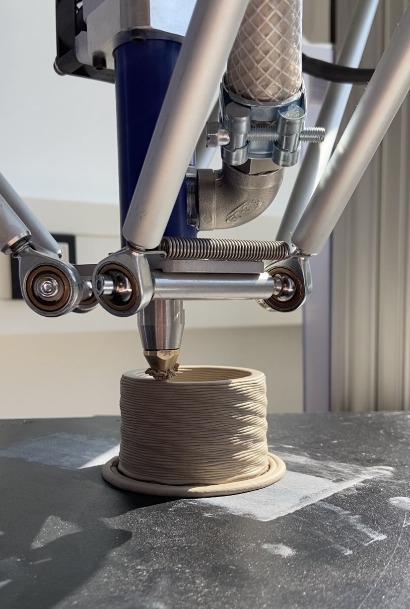

# Ceramics Workshop

!!! warning "The Ceramics Workshop is still at the beginning of its construction and is therefore not yet usable."

Whether it's simple pottery, vacuum casting, or even clay 3D printing, you can sculpt your heart's project out of ceramic in our Ceramics Workshop! 

- [Ceramic – Wikipedia](https://en.wikipedia.org/wiki/Ceramic)
- [Manufacturer's video – Ceramic 3D printing with Delta Wasp 40100 (Youtube)](https://www.youtube.com/watch?v=GfJaUDBBd48)

!!! info "[To the work folder 'Ceramics Workshop' with further documents](https://ruhr-uni-bochum.sciebo.de/s/VuFDh7eChe6z1v7?path=%2FKeramikwerkstatt)"

    In this folder you will find further documents on all areas of the ceramics workshop, such as operating instructions, templates and samples, tutorials and other things to make your work easier. 
    As always: We are stronger together - we are happy about every [contribution to the collection of knowledge and experience!](feedback.en.md)

**Our devices** (click to go directly to the manufacturer/support page)

- [Ceramic 3D Printer - Delta Wasp 40100](https://www.3dwasp.com/en/ceramic-3d-printer-delta-wasp-40100-clay/) Print volume: Ø 400mm x h 1000 mm
- Wash basin with mud trap
- Pottery wheel

## Kiln {: #ofen }

A kiln is necessary for a wide variety of work, for example, to fire things from clay, treat metals (for example, hardening), melt things, burn out molds and much more.

**Our devices (*links lead to the manufacturer's website*):** 

- [Nabertherm LH 120/14](https://nabertherm.com/de/produkte/labor/kammeroefen/kammeroefen-mit-steinisolierung-oder-faserisolierung-bis-1400-degc) (approx. 50 x 50 x 50 cm Volume, approx. 1400°C maximale Temperatur).
- Controller [B400](https://nabertherm.com/de/serie-400), which means that the kiln is programmable in its temperature course.
- Various equipment, for example, the safety equipment, which is very important here in particular, as well as aids for stacking and loading.
