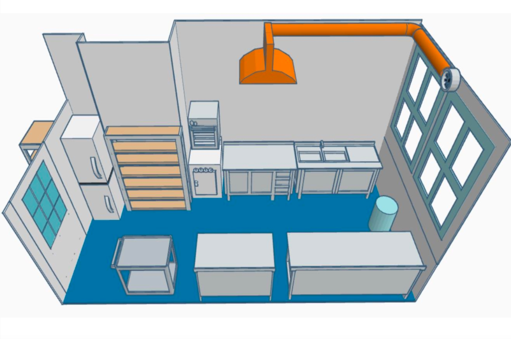

# Küchenlabor

!!! warning "Das Küchenlabor steht noch ganz am Anfang seines Aufbaus und ist dementsprechend noch nicht nutzbar."

Im Küchenlabor dreht sich alles rund um das Thema Kochen, nachhaltige Lebensmittelverwertung und kulinarische Experimente. In einer professionell ausgestatteten Edelstahl-Gastroküche findest Du zukünftig sämtliche Utensilien und Geräte, die für verschiedenste Anwendungen im Lebensmittelbereich eingesetzt werden können. Ob zum Beispiel gemeinsames Kochen als Teamevent, Pralinenherstellung mit vorher eigens kreierten Formen oder die Zubereitung von veganem Käse: Hier darfst Du Dich austoben und deiner Phantasie in der Küche freien Lauf lassen.  
  
Was Dir in der eigenen Küche fehlt, wird im Küchenlabor mit Sicherheit zu finden sein: Vom Hochleistungsmixer über den Kombidämpfer bis hin zum Schockfroster und zurück zum Stabmixer verfügt das Küchenlabor über eine vielseitig nutzbare Ausstattung. Alles was den Lebensmittelhygienerichtlinien entspricht und nicht schädlich für den Menschen ist, kann im Küchenlabor verarbeitet werden.  
  
Die 17 m^2^ kleine Küche bietet durch eine clevere Aufteilung und Einrichtung zahlreiche Möglichkeiten der Kochkunst, aber auch das Experimentieren mit Lebensmitteln kann Bestandteil des Labors werden. Deinen eigenen Projektideen sind kaum Grenzen gesetzt: Farbextrakte aus Lebensmittel ziehen, Kunststoff aus Milch herstellen oder Stärke als Bindemittel für Bioplastik nutzen sind nur einige Beispiele für mögliche Experimente im Küchenlabor.

??? question "Wer ist die Ansprechperson für das Küchenlabor?"
	
	--8<--
	eb.md
	--8<--

!!! info "[Zum Arbeitsordner 'Küchenlabor' mit weiteren Unterlagen](https://ruhr-uni-bochum.sciebo.de/s/VuFDh7eChe6z1v7?path=%2FKüchenlabor)"

    In diesem Ordner findest Du weitere Unterlagen zu allen Bereichen des Küchenlabors wie beispielsweise Bedienungsanleitungen, Betriebsanweisungen, Vorlagen und Muster, Tutorials und andere Dinge, die Dir die Arbeit erleichtern sollen. 
    Wie immer gilt: Gemeinsam sind wir stärker – wir freuen uns über jeden [Beitrag zur Wissens- und Erfahrungssamlung!](feedback.md)