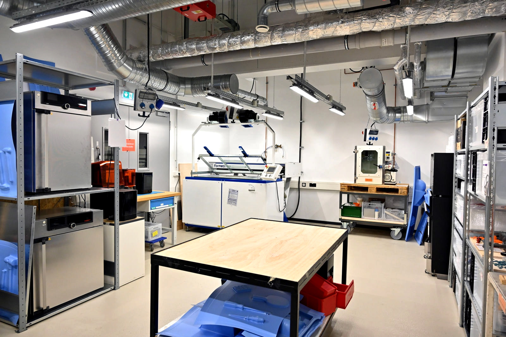
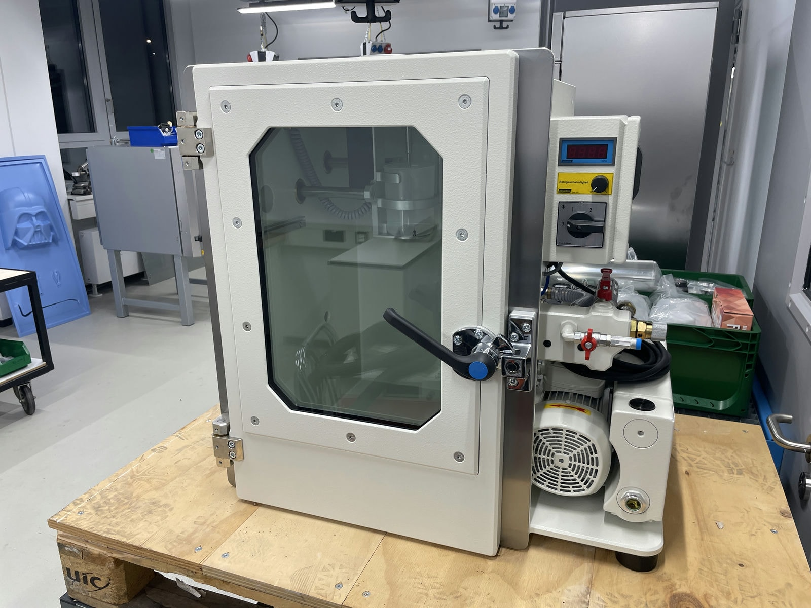
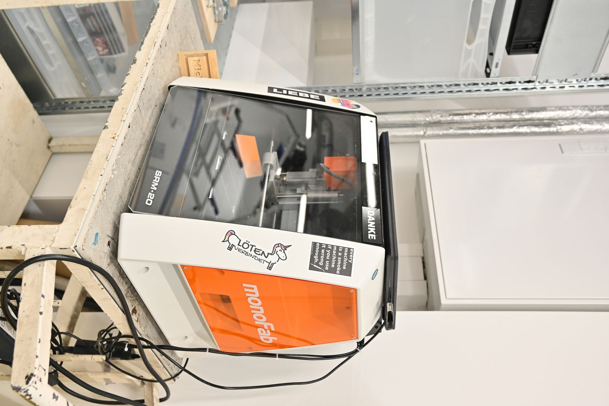

# Plastics Workshop

!!! info "The plastics workshop is still under construction" 

	Many parts of the Plastics Workshop are already available to work with - but not everything. Please contact us as soon as possible with your request! 

In our plastics workshop you will find various machines for processing [plastics](https://de.wikipedia.org/wiki/Kunststoffverarbeitung) in order to turn prototypes and possibly even small series into reality according to your ideas. In addition to the plastics machines themselves, there may also be other equipment set up in this workshop, which may be a little more dangerous or unpleasant, e.g. due to vapors.  

??? question "Who is the contact for the plastics workshop?"
	
	--8<--
	fkb.en.md
	--8<--

## How Can I Use the Plastics Workshop?

Participation in the [General Safety Instruction](unterweisungen.en.md) and at least one special instruction in one of the below-mentioned work areas in the plastics workshop is required for the use of the plastics workshop. The first instruction there also includes a general workshop orientation and, as required, instruction and briefing on overpressure breathing protection and other safety topics.

!!! info "[To the 'Plastics Workshop' work folder with additional documents](https://ruhr-uni-bochum.sciebo.de/s/VuFDh7eChe6z1v7?path=%2FKunststoffwerkstatt)"

    In this folder you will find further documents on all areas of the plastics workshop such as operating manuals, operating instructions, templates and samples, tutorials and other things to make your work easier. 
    As always: Together we are stronger - we are happy about every [contribution to the knowledge and experience collection!](feedback.en.md)

## Recycling plastics / shredding and injection molding 
No one needs to be told anymore how important avoiding waste, recycling and meaningful value cycles are. With projects like [Precious Plastics](https://preciousplastic.com/) there are great possibilities concerning the recycling of plastics - due to [Maker in Residence 2023](mir.en.md.md) now also available at the Makerspace!

**Our devices (*links lead to the manufacturer's website*):** 
	
- [Plasticpreneur Shredder](https://plasticpreneur.com/machines/) for shredding of plastics 
- [Plasticpreneur Injection Machine](https://plasticpreneur.com/machines/) Machine manually operated injection machine
- [Plasticpreneur Air Filter](https://plasticpreneur.com/machines/) extraction for injection and other methods

## Stereolithography (SLA 3D printing) {: #sla }

In SLA printing, an energy source cures light-sensitive resins layer by layer to create a 3D body. SLA printing offers the highest resolution and the best surface smoothness in a 3D printing comparison. Applications include functional prototyping, dentistry and model making.  

**Our devices (*links lead to the manufacturer's website*):** 
	
- [Formlabs Form 3](https://formlabs.com/de/3d-printers/form-3/) Print volume: 145 x 145 x 185 mm
- [Prusa SL1S](https://www.prusa3d.com/de/kategorie/original-prusa-sl1s-speed/) Print volume: 127 x 80 x 150 mm

## Selective Laser Sintering (SLS 3D Printing) {: #sls }

In this 3D printing process fine plastic powder is distributed for each layer of the body to be created. A laser fuses the powder particles (sintering) that are needed for the shape of the body (selective). The model ends up being 'dug out' of a bed of powder, and excess powder in the model is poured off through a hole. The uncured powder supports the resulting model during printing, so (unlike [FDM-](designlabor.en.md#fdm) or [SLA-](#sla)3D printing, for example) no support structures are required. In a 3D printing comparison, SLS printing is particularly well suited for the production of complex and robust parts. The field of application is primarily functional prototyping. 

**Our devices (*links lead to the manufacturer's website*):** 

- [Sintratec S2](https://sintratec.com/product/sintratec-s2/) Max. Part size: 130 x 360 mm with finishing station

## Vacuum Thermoforming 

In vacuum thermoforming (or vacuum forming), a heat-formable material is placed over a fit and heated. The air between the material and the mold is then sucked out. This negative pressure causes the building material to fit precisely onto the mold. After cooling, the material retains this new shape in a stable manner.

**Our devices (*links lead to the manufacturer's website*):** 

- [Formech 1372](https://formech.de/product/1372/) Forming area: 1330 x 620 mm, max. forming depth: 420 mm

## Vacuum Casting 

Prototypes and small series can be produced from various epoxy and polyurethane resins by (vacuum) casting. As with all casting processes, a mold must first be produced - usually from silicone. The special feature of the resins used for casting is that they are available with a wide range of properties (hardness, similarity to mass-produced plastics, fire resistance, medical certifications, etc.). Another peculiarity of the process is that small series can be produced (about 15-30 pieces per silicone mold). 

**Our devices (*links lead to the manufacturer's website*):** 

- [Schüchl UHG-400 Easy](https://www.schuechl.de/UHG-Easy-set-de.html) (chamber volume: 405mm, width: 400 mm, depth: 455 mm)
- 2x Heating cabinet ([UF 75](https://www.memmert.com/de/produkte/waerme-trockenschraenke/universalschrank/uf75/) und [Uf 110](https://www.memmert.com/de/produkte/waerme-trockenschraenke/universalschrank/uf110/)) for preparation and curing
- Various accessories, e.g. for mold making	

!!! info "Further possible uses of the Heating Cabinets and the Vacuum Casting Machine"

	The Heating Cabinets can of course also be used to warm up, dry or temperation of material e.g.: FDM-3D-printing, recycling plastics, ceramics, metal or applications of completly different sectors. But they are not food safe. 

	The Vacuum Casting Machine can in her function as a vacuum chamber be used for different applications - for example the degasification of materials. 

## Plastic Welding

A handheld welder for plastics can be used, for example, to weld plates, rods and other semi-finished plastic products together or to carry out repairs on (larger) plastic parts. Such a device works (similar to [FDM printer](designlabor.en.md#fdm) or ultimately also the ordinary hot glue gun) with an extruder through which a plastic wire is pushed. This then joins the parts to be welded together (which are also preheated by the device). 

**Our devices (*links lead to the manufacturer's website*):** 

- [Munsch MAK-18](https://munsch-kunststoff-schweisstechnik.de/product-detail/mak-18/)
- Various hot air dryers and tools

## CNC Machining 

In the plastics workshop itself, there is a compact desktop CNC milling machine from the model-making sector that can be used, for example, to build (small) molds for casting or deep-drawing as well as jigs and fixtures. 

Larger projects made of plastic can be cut, milled or turned in various ways in the Makerspace. Depending on the desired result, material, size and thickness, the laser cutters in the design lab or the metal construction workshop, the CNC portal milling machine and the hand-guided CNC milling machine in the wood workshop or, of course, the lathes and milling machines in the metal construction workshop come into question.

!!! info "Further possible uses of the desktop CNC milling machine"

	Like so many things in the Makerspace, the desktop CNC router from the plastics workshop has various other tasks. For example, it is a very suitable device for general CNC beginners, can also be used for woodworking and also mills circuit boards in the digital lab.

**Our devices (*links lead to the manufacturer's website*):** 

- [Roland SRM-20 Desktop-CNC-Fräse](https://www.rolanddg.eu/de/produkte/3d/srm-20-small-milling-machine) (working space 203.2 x 152.4 x 60.5mm).
- Div. accessories, e.g. tool holders with diameters 6mm, 3mm and 3.175mm or a vice for easy clamping of parts.

## Maybe in the Future...

!!! question "Do you have [feedback](feedback.en.md) on the topics listed here? Are you a manufacturer for THE device par excellence in one of the areas listed and interested in a [test or demo site](unterstuetzung.en.md#demozentrum)? Do you have other thoughts on the topic? [Talk to us!](kontakt.en.md)"

#### Composite Materials

Fiber composites are, for example, carbon parts as known from vehicle construction and many other applications. We are currently discussing what kind of infrastructure we will offer for this. On the one hand, we are thinking about offering a workstation for classic manual lamination, and on the other hand, there are very interesting approaches in the field of 3D printing for reinforcing [FDM prints](designlabor.en.md#fdm) with fibers. However, both will still take time. 

#### 3D Printer Farm

[FDM printing](designlabor.en.md#fdm) is enjoying quite a lot of demand worldwide - and also here in the Makerspace. It might therefore make sense in the future to increase our capacities and set up a small "3D printer farm". In other words, to set up several centrally controlled 3D printers that are automated as much as possible. However, this is only a consideration and therefore rather a distant dream for the future.

