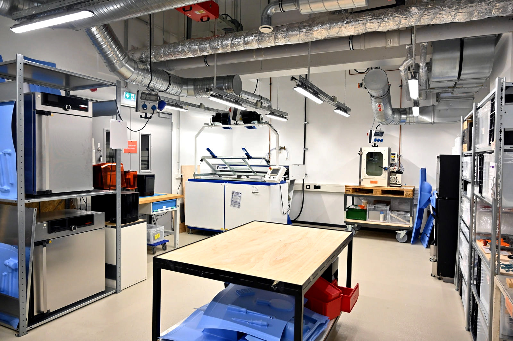
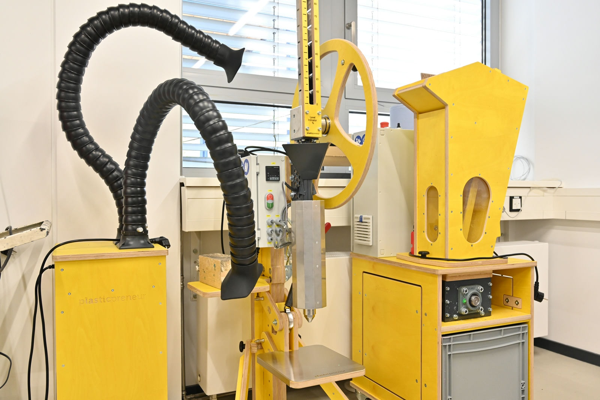
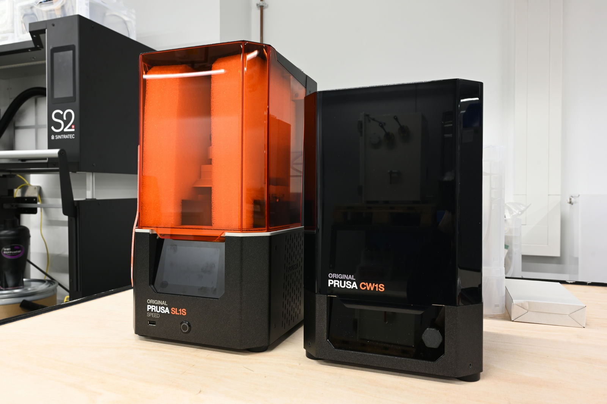
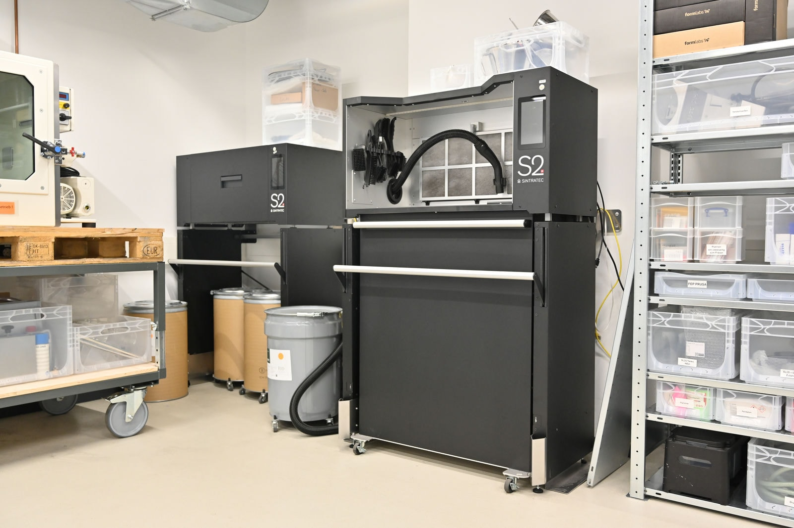
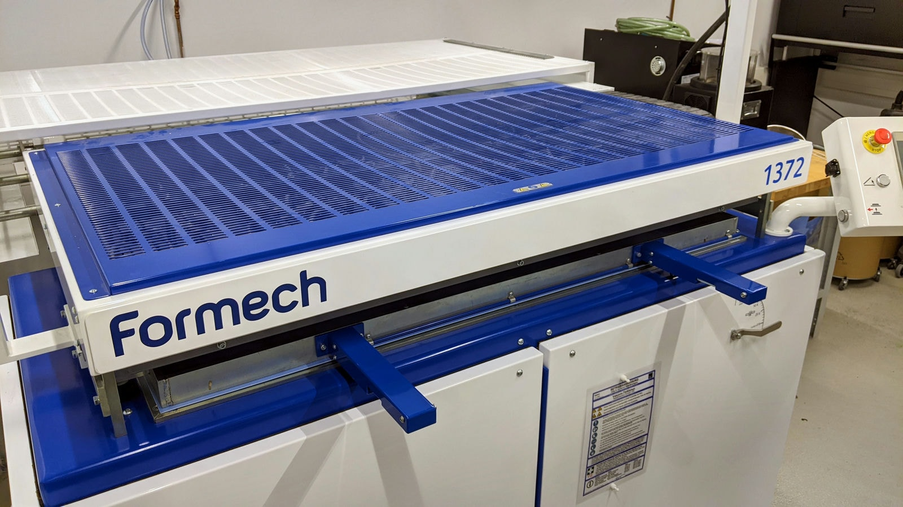
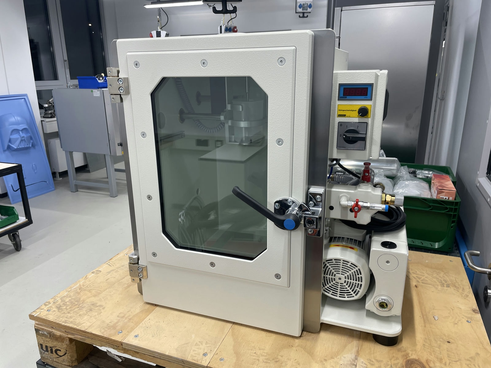
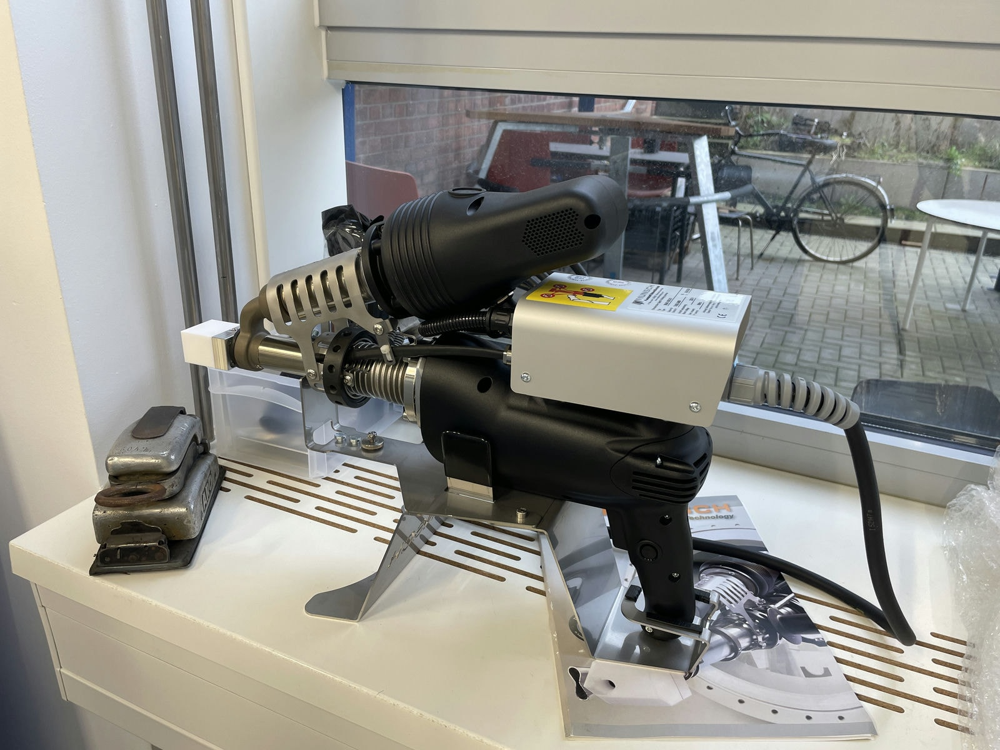
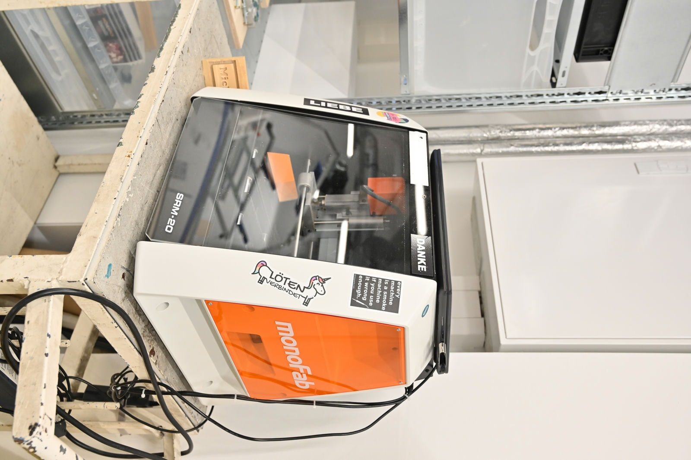

# Kunststoffwerkstatt

!!! warning "Die Kunststoffwerkstatt befindet sich noch im Aufbau"

    Die meisten Teile der Kunststoffwerkstatt sind bereits nutzbar - aber nicht alle. Bitte sprich uns daher möglichst frühzeitig mit deinem Anliegen an! 

In unserer Kunststoffwerkstatt findest Du verschiedene Maschinen zur Verarbeitung von [Kunststoffen](https://de.wikipedia.org/wiki/Kunststoffverarbeitung), um Prototypen und gegebenenfalls sogar Kleinserien nach Deinen Vorstellungen Realität werden zu lassen. Neben den Kunststoffmaschinen an sich sind in dieser Werkstatt gegebenenfalls auch noch andere Geräte aufgebaut, die beispielsweise aufgrund von Ausdünstungen etwas gefährlicher oder unangenehmer sind. 

??? question "Wer ist die Ansprechperson für die Kunststoffwerkstatt? "
	
	--8<--
	fkb.md
	--8<--

## Wie kann ich die Kunststoffwerkstatt nutzen?

Für die Nutzung der Kunststoffwerkstatt wird die Teilnahme an der [Allgemeinen Sicherheitsunterweisung](unterweisungen.md) und mindestens einer speziellen Unterweisung in einen der unten genannten Arbeitsbereiche in der Kunststoffwerkstatt vorausgesetzt. Die erste dortige Unterweisung beinhaltet auch eine allgemeine Werkstattorientierung und nach Bedarf auch Unterweisungen und Einweisungen in Überdruckatemschutz sowie andere Sicherheitsthemen.

!!! info "[Zum Arbeitsordner 'Kunststoffwerkstatt' mit weiteren Unterlagen](https://ruhr-uni-bochum.sciebo.de/s/VuFDh7eChe6z1v7?path=%2FKunststoffwerkstatt)"

    In diesem Ordner findest Du weitere Unterlagen zu allen Bereichen der Kunststoffwerkstatt wie beispielsweise Bedienungsanleitungen, Betriebsanweisungen, Vorlagen und Muster, Tutorials und andere Dinge, die Dir die Arbeit erleichtern sollen. 
    Wie immer gilt: Gemeinsam sind wir stärker – wir freuen uns über jeden [Beitrag zur Wissens- und Erfahrungssamlung!](feedback.md)

## Kunststoff-Recycling / Shreddern und Spritzgießen {: #preciousplastic }

Wie wichtig das Vermeiden von Müll, Recycling und sinnvolle Wertschöpfungskreisläufe sind, muss man niemandem mehr erzählen. Mit dem Projekt [Precious Plastics](https://preciousplastic.com/) gibt es großartige Möglichkeiten zum Recycling von Plastik - dank [Maker in Residence 2023](mir.md) nun auch bei uns! 

**Unsere Geräte (*Links führen zur Internetseite der Hersteller*):** 

- [Plasticpreneur Shredder](https://plasticpreneur.com/machines/) zum Zerkleinern von Kunststoff
- [Plasticpreneur Injection Machine](https://plasticpreneur.com/machines/) manuelle Spritzgussmaschine
- [Plasticpreneur Air Filter](https://plasticpreneur.com/machines/) Absaugung für Spritzguss und andere Verfahren

## Stereolithographie (SLA-3D-Druck) {: #sla }

Beim SLA-Druck (auf Deutsch: Wannenpolymerisationsdruck) härtet eine Energiequelle schichtweise lichtempfindliche Kunstharze, um so einen 3D-Körper zu erschaffen. SLA-Druck bietet im Vergleich zu anderen 3D-Druck-Verfahren die höchste Auflösung und die beste Oberflächenglätte. Einsatzgebiete sind zum Beispiel funktionales Prototyping, Zahnmedizin oder auch Modellbau. 

**Unsere Geräte (*Links führen zur Internetseite der Hersteller*):** 
	
- [Formlabs Form 3](https://formlabs.com/de/3d-printers/form-3/) Druckvolumen: 145 x 145 x 185 mm
- [Prusa SL1S](https://www.prusa3d.com/de/kategorie/original-prusa-sl1s-speed/) Druckvolumen: 127 x 80 x 150 mm

## Selektives Lasersintern (SLS-3D-Druck) {: #sls }

Bei diesem 3D-Druck-Verfahren wird für jede Schicht des zu erstellenden Körpers feines Kunststoffpulver verteilt. Ein Laser verschmilzt die Pulverpartikel (Sintern), die für die Form des Körpers benötigt werden (selektiv). Das Modell wird am Ende aus einem Pulverbett 'ausgegraben' und überschüssiges Pulver im Modell durch ein Loch abgegossen. Das nicht gehärtete Pulver stützt das entstehende Modell beim Druck, sodass (anders als zum Beispiel bei [FDM-](designlabor.md#fdm) oder [SLA-](#sla)3D-Druck) keine Stütz-Strukturen erforderlich sind. Im Vergleich mit anderen 3D-Druck-Verfahren ist SLS-Druck besonders gut für die Herstellung komplexer und robuster Teile geeignet. Einsatzgebiet ist vor allem das funktionale Prototyping. 

**Unsere Geräte (*Links führen zur Internetseite der Hersteller*):** 

- [Sintratec S2](https://sintratec.com/product/sintratec-s2/) Maximale Partgröße: 130 x 360 mm mit Nachbearbeitungsstation

## Vakuum-Tiefziehen 

Beim Vakuumtiefziehen (oder auch: Vakuumformen) wird ein durch Wärme verformbarer Stoff über eine Passform gelegt und erhitzt. Anschließend wird die Luft zwischen Baustoff und Form herausgesaugt. Durch diesen Unterdruck legt sich der Baustoff passgenau auf die Form. Nach dem Abkühlen behält der Stoff diese neue Form stabil bei.

**Unsere Geräte (*Links führen zur Internetseite der Hersteller*):** 

- [Formech 1372](https://formech.de/product/1372/) Formfläche: 1330 x 620 mm, maximale Ziehtiefe: 420 mm

## Vakuumguss 

Per Vakuumguss lassen sich aus verschiedenen Epoxid- und Polyurethanharzen Prototypen und Kleinserien herstellen. Wie bei allen Gussverfahren muss vorher eine Form produziert werden – üblicherweise aus Silikon. Das Besondere an den fürs Gießen verwendeten Harzen ist, dass es sie mit sehr vielen verschiedenen Eigenschaften gibt. Sie unterscheiden sich in Härte, Ähnlichkeit zu Kunststoffen aus der Massenproduktion, Feuerresistenz, medizinische Zertifizierungen und vielem mehr. Eine weitere Besonderheit des Verfahrens ist, dass sich kleine Serien produzieren lassen, etwa 15 bis 30 Stück pro Silikonform. 

**Unsere Geräte (*Links führen zur Internetseite der Hersteller*):** 

- [Schüchl UHG-400 Easy](https://www.schuechl.de/UHG-Easy-set-de.html) (Kammervolumen: 405 mm, Breite: 400 mm, Tiefe: 455 mm)
- 2x Klima-/Wärmeschrank ([UF 75](https://www.memmert.com/de/produkte/waerme-trockenschraenke/universalschrank/uf75/) und [Uf 110](https://www.memmert.com/de/produkte/waerme-trockenschraenke/universalschrank/uf110/)) bis 300°C, 1x mit steuerbarer Lüftung
- Diverses Zubehör, zum Beispiel zum Formenbau	

!!! info "Weitere Nutzungsmöglichkeiten "

	Die Wärmeschränke können natürlich auch zur Erwärmung, Trockung und Temperierung von Material wie z.B. Filament für den FDM-3D-Druck, Recycling-Kunststoff, Keramik, Metall oder Anwendungen aus ganz anderen Bereichen eingesetzt werden. Nur lebensmittelecht sind sie nicht. 

	Die Vakuumgussmaschine kann in ihrer Funktion als Vakuumkammer für verschiedenste Anwendungen wie z.B. das Entgasen von Stoffen nützlich sein.

## Kunststoffschweißen

Mit einem Handschweißgerät für Kunststoffe lassen sich zum Beispiel Platten, Stangen und andere Kunststoffhalbzeuge miteinander verschweißen oder Reparaturen an (größeren) Kunststoffteilen durchführen. Ein solches Gerät arbeitet, ähnlich wie [FDM-Drucker](designlabor.md#fdm) oder letztlich auch die gewöhnliche Heißklebepistole, mit einem Extruder, durch den ein Kunststoffdraht geschoben wird. Dieser fügt dann die zu verschweißenden Teile zusammen, die durch das Gerät vorerhitzt werden. 

**Unsere Geräte (*Links führen zur Internetseite der Hersteller*):** 

- [Munsch MAK-18](https://munsch-kunststoff-schweisstechnik.de/product-detail/mak-18/)
- Diverse Heißluftföhns und -Werkzeuge

## CNC-Bearbeitung 

In der Kunststoffwerkstatt selbst steht eine kompakte Desktop-CNC-Fräse aus dem Modellbau-Bereich, mit der sich zum Beispiel kleine Formen fürs Gießen oder Tiefziehen sowie Vorrichtungen und Hilfsmittel bauen lassen.  

Größere Projekte aus Kunststoff lassen sich im Makerspace auf verschiedene Weise Schneiden, Fräsen oder Drehen. In Frage kommen je nach gewünschtem Ergebnis, Material, Größe und Stärke die Lasercutter im Designlabor oder der Metallbauwerkstatt, die CNC-Portalfräse und die handgeführte CNC-Fräse in der Holzwerkstatt oder natürlich die Dreh- und Fräsmaschinen in der Metallbauwerkstatt.

!!! info "Weitere Nutzungsmöglichkeiten der Desktop-CNC-Fräse"

	Wie so vieles im Makerspace hat auch die Desktop-CNC-Fräse aus der Kunststoffwerkstatt diverse weitere Aufgaben. Sie ist zum Beispiel ein für allgemeine CNC-Einsteiger\*innen sehr gut geeignetes Gerät, kann auch für die Holzbearbeitung eingesetzt werden und fräst auch mal im Digitallabor Platinen.

**Unsere Geräte (*Links führen zur Internetseite der Hersteller*):** 

- [Roland SRM-20 Desktop-CNC-Fräse](https://www.rolanddg.eu/de/produkte/3d/srm-20-small-milling-machine) (Arbeitsraum 203,2 x 152,4 x 60,5 mm).
- Div. Zubehör, zum Beispiel Werkzeug-Aufnahmen mit Durchmesser 6 mm, 3 mm und 3,175 mm oder ein Schraubstock für einfaches Einspannen von Teilen.

## Vielleicht in Zukunft...

!!! question "Hast Du [Feedback](feedback.md) zu den hier aufgeführten Themen? Bist Du ein Hersteller für DAS Gerät schlechthin in einem der genannten Bereiche und bist interessiert an einem  [Test- oder Demo-Standort](unterstuetzung.md#demozentrum)? Hast Du andere Gedanken zum Thema? [Sprich uns an!](kontakt.md)"

#### Verbundwerkstoffe

Faserverbundwerkstoffe sind zum Beispiel Teile aus Carbon, wie man sie aus dem Fahrzeugbau und vielen anderen Anwendungen kennt. Welche Art von Infrastruktur wir hierzu anbieten werden, erörtern wir derzeit. Zum einen denken wir darüber nach, einen Arbeitsplatz zum klassischen Laminieren per Hand anzubieten, zum anderen gibt es im Bereich 3D-Druck sehr interessante Ansätze dazu, [FDM-Drucke](designlabor.md#fdm) mit Fasern zu verstärken. Beides wird allerdings noch seine Zeit brauchen. 

#### 3D-Drucker-Farm

Der [FDM-Druck](../designlabor#fdm) erfreut sich weltweit – und auch bei uns im Makerspace – ziemlich großer Nachfrage. Es könnte daher in Zukunft Sinn ergeben, unsere Kapazitäten aufzustocken und eine kleine "3D-Drucker-Farm" einzurichten. Sprich: Mehrere zentral gesteuerte und möglichst weit automatisierte 3D-Drucker aufzubauen. Das ist aber nur eine Überlegung und daher eher ferne Zukunftsmusik.
