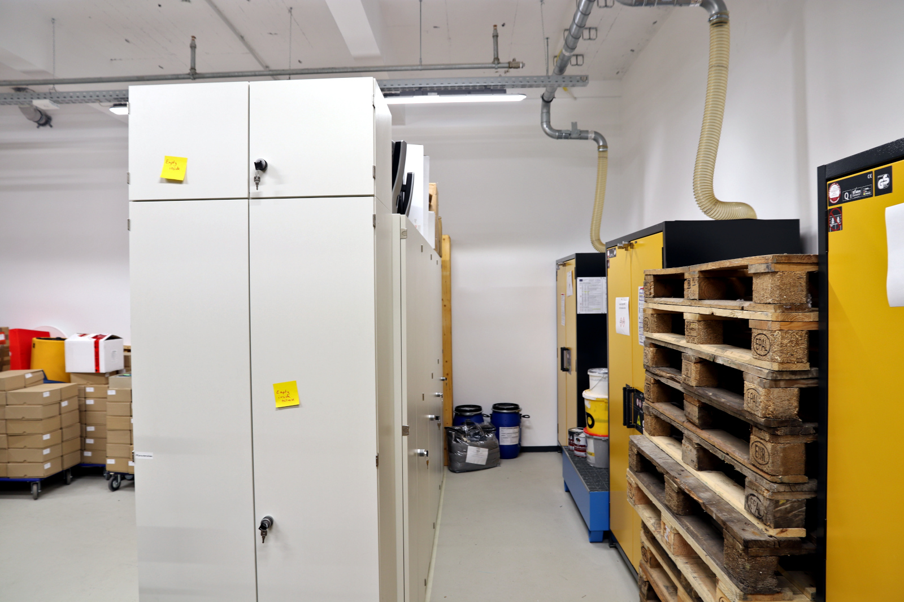

# Material and Storage

'Making' almost always includes the processing of materials. Therefore, the handling and storage of various materials, substances and goods is also an important topic in the Makerspace. Thus, there is the possibility to store things and projects at different places with us. 

!!! info "[To the work folder 'Lager' (storage)](https://ruhr-uni-bochum.sciebo.de/s/VuFDh7eChe6z1v7?path=%2FLager)"

    In this folder you will find further documents such as photos of the stock, operating instructions, templates and samples, and other things to make your work easier.  
    As always: Together we are stronger - we are glad about every [contribution to the knowledge and experience collection!](feedback.en.md)

## General Rules for the Usage of Things

1. for on-site use - **destruction-free, max. on a daily basis and incl. clearing back** after work is done - as a rule, all publicly accessible stored things are freely available (observe markings if necessary). 
1. for consumables, point 1 only applies if it is material from the [treasure chest](#schatzkiste).
1. things stored in the central warehouse, offices and workshops or otherwise under lock and key may only be released and used by arrangement. 
1. project boxes and experimental setups of third parties are off limits. 

## \#schatzkiste (Treasure Chest) - Common (Consumable) Material {: #schatzkiste }

The Makerspace cannot finance or donate the materials for your project. However, under the aspect of cooperative and sustainable work, we provide storage space - *treasure chests* - for material donations of all kinds for the general public. That means:

- If you have bought e.g. 3D printing filament, a wooden board or too many LEDs for your project and subsequently have usable leftovers that you don't need anymore, we would be happy if you would make them available to the community. 
- If you are missing an electrical resistor or a piece of wood for your project, you might also find something in our "treasure chest". 
- We also make sure that especially new users or groups without much money (e.g. students) are provided with leftover material from the "treasure chest" to take their first steps as a "maker".

!!! info "We are very happy about leftover material for the \#schatzkiste (treasure chest) and [donations in kind](unterstuetzung.en.md#sachspenden) from the above areas, which we can make available to the general public."

### Making Treasures Visible

Since we do not want to hide the treasures, but make them visible for everyone, it is important that you label the corresponding material with the hashtag =="\#Schatzkiste"== (via sticker, label, label from the label printer, ...). 

!!! warning "Please do not take unsolicited materials on which you cannot find the hashtag \#Schatzkiste. Please just talk to us if you are unclear!"

## Project Storage and Project Boxes {: #projektboxen }

A project is rarely completed in one day. Therefore, you may want to temporarily store your materials and your project with us for practical reasons. We offer a limited space for this purpose. Important: We cannot assume any liability for what is stored there and the storage room is open to the community. We also ask that the space provided be used responsibly and on a temporary basis. 

1. please always sort your items into one of the abundant euroboxes and **label them with name and project name**.
2. storage of anything larger than one of the boxes must be discussed with the team on a case-by-case basis. 
3. project boxes are to be put away at the end of work - we will tell you where to.

!!! warning "Important information about project boxes and storage"

    - **Do not store hazardous materials in your project box under any circumstances!** The Makerspace also has facilities for storing hazardous materials. Just talk to us about it. PS: Batteries and similar are also hazardous materials!
    - The lockers and storage compartments are **not** available for the prolonged storage of projects and can usually only be used on a daily basis. If they are occupied for a longer period, they will be opened and emptied.
    - Items that are left unlabeled and outside of a project box may be added to the inventory of the makerspace for use in the #Schatzkiste after 48 hours without consulting the owners!

## Other Storage Locations

In addition to the project storage, the RUB Makerspace also has a central storage facility in the basement and a storage room in the basement. These warehouses are intended for operational purposes of the Makerspace and are not freely accessible to users. For example, our hazardous materials cabinets are located here and, in addition to hazardous materials, consumables and repair materials, furniture and various other items are also stored.

