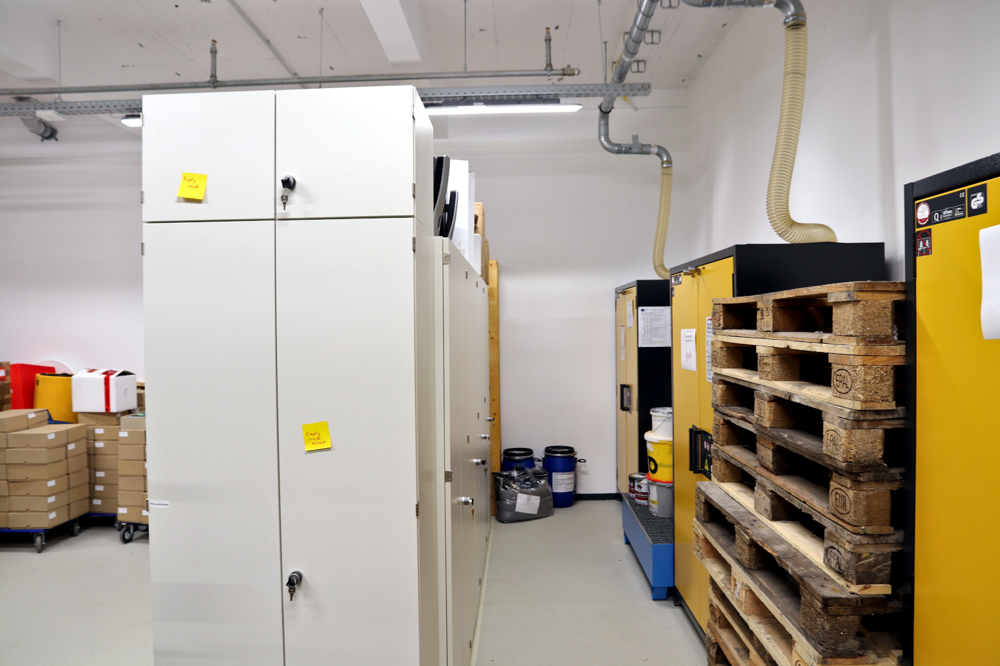

# Material und Lager

‚Making‘ schließt fast immer die Bearbeitung von Materialien ein. Daher ist auch der Umgang mit und die Lagerung von verschiedensten Materialien, Stoffen und Gütern ein wichtiges Thema im Makerspace. An verschiedenen Orten gibt es daher die Möglichkeit Dinge und Projekte bei uns zu lagern.

!!! info "[Zum Arbeitsordner ‚Lager‘](https://ruhr-uni-bochum.sciebo.de/s/VuFDh7eChe6z1v7?path=%2FLager)"

    In diesem Ordner findest Du weitere Unterlagen wie zum Beispiel Fotos der Lagerbestände, Betriebsanweisungen, Vorlagen, Muster und andere Dinge, die Dir die Arbeit erleichtern sollen.
    Wie immer gilt: Gemeinsam sind wir stärker – wir freuen uns über jeden [Beitrag zur Wissens- und Erfahrungssammlung!](feedback.md)

## Allgemeine Spielregeln zur Verwendung von Dingen

1. Für die Verwendung vor Ort – **zerstörungsfrei, maximal tagesweise und inkl. Zurückräumen** nach getaner Arbeit – stehen im Regelfall alle öffentlich zugänglich gelagerten Dinge frei zur Verfügung (gegebenenfalls Kennzeichnungen beachten). 
1. Für Verbrauchsmaterial gilt Punkt 1 nur, wenn es Material aus der [Schatzkiste](#schatzkiste) ist.
1. Dinge, die im Zentrallager, in Büros und Werkstätten oder anderweitig unter Verschluss gelagert sind, dürfen nur nach Absprache herausgegeben und verwendet werden. 
1. Projektkisten und Versuchsaufbauten Dritter sind Tabu. 

## \#Schatzkiste – gemeinschaftliches (Verbrauchs-)material {: #schatzkiste }

Der Makerspace kann Dir nicht die Materialien für Dein Projekt finanzieren beziehungsweise schenken. Unter dem Aspekt des kooperativen und nachhaltigen Arbeitens stellen wir aber Lagerplatz – Schatzkisten – mit Materialspenden aller Art für die Allgemeinheit zur Verfügung. Das heißt:

- Falls Du für Dein Projekt zum Beispiel 3D-Druck-Filament, eine Holzplatte oder zu viele LEDs gekauft hast und anschließend verwertbare Reste übrighaben solltest, die Du nicht mehr brauchst, freuen wir uns, wenn Du diese der Community zur Verfügung stellen würdest. 
- Falls Dir für Dein Projekt ein elektrischer Widerstand oder ein Stück Holz fehlt, kann es gut sein, dass auch Du in unserer ‚Schatzkiste‘ fündig wirst. 
- Wir sorgen außerdem im Alltag dafür, dass insbesondere neue Nutzende oder Gruppen ohne viel Geld (zum Beispiel Schüler\*innen) aus der ‚Schatzkiste‘ mit Restmaterial versorgt werden, um ihre ersten Schritte als Maker\*in zu gehen.

!!! info "Wir freuen uns sehr über Restmaterial für die \#Schatzkiste und über [Sachspenden](unterstuetzung.md#sachspenden) aus den oben genannten Bereichen, die wir der Allgemeinheit zur Verfügung stellen können."

### Schätze sichtbar machen

Da wir die Schätze nicht verstecken, sondern für alle erkennbar machen wollen, ist es wichtig, dass Du entsprechendes Material mit dem Hashtag =="\#Schatzkiste"== versiehst (per Aufkleber, Beschriftung, Label aus dem Labeldrucker, ...). 

!!! warning "Bitte nimm nicht ungefragt Materialien, auf denen Du den Hashtag \#Schatzkiste nicht finden kannst. Sprich uns bei Unklarheit einfach an!"

## Projektlager und Projektboxen {: #projektboxen }

Ein Vorhaben ist selten an einem Tag abgeschlossen. Daher kann es sein, dass Du Deine Materialien und Dein Projekt aus praktischen Gründen bei uns zwischenlagern möchtest. Wir bieten für diesen Zweck begrenzt Raum an. Wichtig: Wir können keine Haftung für dort Eingelagertes übernehmen und der Lagerraum ist für die Community offen zugänglich. Außerdem bitten wir darum, dass die dafür vorgesehene Fläche verantwortungsvoll und temporär befristet genutzt wird. 

1. Sortiere Deine Gegenstände bitte immer in eine der reichlich vorhandenen Kisten ein und **beschrifte sie mit Namen und Projektbezeichnung.**
2. Die Lagerung von allem, was größer als eine der Kisten ist, muss im Einzelfall mit dem Team besprochen werden. 
3. Projektboxen werden nach Arbeitsende weggeräumt  – und zwar (ausschließlich) ins Projektlager im UG oder auf die Schließfächer im EG.

!!! warning "Wichtige Informationen zu Projektboxen und zum Einlagern"

    - **Lagere keinesfalls Gefahrstoffe in Deiner Projektkiste!** Der Makerspace verfügt auch über Möglichkeiten zur Lagerung von Gefahrgut. Sprich uns dazu einfach an. PS: Auch Akkus und Ähnliche sind Gefahrstoffe!
    - Die Schließfächer und Spinde stehen **nicht** für die längere Lagerung von Projekten zur Verfügung und können in der Regel nur tagesweise genutzt werden. Bei längerer Belegung werden sie geöffnet und geleert. 
    - Dinge, die unbeschriftet und außerhalb einer Projektkiste hinterlassen werden, können nach 48 Stunden ohne Rücksprache mit den Besitzer\*innen in den Bestand des Makerspace zur Verwendung in der #Schatzkiste übergehen!

## Weitere Lagerorte

Der RUB-Makerspace verfügt neben dem Projektlager auch über ein Zentrallager im UG und einen Lagerraum im Kellergeschoss. Diese Lager sind für betriebliche Zwecke des Makerspace und nicht frei für Nutzende zugänglich. Hier stehen beispielsweise unsere Gefahrstoffschränke und es werden neben Gefahrstoffen auch Verbrauchs- und Reparaturmaterialien, Möbel und verschiedene andere Dinge gelagert.

