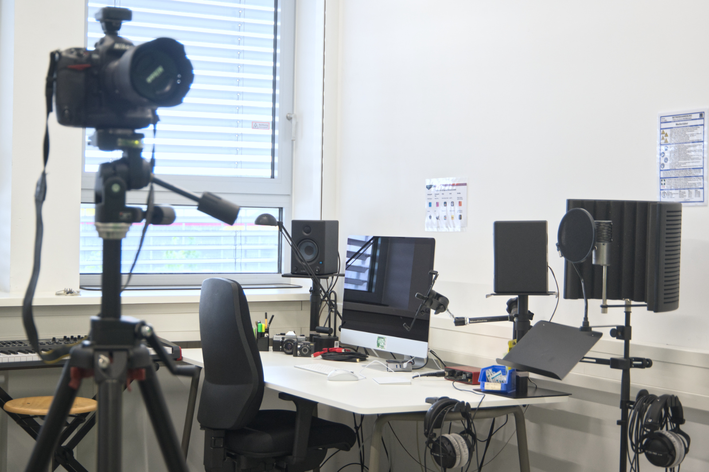
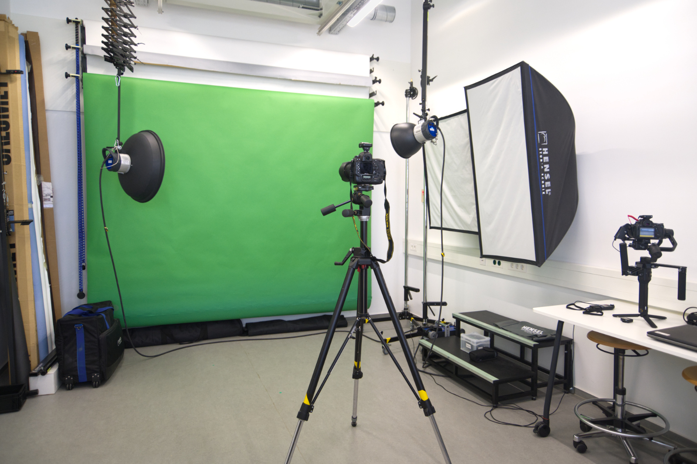
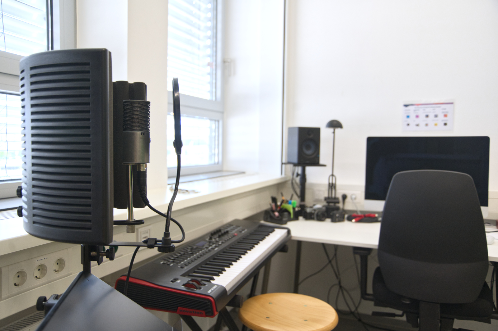
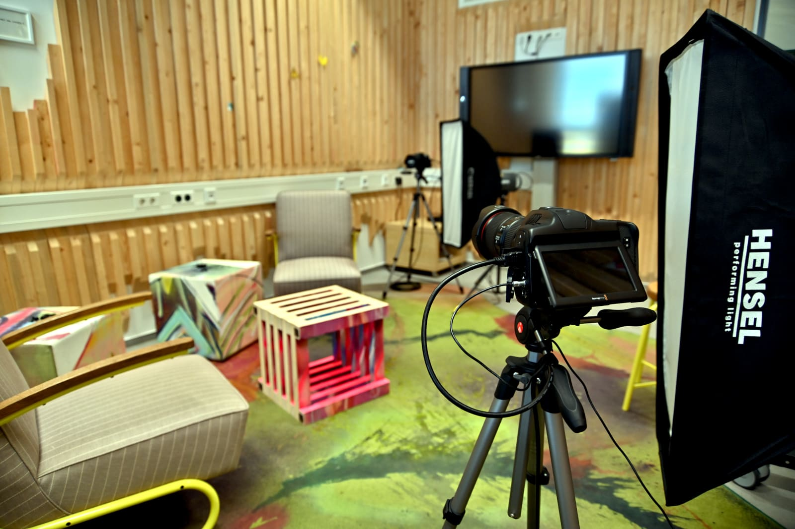
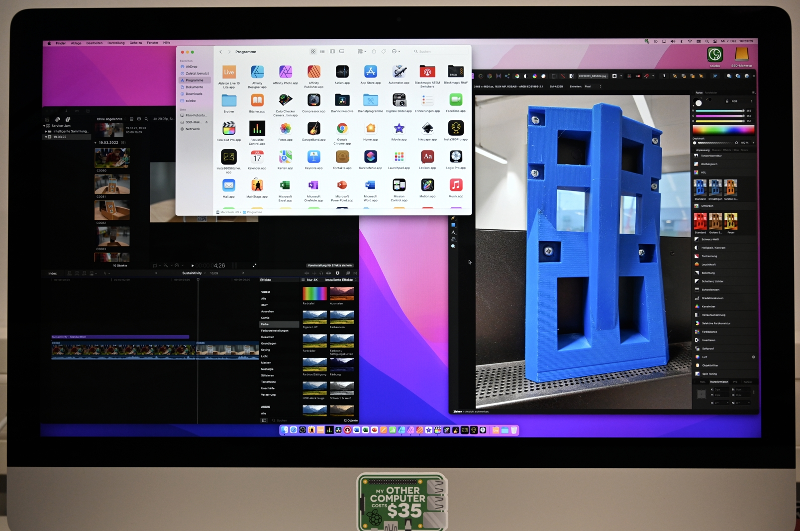

# Medienlabor

Das Medienlabor haben wir aufgebaut, um Dir die Möglichkeit zu geben, Deine Projekte professionell zu dokumentieren und zu präsentieren. Hier bieten wir Dir alles, für eindrucksvolle Produktfotos, spannende Podcasts, das Aufzeichnen von Lehrveranstaltungen oder überzeugende Pitch-Videos inklusive zugehöriger Software.

??? question "Wer ist die Ansprechperson für das Designlabor?"
	
	--8<--
	th.md
	--8<--

## Das kannst Du im Medienlabor machen

- [Foto- und Videoshootings mit DSLR- und Systemkameras](#foto)
- [Aufnahmen mit professionellem Audioequipment](#audio)
- [360° Foto- und Videoaufnahmen](#foto)
- [Video-Broadcasts](#live)
- Drohnenaufnahmen (zurzeit noch nicht einsatzfähig)
- Umfangreiche [Nachbearbeitung](#edit) mit Software für Sound, Foto und Video!

Das meiste Equipment kann übrigens auch [ausgeliehen](ausleihe.md) werden. Frag uns einfach!

## So kannst Du das Medienlabor nutzen

Um im Medienlabor zu arbeiten, musst Du erst die [Allgemeine Sicherheitsunterweisung](unterweisungen.md) besucht haben und bekommst danach eine Einweisung für den jeweiligen Anwendungsfall (beispielsweise Produktfotos oder 360°-Kamera). Mit den meisten Geräten darfst Du anschließend selbstständig arbeiten. Ausnahmen sind Drohne und Kamerakran, die mehr Auflagen haben. Sprich uns dazu bitte separat an.
Wenn Du das Medienlabor nutzen möchtest, sag uns einfach vor Ort Bescheid oder [kontaktiere](kontakt.md) uns.

!!! info "[Zum Arbeitsordner "Medienlabor" mit weiteren Unterlagen](https://ruhr-uni-bochum.sciebo.de/s/VuFDh7eChe6z1v7?path=%2FMedienlabor)"
    In diesem Ordner findest Du weitere Unterlagen zum Medienlabor wie zum Beispiel Bedienungsanleitungen, Betriebsanweisungen, Tutorials und andere Dinge, die Dir die Arbeit erleichtern sollen.  
    Wie immer gilt: Gemeinsam sind wir stärker – wir freuen uns über jeden [Beitrag zur Wissens- und Erfahrungssamlung!](feedback.md)

## Foto- und Videokameras {: #foto }

In unserem Fotostudio findest Du eine Auswahl an Spiegelreflexkameras, die zum Teil auch Videos aufnehmen können. Wir bieten Dir für Deine Projekte professionelles Zubehör wie verschiedene Objektive, Stative, ein Lichtzelt, Fotoblitze mit einer großen Auswahl an Lichtformern, Belichtungsmesser, einen Kamerakran und vieles mehr.

360°-Content etabliert sich heutzutage in verschiedenen Bereichen, wie bei Hausbesichtigungen oder Erkundungstouren, Produktmarketing oder immersiven Virtual-Reality-Videos. 

[Anwendungsbeispiel: Digitaler Rundgang über den Campus der RUB in 360°.](https://studium.ruhr-uni-bochum.de/de/digitale-campustour)

Solltest Du Dich ergänzend zu den 360°-Kameras außerdem für unser **VR-/AR-Equipment** interessieren dann findest Du [hier](../designlabor/#mr) weitere Informationen!

=== "Kameras"
	
    *Links führen zur Internetseite des Geräte-Herstellers*

    **Vollformatsensor**

	- [Nikon Z7 – spiegellose Foto- und Videokamera](https://www.nikon.de/de_DE/product/digital-cameras/mirrorless/professional/z-7)

	- [Nikon D800E – Foto- und Videokamera](https://www.nikon.de/de_DE/product/discontinued/digital-cameras/2015/d800e)

    - [Nikon D3X – Fotokamera](https://www.nikon.de/de_DE/product/discontinued/2014/d3x)

    **Crop-Sensor**

    - [Nikon D70 – Fotokamera](https://www.nikon.de/de_DE/product/discontinued/digital-cameras/2006/d70#overview)

    - [Canon EOS 80D – Foto- und Videokamera](https://www.canon.de/for_home/product_finder/cameras/digital_slr/eos-80d/)

    **Spezielle Bauarten**

    - GoPro HERO6 Black – Action-Cam

    - [Insta360 Pro 2 – 360°-Kamera](https://www.insta360.com/de/product/insta360-pro2/?ref=steemhunt)

    - [Ricoh Theta 360 – 360°-Kamera](https://theta360.com/de/)

=== "Objektive"

    **Zoomobjektive**

    - Nikon AF-S NIKKOR 24-70mm f/2,8G ED

    - Nikon AF-S NIKKOR 24-120mm f/3,5-5,6G

    - Nikon NIKKOR Z 24-70mm f/4 S

    - Canon EF-S 15-85mm f/3,5-5,6 IS USM

    **Makroobjektive**

    - Nikon AF-S VR Micro NIKKOR 105mm f/2,8G IF-ED

    - Nikon AF-S Micro NIKKOR 60mm f/2,8G ED

    - Canon EF 100mm f/2,8L Macro IS USM

    **Weitwinkelobjektive**

    - Nikon AF-S NIKKOR 14-24mm f/2,8G ED

=== "Zubehör"

	*Links führen zur Internetseite des Geräte-Herstellers*

    - [DJI Ronin-S – Gimbal](https://www.dji.com/de/ronin-s)

    - [Blackmagicdesign ATEM Mini – Kamerahub](https://www.blackmagicdesign.com/de/products/atemmini)

    - [CobraCrane Ultralight 112 – Kamerakran mit Dolly](https://shop.cobracrane.de/cobracrane-ultralight-112.html)

    - [ColorChecker Karte – Farbreferenzkarte](https://calibrite.com/de/product/colorchecker-classic/)

    - [Insta360 Farsight – Fernsteuerungseinheit für Insta360 Pro 2](https://store.insta360.com/product/farsight?_gl=1*4gigee*_ga*Mjg3ODg5MDQwLjE2Njk2NTkyMzM.*_ga_7TV2BE92TS*MTY2OTY1OTIzMi4xLjEuMTY2OTY1OTI0Ni4wLjAuMA..&_ga=2.83849758.961670424.1669659234-287889040.1669659233)

    - [DataVideo TP300 – Teleprompter](https://www.datavideo.com/de/product/TP-300)

    - Diverse Stative und Studiohardware

    - Nikon Speedlight SB-800 – Blitz

## Audiotechnik {: #audio }

Ob in Podcasts, Livestreams, Filmen, Musik oder Sounddesign – Audioqualität spielt eine entscheidende Rolle für den Gesamteindruck Deines Projekts. Mit unserem Equipment kannst Du Dein Audioprojekt professionell umsetzen (von der Aufnahme bis zur fertigen Audiodatei)!

=== "Studio"

    *Links führen zur Internetseite des Geräte-Herstellers*

    - [2x Aston Origin – Großmembranmikrofon](https://www.astonmics.com/DE/product/mics/origin)
    - [Focusrite Scrlett 4i4 3rd Gen. – USB Audiointerface](https://focusrite.com/en/usb-audio-interface/scarlett/scarlett-4i4)
    - [Novation Impulse – MIDI-Masterkeyboard](https://novationmusic.com/de/keys/impulse)
    - [Presonus HP4 – Kopfhörerverstärker](https://www.presonus.com/produkte/de/HP4)
    - [4x Beyerdynamic DT 770 Pro 80 Ohm – Kopfhörer](https://www.beyerdynamic.de/dt-770-pro.html)
    - [1x Rode Podcaster – Großmembranmikrofon](https://de.rode.com/microphones/podcaster)
    - [1x Rode Wireless GO – Drahtloses Ansteck-/Lavaliermikrofon mit einem Sender/Mikrofon](https://de.rode.com/microphones/wireless/wirelessgo)
    - [2x Rode Wireless GO II – Drahtloses Ansteck-/Lavaliermikrofon mit zwei Sendern/Mikrofonen](https://rode.com/de/microphones/wireless/wirelessgoii)
    - 2x Mikrofonstativ mit Akustikschirm

=== "Veranstaltung"

    *Links führen zur Internetseite des Geräte-Herstellers*

    - [LD Systems Curv 500 PS – PA-Anlage/Beschallungsanlage](https://www.ld-systems.com/de/serien/curv-500-serie/3867/curv-500-ps?c=3068)
    - [Behringer Xenyx X2222 – Mischpult](https://www.behringer.com/product.html?modelCode=P0A0L)
    - [4x Shure Beta 58A – Drahtloses Handmikrofon](https://www.shure.com/de-DE/produkte/funkmikrofon-systeme/blx_wireless/beta58a-blx2)
    - [4x Shure WL185 – Drahtloses Ansteck-/Lavaliermikrofon](https://www.shure.com/de-DE/produkte/mikrofone/wl185)
    - [1x Beyerdynamic DT 770 Pro 80 Ohm – Kopfhörer](https://www.beyerdynamic.de/dt-770-pro.html)
    - 4x Mikrofonstativ

## Lichttechnik {: #licht }

Perfekte Aufnahmen und Veranstaltungen gelingen nur mit guter Beleuchtung! Hierfür kannst Du unsere verschiedenen Dauerlichtquellen, Blitze, Softboxen und Abdunklungsmöglichkeiten nutzen.

=== "Studio"

    *Links führen zur Internetseite des Geräte-Herstellers*

    **Blitze**

    - Hensel TRIA 24 S – Generator für Blitzköpfe
    - 2x Hensel EH 3000 – Blitzköpfe
    - 3x Hensel Expert Pro – Kompaktblitze

    **Dauerlicht**

    - 2x Hensel Intra LED – Dauerlichtquelle
    - Cullmann Culight V 390DL – akkubetriebene Videoleuchte mit Blitzschuhadapter

    **Lichtformer**

    - Softboxen in unterschiedlichen Größen bis 60 x 120 cm
    - 7", 9" und 12" Reflektoren mit Wabeneinsätzen
    - Beautydish
    - Snoot – Engstrahlenreflektor für Spotlight
    - Lichtzelt

    **Zubehör**

    - [Calumet DFM 3 – Belichtungsmesser](https://www.calumetphoto.de/product/Calumet-DFM-3-Belichtungsmesser/CALCF0300)
    - Diverse Stative und Studiohardware

=== "Veranstaltung"

    - [9x Stairville Outdoor Stage Par RGBW – Outdoorscheinwerfer](https://www.thomann.de/de/stairville_outdoor_stage_par_12x4w_quad.htm)
    - [3x Stairville Outdoor Stage Par WLA – Outdoorscheinwerfer](https://www.thomann.de/de/stairville_outdoor_stage_par_12x3w_wla.htm)

## Medienproduktion {: #edit }

Nichts läuft heute ohne Software. Egal ob Filmschnitt, Streaming, Soundbearbeitung... Die Möglichkeiten sind grenzenlos. Bei uns hast Du sowohl Zugang zu gängiger Open-Source-Software, als auch zu professionellen Programmen etablierter Hersteller. Da Videoprojekte und 360°-Aufnahmen auch schonmal etwas höhere Anforderungen an die Computerhardware stellen können hast Du bei uns die Möglichkeit Deine Projekte direkt vor Ort auf leistungsstarken Systemen zu bearbeiten. [Hier](../digitallabor/#it) findest Du Informationen zu unseren Laptops und Desktop-Workstations.

=== "Video"

    *Links führen zur Internetseite des Herstellers*

    - [DaVinci Resolve](https://www.blackmagicdesign.com/de/products/davinciresolve/)

    - [Final Cut Pro](https://www.apple.com/de/final-cut-pro/)

    - [Shotcut](https://www.shotcutapp.com/)

=== "Foto und Grafik"

    *Links führen zur Internetseite des Herstellers*

    - [Affinity Suite (Photo, Designer, Publisher)](https://affinity.serif.com/de/)

    - [GIMP](https://www.gimp.org)

    - [Krita](https://krita.org/en/)

    - [Inkscape](https://inkscape.org/de/)

=== "Audio"

    *Links führen zur Internetseite des Herstellers*

    - [Logic Pro](https://www.apple.com/de/logic-pro/)

    - [Ableton Live Lite](https://www.ableton.com/de/live/)

    - [Garage Band](https://www.apple.com/mac/garageband/)

    - [Ardour – open-source Digital Audio Workstation](https://ardour.org)

    - [LMMMS – open-source Digital Audio Workstation](https://lmms.io)

=== "Sonstige"

    *Links führen zur Internetseite des Herstellers*

    - [Insta360 Stitcher](https://onlinemanual.insta360.com/pro2/de-de/tutorial_video/stitcher_photo)

    - [ATEM Software Control](https://www.blackmagicdesign.com/de/products/atemmini/software)

    - [OBS Studio](https://obsproject.com/)

## Bühnentechnik {: #live }

Unsere Veranstaltungstechnik wird ergänzt durch eine Bühne mit Rollstuhlrampe.

=== "Bühne"

    *Links führen zur Internetseite des Geräte-Herstellers*

    - [10x Scherenpodest 2x1m](https://www.thomann.de/de/stairville_unistage_20_x_10m_odsc_outd.htm)

    - 15m Podestgeländer

    - 15x0,4m Bühnenvorhang – schwarzer Molton

    - Rollstuhlrampe für 0,4m Bühnenhöhe

    - 2x Treppe für 0,4m Bühnenhöhe

=== "Sound"

    Beim angegebenen Equipment handelt es sich um die selben Geräte wie im Abschnitt [Audiotechnik/Veranstaltung](../medienlabor/#audio)

    *Links führen zur Internetseite des Geräte-Herstellers*

    - [LD Systems Curv 500 PS – PA-Anlage/Beschallungsanlage](https://www.ld-systems.com/de/serien/curv-500-serie/3867/curv-500-ps?c=3068)

    - [Behringer Xenyx X2222 – Mischpult](https://www.behringer.com/product.html?modelCode=P0A0L)

    - [4x Shure Beta 58A – Drahtloses Handmikrofon](https://www.shure.com/de-DE/produkte/funkmikrofon-systeme/blx_wireless/beta58a-blx2)

    - [4x Shure WL185 – Drahtloses Ansteck-/Lavaliermikrofon](https://www.shure.com/de-DE/produkte/mikrofone/wl185)

    - [1x Beyerdynamic DT 770 Pro 80 Ohm – Kopfhörer](https://www.beyerdynamic.de/dt-770-pro.html)

    - 4x Mikrofonstativ

=== "Licht"

    Beim angegebenen Equipment handelt es sich um die selben Geräte wie im Abschnitt [Lichttechnik/Veranstaltung](../medienlabor/#licht)

    *Links führen zur Internetseite des Geräte-Herstellers*

    - [9x Stairville Outdoor Stage Par RGBW – Outdoorscheinwerfer](https://www.thomann.de/de/stairville_outdoor_stage_par_12x4w_quad.htm)

    - [3x Stairville Outdoor Stage Par WLA – Outdoorscheinwerfer](https://www.thomann.de/de/stairville_outdoor_stage_par_12x3w_wla.htm)

=== "Medientechnik"

    *Links führen zur Internetseite des Geräte-Herstellers*

    - Legamaster – 86" Touch-Display

    - Kurzdistanzbeamer mit mobiler Leinwand (noch im Aufbau)