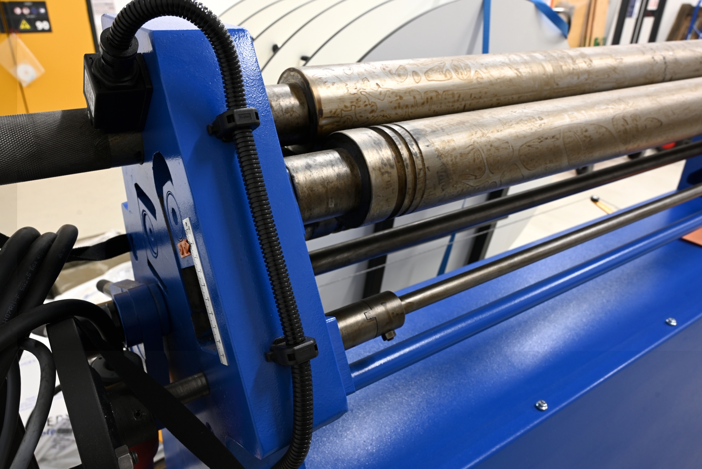
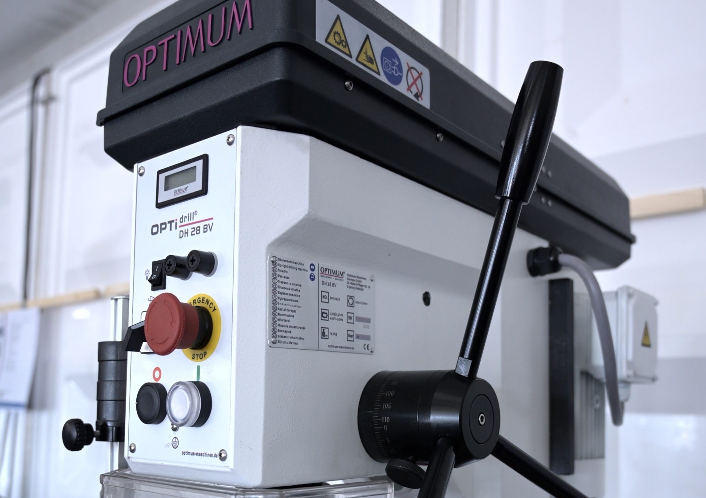
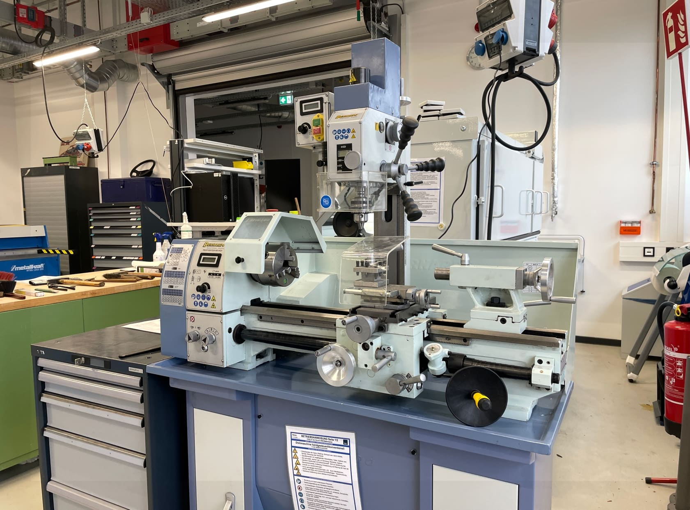
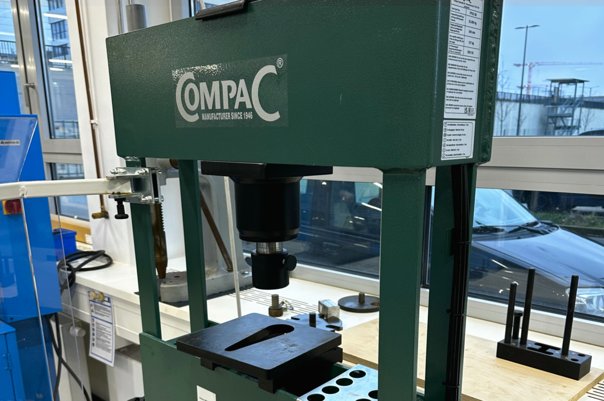

# Metal Workshop

!!! info "Availability of Machines and Devices" 

	From time to time, certain machines and equipment may not be available for use due to renovations, expansions, maintenance, repairs or other similar reasons. This may be because they are out of order or require initial commissioning. If you require the use of specific equipment for your project, we ask that you contact the relevant contacts by email or telephone in advance to ensure availability.

Whether you need to drill, bend, mill, saw, weld, or press, our Metal Workshop provides the right machines, as well as competent guidance and support for your metalworking project.  

In our workshops, "Basics of Metalworking" and "Welding for Beginners," you can learn the basics of handling metalworking tools and start your first projects with confidence, while receiving expert support from our team. At our Metal Workshop, we encourage you to get involved and take on new challenges. Instead of saying "Hands off," we say: "Come here! Go for it! We will help you! Keep at it!"  

Once you have completed the necessary safety briefings, you are allowed to work independently in the Metal Workshop. Join the "Club of Metalworking" and let your creativity flow. :material-hammer-wrench:  

??? question "Who is the contact for the Metal Workshop?"
	
	--8<--
	dk.en.md
	--8<--

## How to use the Metal Workshop

In order to work in the Metal Workshop, you must first have attended the [General Safety Instruction](unterweisungen.en.md) and then receive instruction and training for the respective application (for example, milling or drilling). Many devices require experience in handling and therefore we only let you work independently on the machines after detailed instruction.
If you want to use our Metal Workshop, just let us know on site or [contact](kontakt.en.md) us.

To work in our Metal Workshop, you must first attend the [General Safety Instruction](unterweisungen.en.md) and receive training for the specific equipment or application you wish to use, such as milling or drilling. Many of the machines in the Metal Workshop require experience and expertise to operate safely and effectively, so we only allow individuals to work independently after they have received detailed instruction and training.

If you would like to use our Metal Workshop, please let us know on-site or [contact us](kontakt.en.md).  

!!! info "[To the work folder 'Metal Workshop' with further documents](https://ruhr-uni-bochum.sciebo.de/s/VuFDh7eChe6z1v7?path=%2FMetallbauwerkstatt)"

    In this folder you will find further documents for the Metal Workshop such as operating manuals, operating instructions, tutorials and other things to make your work easier.  
    As always: Together we are stronger - we are happy about every [contribution to the knowledge and experience collection!](feedback.en.md)

## This is What You Can Do in the Metal Workshop

- [Sheet metal working](#blech) 
- [Drilling](#bohren)
- [Lathing](#drehen)
- [Milling](#fraesen)
- [Measure and test](#messen)
- [Pressing](#pressen)
- [Welding](#schweissen)

Below you will find a detailed description of each of these areas.

## Sheet Metal Working {: #blech }

Bending is a manufacturing process in which a bending moment is applied to the material, causing a plastic, permanent deformation. 
When bending sheet metal, the shape is changed by folding it over. 
   

**Our Devices (*Links lead to the manufacturer's website*):** 

- [Plate Shears MTBS-1255-30](https://www.top-maschinen.de/metallkraft-tafelblechschere-mtbs-1255-30-e.html)

	- 1250 mm working width
	- up to 3 mm cutting capacity depending on material
	- length stop up to 630 mm

- [Press Brake Bench FSBM-1020-25](https://www.top-maschinen.de/schwenkbiegemaschine-fsbm-1020-25-e.html) 

	- 1020 mm working width
	- Maximum bending angle 135
	- Bending capacity mild steel 2,5 mm
	- Bending capacity VA steel 1,5 mm
	- Bending capacity aluminum 3 mm
            
- [Round Bending Machine RBM 1270-25E](https://www.stuermer-maschinen.de/suche/produktdetail/?tx_stuermerprodukte_pi1%5Baction%5D=show&tx_stuermerprodukte_pi1%5Bcontroller%5D=Produkt&tx_stuermerprodukte_pi1%5Bprodukt%5D=3813202&tx_stuermerprodukte_pi1%5Btaxo%5D=10003&tx_stuermerprodukte_pi1%5Bsearch%5D=1&tx_stuermerprodukte_pi1%5BL%5D=0&cHash=abc81d69d8e4932c28ba6929dd61df93)

	- 1270 mm working width
	- Bending capacity for 
		- steel 2.5 mm
		- VA steel 1.8 mm
		- aluminum 3.0 mm
	- Bending diameter minimum 135 mm

## Stationary Drilling Machines {: #bohren }

To drill a hole in solid material, a stationary drilling machine is very suitable. Here you can drill into a wide variety of materials. Whether steel, aluminum or plastic. 

**Our Devices (*Links lead to the manufacturer's website*):** 

- [Stationary Drilling Machine Optidrill DH28BV](https://www.stuermer-maschinen.de/metallbearbeitung/metallbearbeitungsmaschinen-bohrmaschinen/optidrill-dh-28bv-3020430/)
	- Drilling capacity up to 28 mm
	

- [Bench Drill UNIMAX 1 TAP](https://maxion.de/home/produkte/tischbohrmaschinen/unimax-1-tap/)
   - Drilling capacity up to 18 mm

## Lathing {: #drehen }

Lathing is the exciting machining of round parts. So you can make round parts with offsets and curves on lathes.

**Our Devices (*Links lead to the manufacturer's website*):** 

- [GDW C280Z](https://www.gdw-drehen.de/drehmaschinen/conturline/c-280z/)
	- Tip width 650 mm
	- Diameter over bed 360 mm

- [Profi 550 WQV Bernardo Lead Spindle Lathe](https://www.bernardo-maschinen.com/profi-550-wqv-bernardo-leitspindeldrehmaschine.html)
	- Center width 550 mm
	- Center height 125 mm
	- Maximum diameter over bed 250 mm
	
	- Milling attachment:
	- Drilling capacity 16 mm
	- Face milling cutter maximum 50 mm
	- End mill maximum 16 mm
	- Pivotable -90° to 90
	

## Milling Machines {: #fraesen }

Milling produces parts with flat surfaces or contours. Not every part can be produced in 3D printing. Straight components made of steel, aluminum, brass and copper are milled. Plastics can also be milled.

**Our Devices (*Links lead to the manufacturer's website*):** 

- [Avia FNX 30PNC](http://www.avia-cnc.de/index.php/beschreibung-30pnc)
	- Manual milling machine that can also be programmed for simple straight lines. No curves can be programmed and there is no CAM function.  
	- Table area 710 mm x 315 mm
	- Travel 400 mm x 315 mm x 350 mm
	- Control: TNC 128 Heidenhain linear control
	- Speed Variable max 3000 1/min
	
	
## Measuring and Testing {: #messen }

If a component is also to function in assembly, measuring and checking the required dimensions is very important. In our Basic Workshop you will learn to recognize the dimensions. 

**Our Devices (*Links lead to the manufacturer's website*):** 

- [Mitutoyo Measuring Device](https://shop.mitutoyo.ch/web/mitutoyo/de_CH/mitutoyo/01.03.05.031/Nur%20f%C3%BCr%20Web/$catalogue/mitutoyoData/PR/518-351D-21/index.xhtml;jsessionid=C3B2314D4FEA26CAA5A579460BBCD050)
- Various hand-held measuring devices (measuring screws, gauges and so on)

## Pressing {: #pressen }

Sometimes you also need to press two workpieces together. Pressing is very well suited for this. In advance, of course, the components must be manufactured so that the process also works.

**Our Devices (*Links lead to the manufacturer's website*):** 

- [Workshop Press Compac 25t](https://www.compacgmbh.de/de/produkte/werkstattpressen/hp-25/hp-25-1)
	- Pressure 25 tons
	- Stroke 240 mm
- Hand lever press 

## Welding / Thermal Cutting {: #schweissen }

Welding permits a wide range of design possibilities. In general, welded constructions are material-saving, simple and quick to manufacture, and thus cost-effective. For joining metals, welding is generally the best non-detachable connection. 

**Our Devices (*Links lead to the manufacturer's website*):** 

- [Kemppi Fast MIG Pulse 450](https://www.kemppi.com/de-DE/angebot/family/fastmig-x/)
- Artec Topweld EL (Electric hand welder)
- Artec Topweld TIG 300 DC (TIG steel welder)
- [Kemppi Master TIG MLS 4000](https://www.kemppi.com/de-DE/angebot/family/mastertig/?wbraid=CjoKCAjw24qHBhAiEioARvDE1baZIAnCw37Rvk4Z49C4CINIcttEm59wB7fnDBiFhEa2N6kfb8saAr5X)
- [Migatronic PI 250 AC/DC](https://www.migatronic.com/de/support/produkt/pi-250-tig-acdc-1354)
- [Plasma Hand Cutter Inverter CUTi-35](https://www.kjellberg.de/de/catalog/cuti-35.html)
	- Material thickness 0.5 - 12 mm
	- Electrically conductive materials.
