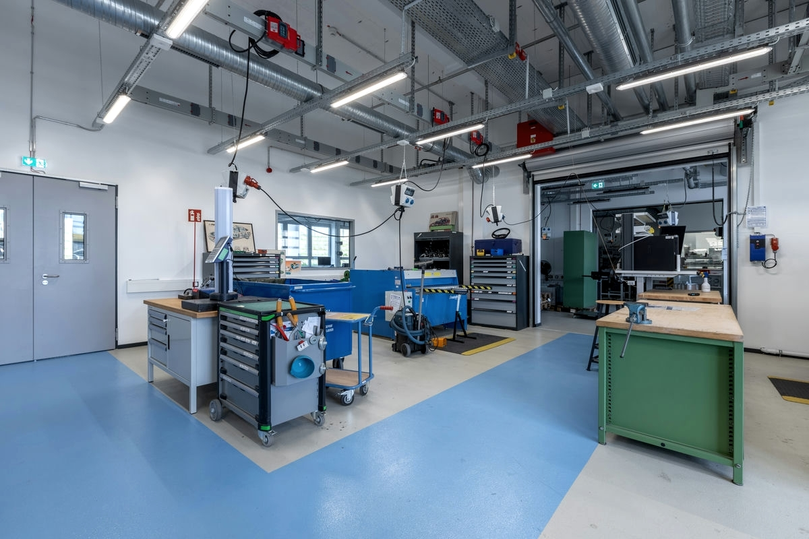
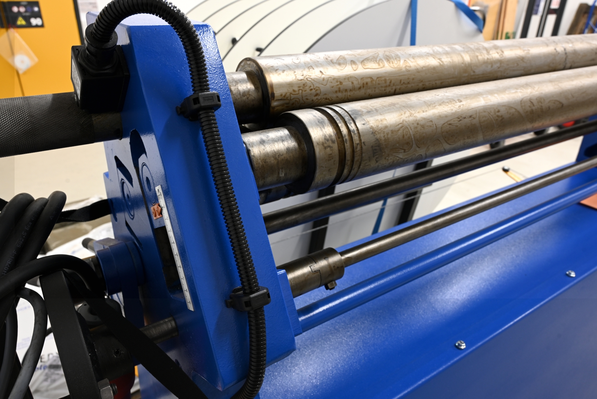
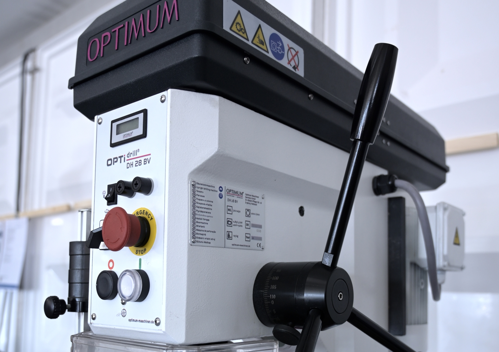
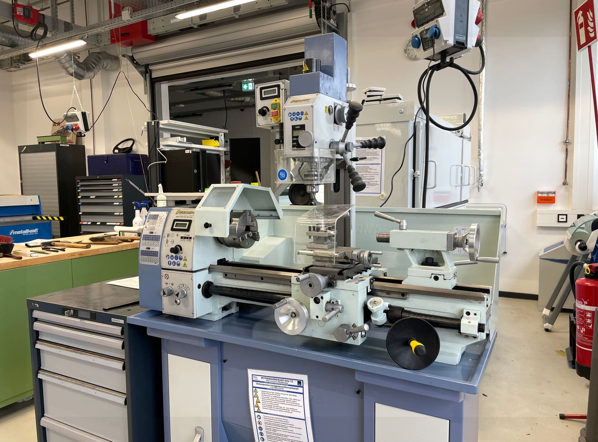
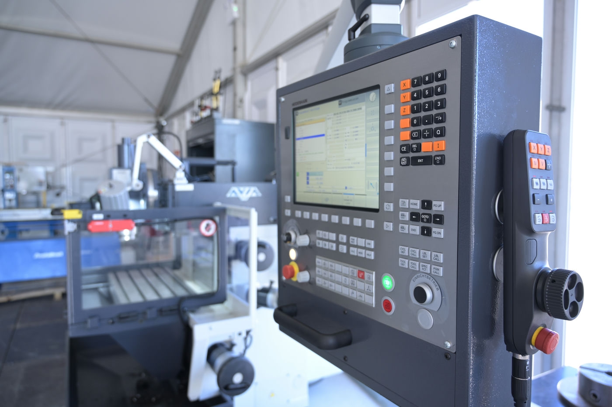
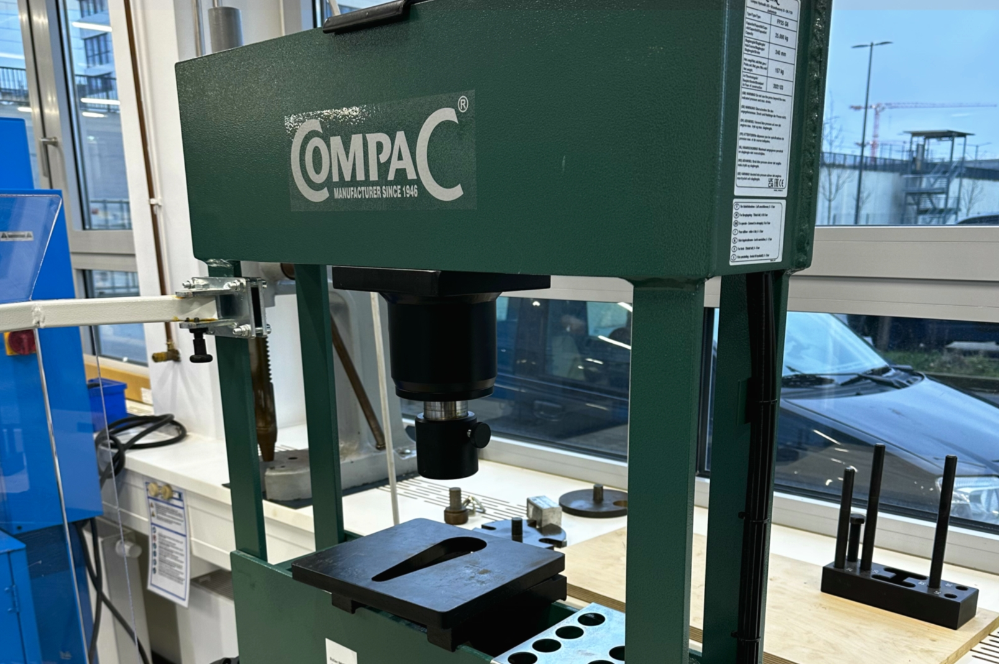
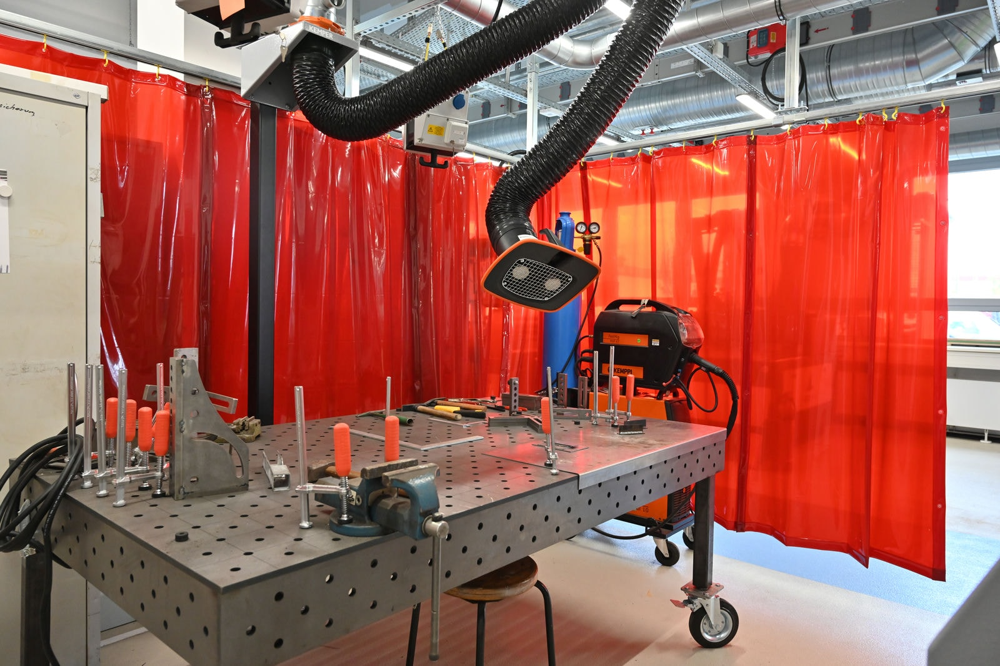

# Metallbauwerkstatt

!!! warning "Die Metallbauwerkstatt befindet sich noch im Aufbau"

    Viele Teile der Metallbauwerkstatt sind bereits nutzbar - aber nicht alle. Außerdem sind bestimmte Teile unserer Ausstattung noch in Beschaffung - wir können z.B. noch nicht so viel im Bereich CNC-Fräsen wie in Zukunft möglich sein wird - oder in der Inbetriebname. Bitte sprich uns daher möglichst frühzeitig mit deinem Anliegen an! 

Ob bohren, biegen, fräsen, sägen, schweißen oder pressen, in unserer Metallwerkstatt findest Du die richtige Maschine und kompetente Anleitung und Unterstützung für Dein Metallprojekt! In den Workshops 'Basics of metalworking' oder 'Welding for beginners' lernst Du Grundlagen und Handling kennen und kannst erste Projekte danach selbstständig und mit Unterstützung starten. Wo es woanders heißt "Finger weg", heißt es bei uns: "Komm her! Geh ran! Wir helfen Dir dabei! Bleib dran!" Nach den Sicherheitsunterweisungen darfst Du recht selbstständig arbeiten. Tauche ein in den 'Club of metalworking'! :material-hammer-wrench:

??? question "Wer ist die Ansprechperson für die Metallbauwerkstatt?"
	
	--8<--
	dk.md
	--8<--

## So kannst Du die Metallbauwerkstatt nutzen

Um in der Metallwerkstatt zu arbeiten, musst Du erst die [Allgemeine Sicherheitsunterweisung](unterweisungen.md) besucht haben und bekommst danach eine Unter- und Einweisung für den jeweiligen Anwendungsfall (beispielsweise Fräsen oder Bohren). Viele Geräte erfordern Erfahrung im Umgang und daher lassen wir Dich nur nach ausführlicher Einweisung selbstständig an den Maschinen arbeiten.
Wenn Du unsere Metallwerkstatt nutzen möchtest, sag uns einfach vor Ort Bescheid oder [kontaktiere](kontakt.md) uns.

!!! info "[Zum Arbeitsordner 'Metallbauwerkstatt' mit weiteren Unterlagen](https://ruhr-uni-bochum.sciebo.de/s/VuFDh7eChe6z1v7?path=%2FMetallbauwerkstatt)"

    In diesem Ordner findest Du weitere Unterlagen zur Metallbauwerkstatt wie zum Beispiel Bedienungsanleitungen, Betriebsanweisungen, Tutorials und andere Dinge, die Dir die Arbeit erleichtern sollen.  
    Wie immer gilt: Gemeinsam sind wir stärker – wir freuen uns über jeden [Beitrag zur Wissens- und Erfahrungssammlung!](feedback.md)

## Das kannst Du in der Metallwerkstatt machen

- [Bleche bearbeiten](#blech) 
- [Bohren](#bohren)
- [Drehen](#drehen)
- [Fräsen](#fraesen)
- [Messen und Prüfen](#messen)
- [Pressen](#pressen)
- [Schweißen](#schweissen)

Im Folgenden findest Du eine ausführliche Beschreibung dieser einzelnen Bereiche.

## Blechbearbeitung {: #blech }

Das Biegen ist ein Fertigungsverfahren, bei dem auf das Material ein Biegemoment aufgebracht und dadurch eine plastische, dauerhafte Verformung herbeigeführt wird. 
Beim Biegen von Blechen wird durch das Umklappen die Form verändert. 
   

**Unsere Geräte (*Links führen zur Internetseite der Hersteller*):** 

- [Tafelblechschere MTBS-1255-30](https://www.top-maschinen.de/metallkraft-tafelblechschere-mtbs-1255-30-e.html)

	- 1250 mm Arbeitsbreite
	- bis 3 mm Schnittleistung abhängig vom Material
	- Längenanschlag bis 630 mm

- [Abkantbank FSBM-1020-25](https://www.top-maschinen.de/schwenkbiegemaschine-fsbm-1020-25-e.html) 

	- 1020 mm Arbeitsbreite
	- Maximaler Biegewinkel 135°
	- Biegeleistung Baustahl 2,5 mm
	- Biegeleistung VA-Stahl 1,5 mm
	- Biegeleistung Aluminium 3 mm
            
- [Rundbiegemaschine RBM 1270-25E](https://www.stuermer-maschinen.de/suche/produktdetail/?tx_stuermerprodukte_pi1%5Baction%5D=show&tx_stuermerprodukte_pi1%5Bcontroller%5D=Produkt&tx_stuermerprodukte_pi1%5Bprodukt%5D=3813202&tx_stuermerprodukte_pi1%5Btaxo%5D=10003&tx_stuermerprodukte_pi1%5Bsearch%5D=1&tx_stuermerprodukte_pi1%5BL%5D=0&cHash=abc81d69d8e4932c28ba6929dd61df93)

	- 1270 mm Arbeitsbreite
	- Biegeleistung bei 
		- Stahl 2.5 mm
		- VA-Stahl 1.8 mm
		- Aluminium 3.0 mm
	- Biegedurchmesser minimal 135 mm

## Standbohrmaschinen {: #bohren }

Um ein Loch/eine Bohrung in festes Material zu bekommen, ist eine Standbohrmaschine sehr gut geeignet. Du kannst bei uns in die verschiedensten Materialien bohren. Ob Stahl, Aluminium oder Kunststoff. 

**Unsere Geräte (*Links führen zur Internetseite der Hersteller*):** 

- [Säulenbohrmaschine Optidrill DH28BV](https://www.stuermer-maschinen.de/metallbearbeitung/metallbearbeitungsmaschinen-bohrmaschinen/optidrill-dh-28bv-3020430/)
	- Bohrleistung bis 28 mm
	

- [Tischbohrmaschine UNIMAX 1 TAP](https://maxion.de/home/produkte/tischbohrmaschinen/unimax-1-tap/)
   - Bohrleistung bis 18 mm

## Drehmaschinen {: #drehen }

Drehen ist die spannende Bearbeitung von runden Teilen. Du kannst also runde Teile mit Absätzen und Rundungen an Drehmaschinen herstellen.

**Unsere Geräte (*Links führen zur Internetseite der Hersteller*):** 

- [GDW C280Z](https://www.gdw-drehen.de/drehmaschinen/conturline/c-280z/)
	- Spitzenweite 650 mm
	- Durchmesser über Bett 360 mm

- [Profi 550 WQV Bernardo Leitspindeldrehmaschine](https://www.bernardo-maschinen.com/profi-550-wqv-bernardo-leitspindeldrehmaschine.html)
	- Spitzenweite 550 mm
	- Spitzenhöhe 125 mm
	- Maximaler Durchmesser über Bett 250 mm
	
	- Fräsaufsatz:
	- Bohrleistung 16 mm
	- Stirnfräser maximal 50 mm
	- Schaftfräser maximal 16 mm
	- Schwenkbar -90° bis 90°
	

## Fräsmaschinen {: #fraesen }

Beim Fräsen werden Bauteile mit ebenen Flächen oder Konturen hergestellt. Nicht jedes Teil lässt sich im 3D-Druck herstellen. Gerade Bauteile aus Stahl, Aluminium, Messing und Kupfer werden gefräst. Auch Kunststoffe lassen sich fräsen.

**Unsere Geräte (*Links führen zur Internetseite der Hersteller*):** 

- [Avia FNX 30PNC](http://www.avia-cnc.de/index.php/beschreibung-30pnc)
	- Manuelle Fräsmaschine, die auch für einfache Geraden programmiert werden kann. Es können keine Rundungen programmiert werden und es gibt keine CAM-Funktion.  
	- Tischfläche 710 mm x 315 mm
	- Verfahrweg 400 mm x 315 mm x 350 mm
	- Steuerung: TNC 128 Heidenhain Streckensteuerung
	- Drehzahl Variabel max 3000 1/min
	
	
## Messen und Prüfen {: #messen }

Wenn ein Bauteil auch im Zusammenbau funktionieren soll, ist das Messen und Prüfen der geforderten Maße sehr wichtig. In unserem Basic Workshop lernst Du die Maße zu erkennen. 

**Unsere Geräte (*Links führen zur Internetseite der Hersteller*):** 

- [Mitutoyo Messgerät](https://www.hoffmann-group.com/DE/de/hom/Messtechnik/H%C3%B6henanrei%C3%9Fger%C3%A4te-H%C3%B6henmessger%C3%A4te/H%C3%B6henmessger%C3%A4te/Digitales-H%C3%B6henmessger%C3%A4t-Linear-Height/p/445390-600EG)
- Diverse Handmessgeräte (Messschrauben, Lehren und so weiter)

## Pressen {: #pressen }

Manchmal mussst Du auch zwei Werkstücke zusammendrücken. Dafür ist Pressen sehr gut geeignet. Im Vorfeld müssen natürlich die Bauteile so gefertigt werden, dass das Verfahren auch funktioniert.

**Unsere Geräte (*Links führen zur Internetseite der Hersteller*):** 

- [Werkstattpresse Compac 25t](https://www.compacgmbh.de/de/produkte/werkstattpressen/hp-25/hp-25-1)
	- Druck 25 Tonnen
	- Hub 240 mm
- Handhebelpresse 

## Schweißen / Thermisches Trennen {: #schweissen }

Das Schweißen gestattet vielfältige konstruktive Möglichkeiten. Im Allgemeinen sind Schweißkonstruktionen werkstoffsparend, einfach und schnell herzustellen und dadurch kostengünstig. Zum Fügen von Metallen ist die Schweißung im Allgemeinen die beste unlösbare Verbindung. 

**Unsere Geräte (*Links führen zur Internetseite der Hersteller*):** 

- [Kemppi Fast MIG Pulse 450](https://www.schweisstechnikkenn.com/de/mietpark/migmag-schweissen/fastmig-pulse-450/show.html)
- Artec Topweld EL (Elektro-Handschweißgerät)
- Artec Topweld TIG 300 DC (WIG-Stahlschweißgerät)
- [Kemppi Master TIG MLS 4000](https://www.kemppi.com/de-DE/angebot/family/mastertig/?wbraid=CjoKCAjw24qHBhAiEioARvDE1baZIAnCw37Rvk4Z49C4CINIcttEm59wB7fnDBiFhEa2N6kfb8saAr5X)
- [Migatronic PI 250 AC/DC](https://www.migatronic.com/de/support/produkt/pi-250-tig-acdc-1354)
- [Plasma-Handschneidinverter CUTi-35](https://www.kjellberg.de/de/catalog/cuti-35.html)
	- Materialstärke 0,5 – 12 mm
	- Elektrisch leitfähige Werkstoffe.
