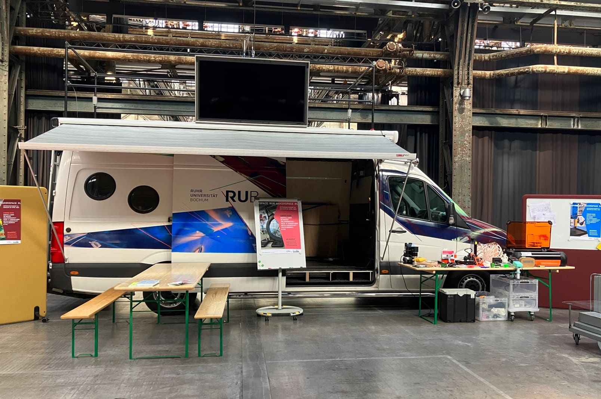
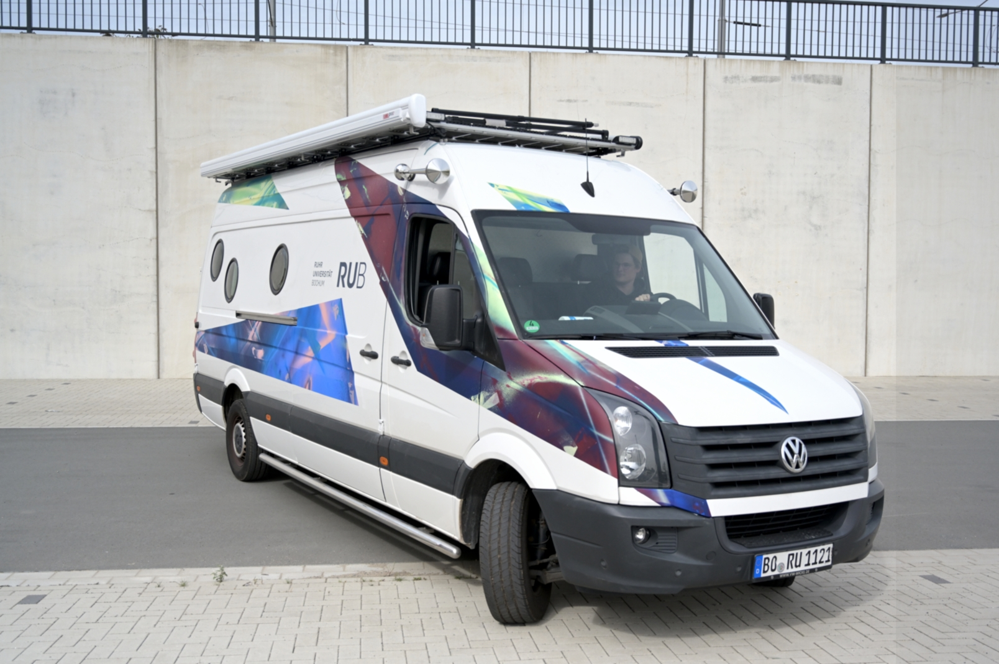
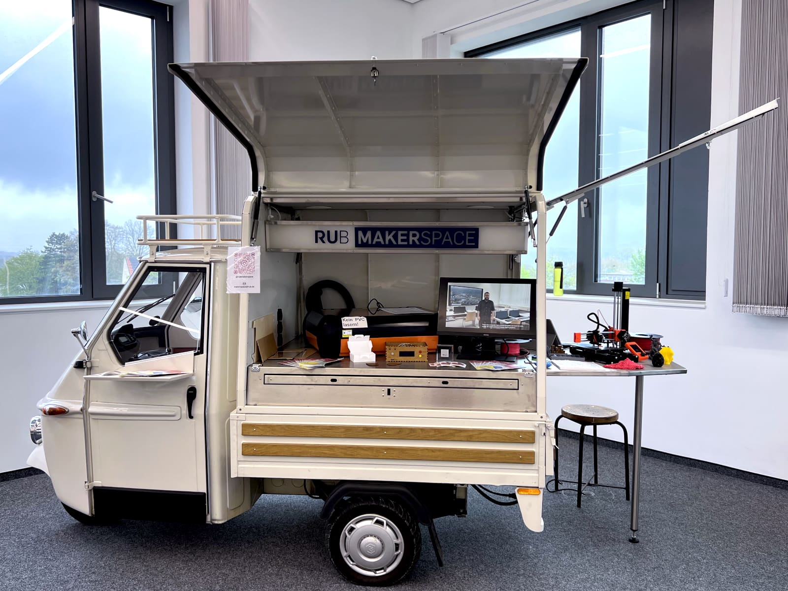

# Mobile Makerspaces

??? warning "Unsere mobilen Makerspaces sind noch im Aufbau – Anklicken für mehr Informationen."

    Unsere beiden Fahrzeuge sind laufende Projekte. Der VW Crafter ist bunt gestaltet und hat eine funktionierende Grundausstattung wie oben beschrieben aber noch keine weiteren Ausbauten. In Zukunft soll er aber Module für verschiedene Werkzeuge und Maschinen bekommen.  
      
    Unsere Piaggio Ape ist noch nicht so auffällig gestaltet. Sie hat zwar einen funktionalen Aufbau, aber noch keine weitere Innenausstattung mit Geräten und Modulen. 

Der RUB-Makerspace hat zwei Fahrzeuge, die als mobile Makerspaces für Workshops und Veranstaltungen im Außeneinsatz sind oder für repräsentative Zwecke und zum Transport von Personal und Material genutzt werden können.

## VW Crafter 

Wir haben das ehemalige Fahrzeug der RUB-Poststelle übernommen und haben es 'aufgehübscht'. Der alte, aber zuverlässige, VW Crafter hat bereits eine Dachterrasse, eine Markise und einen Holzinnenausbau inklusive Sitzbänken und Beleuchtung bekommen. Außerdem wurde er bunt gestaltet und hat auch ein paar weitere optische Auffälligkeiten bekommen.  
  
Das Fahrzeug ist optimal, um mit viel Material in den Außeneinsatz zu gehen und ist komplett als weitgehend autarker Messestand verwendbar.

## Piaggio Ape 

Die Ape ist vielleicht der kleinste mobile Makerspace der Welt. Das Fahrzeug ist auf Elektroantrieb umgebaut worden. Der hintere Aufbau kann aufgeklappt werden, sodass ein Stand für Workshops und Messeauftritte entsteht. Wir hoffen in Zukunft mit gewisser Regelmäßigkeit mit der Ape auf dem Campus präsent sein zu können. Für längere Strecken und größere Messeaufbauten kann die Ape außerdem im Crafter transportiert werden.  
  
Die Ape ist ideal für kleine, aber auffällige und öffentlichkeitswirksame Aktionen in der näheren Umgebung.

   
