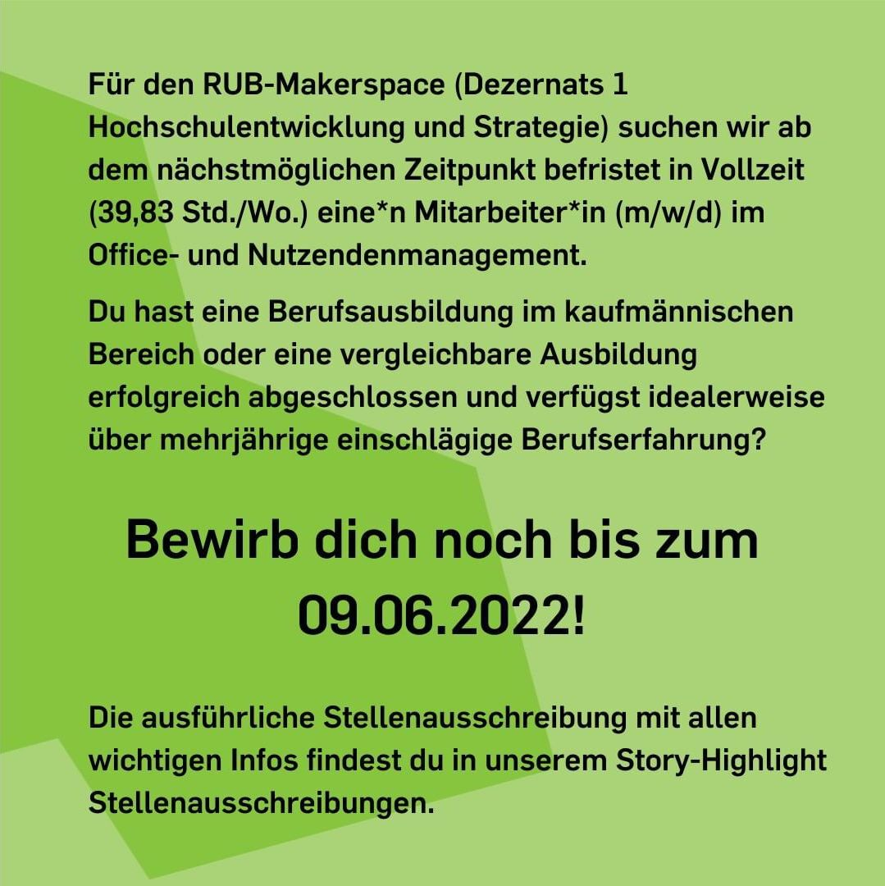

---
hide:
  - toc
date: "2022-01-01"  
authors: "Name oder Kürzel hier"
---

## ToDo zu jeder Newsmeldung

1. Dieses Dokument ([**news-vorlage.md**](https://git.noc.ruhr-uni-bochum.de/makerspace/website/-/tree/main/docs/news-entwuerfe/news-vorlage.md)) kopieren und die Kopie umbenennen. Der Dateiname ergibt nachher die URL, d.h. bleibt knackig-kurz. ==Sonderzeichen und Leerzeichen sind verboten (Nur Buchstaben, Zahlen, Unter- und Bindestriche benutzen!). Den ersten Teil des Dateinamens bildet immer das Datum des Beitrags. Beispiel an den vorhandenen Dateien und ihren Namen nehmen.== 
1. Datum und Autor\*Innen oben im "Header"-Block anpassen (nach "date:" und "authors:" und jeweils innerhalb der Anführungszeichen). *Übrigens:* Dieser ganze Block ist nur in der Markdown-Quelldatei sichtbar - online auf der Website nicht direkt. Hier sorgt er dafür, dass in der Fußzeile das Veröffentlichungsdatum, Autor\*Innen und der Lizenzhinweis gesetzt wird ("Dieser Beitrag steht nicht standardmäßig unter einer freien Lizenz").
1. Den Inhalt der Newsmeldung schreiben / ins Dokument reinkopieren
1. Ggf. Links im Inhalt setzen - so: ```[Text des Links](URL)```
1. Bilder adäquat komprimieren, im Ordner [/medien](https://git.noc.ruhr-uni-bochum.de/makerspace/website/-/tree/main/docs/medien) ablegen und mit dem Datum der News-Meldung und ggf. Buchstaben benennen - zum Beispiel so: ```2022-03-03.jpg``` und ```2022-03-03a.jpg```.
1. Bilder verlinken (im Regelfall ganz unten auf der Seite, s.a. Beispiele unten). Das geht so: ```{ width="45%" } ```. 
1. Diese ToDo-Liste (den ganzen Abschnitt) löschen ;-)
1. Das finale(!) Dokument in Gitlab in den Ordner ["/news"](https://git.noc.ruhr-uni-bochum.de/makerspace/website/-/tree/main/docs/news) verschieben (bzw. im News-Arbeitsordner in Sciebo ablegen, falls man nicht mit/in Gitlab arbeitet).

!!! warning "Achtung! NUR finale Dokumente in den /news-Ordner!"
    In Gitlab keine Entwürfe oder ähnliches im Ordner "news" ablegen. ALLE Dokumente, die dort liegen, wandern in den RSS-Feed und werden in Zukunft ggf. noch weiter automatisch bearbeitet! Für Entwürfe gibt es den Ordner **[/news-entwuerfe](https://git.noc.ruhr-uni-bochum.de/makerspace/website/-/tree/main/docs/news-entwuerfe)**, in dem auch dieses Dokument **[(news-vorlage.md)](https://git.noc.ruhr-uni-bochum.de/makerspace/website/-/tree/main/docs/news-entwuerfe/news-vorlage.md)** lebt.


!!! warning "Keine Werbung / wirtschaftlich wirksame Beiträge"
  D.h. für Social Media-Beiträge z.B., dass @-Mentions bitte am besten auch gleich so neutral wie sinnvoll ersetzt werden. Links zu Firmen dürfen nicht in den News landen.

# Überschrift der Newsmeldung

Hier der Text der Newsmeldung. Dies ist ein [Beispiel-Link](https://rub.de).

## Eine Unter-Überschrift

Und dies sind zwei Beispielfotos:

{ width="45%" } { width="45%" }

Und ein Beispielbild ohne das 45%-Anhängsel:


