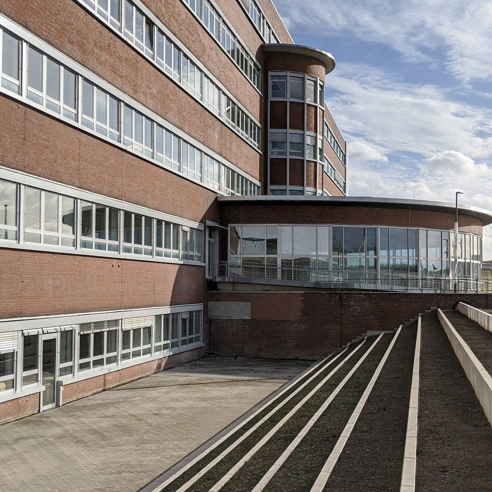
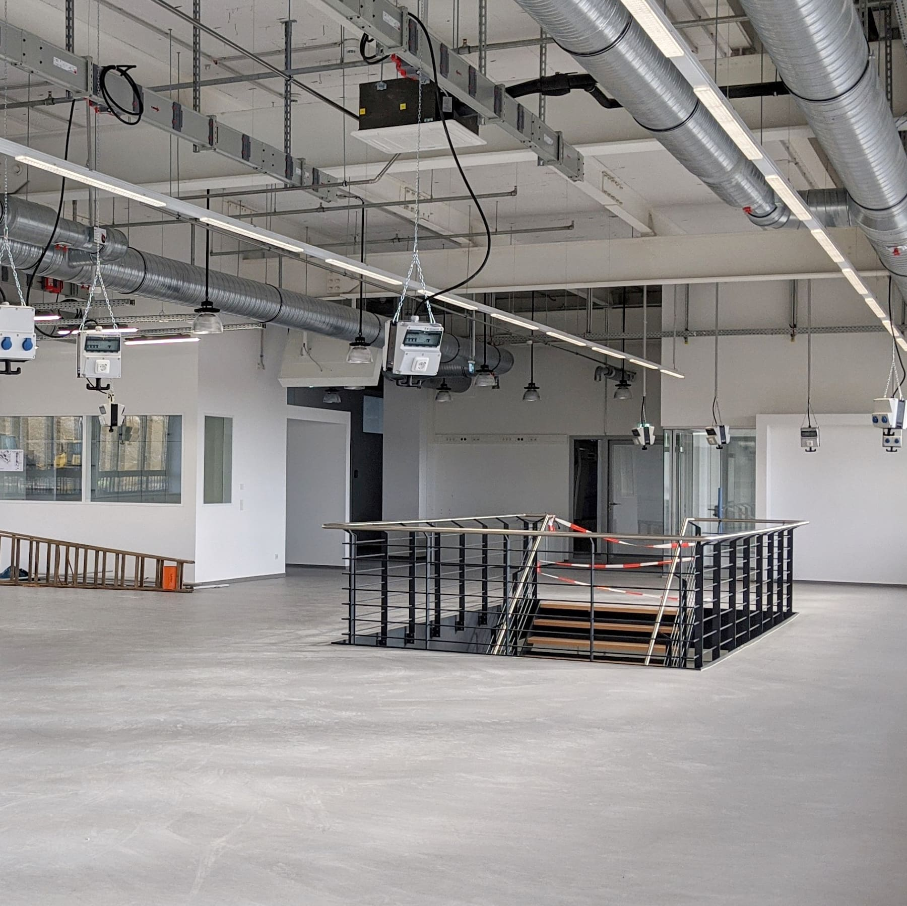
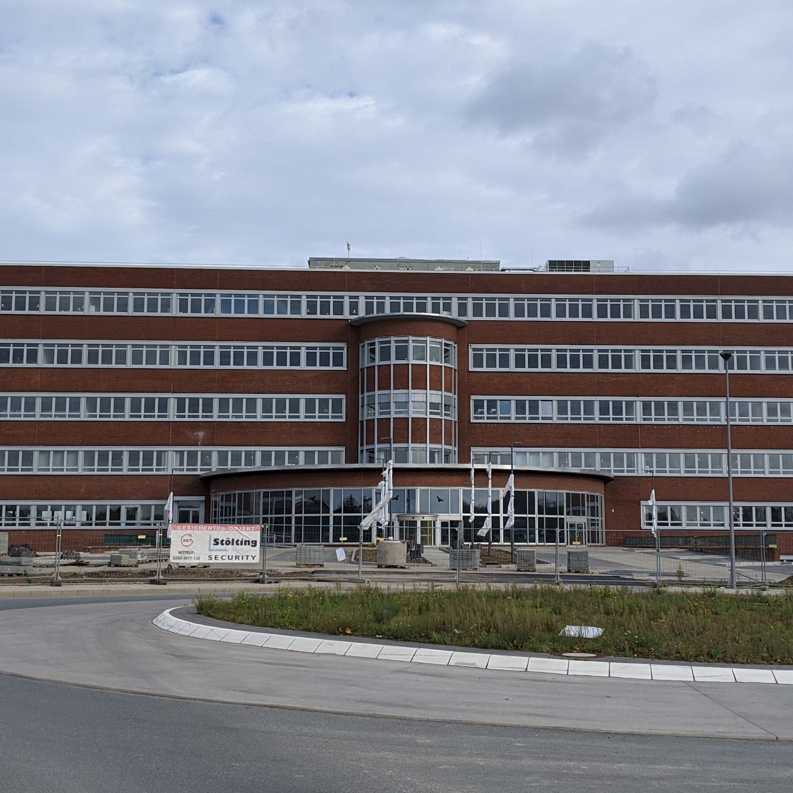

---
hide:
  - toc
date: "2020-11-19"
authors: "LS"
---

# Der RUB-Makerspace auf Mark 51°7 kommt!

Viele Monate wurde hier hart gearbeitet und noch sind nicht alle Renovierungsarbeiten abgeschlossen. Trotzdem haben wir nun unsere 2000 qm dieses wunderschönen Gebäudes bezogen!
Seid gespannt auf die top ausgestatteten Räume und Flächen am denkwürdigen Standort Mark 51°7 und folgt uns für weitere Updates rund um den Aufbau des RUB-Makerspace!

{ width="45%" } { width="45%" } { width="45%" } 
