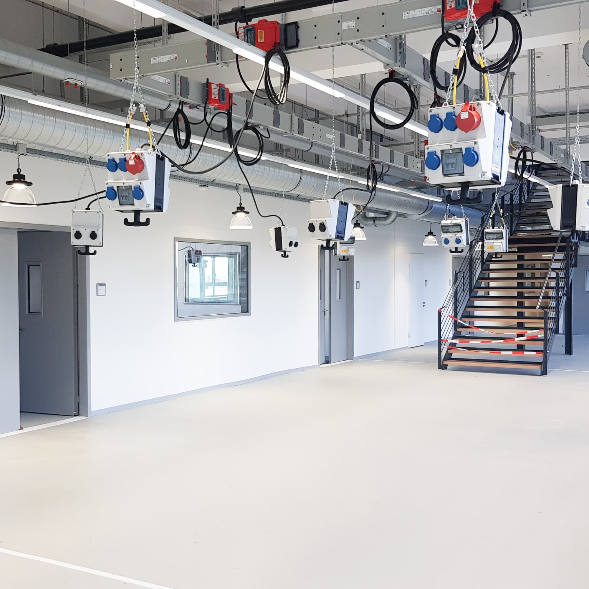
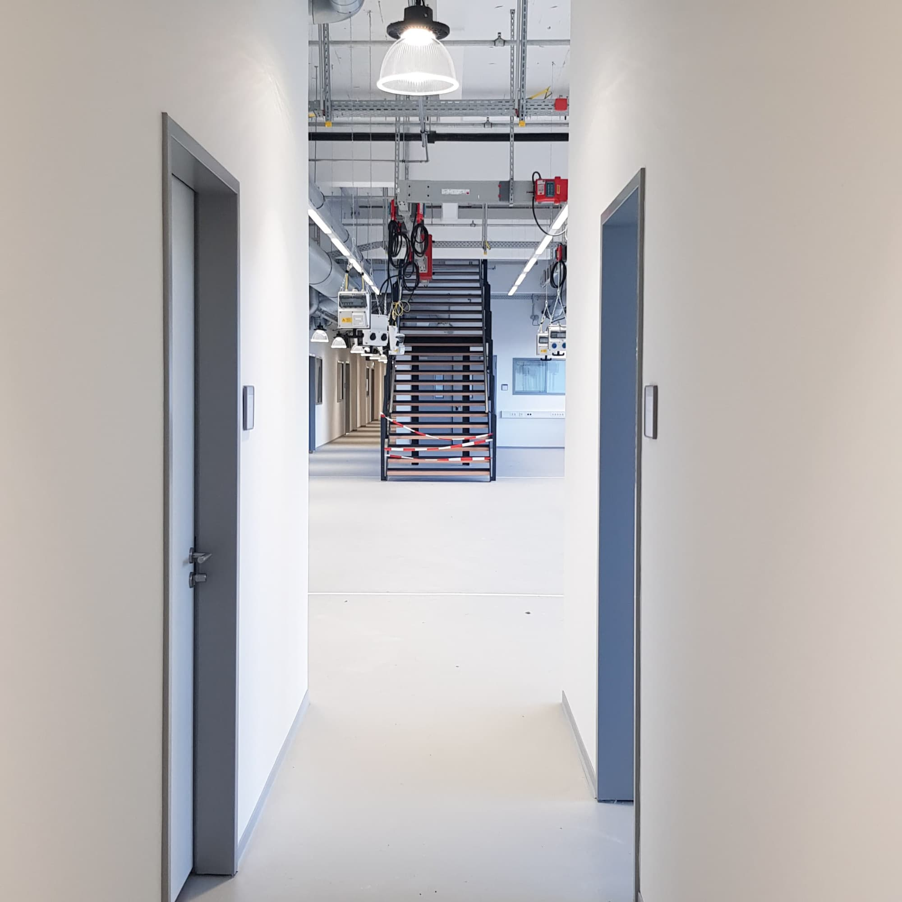

---
hide:
  - toc
date: "2020-12-02"  
---

# Erster Blick ins Untergeschoss

Montagezone, Seminarräume, Lager für Projektarbeiten und so weiter bekommen ihren Platz in unserem lichtdurchfluteten Untergeschoss mit Außenterrasse.

{ width="45%" } { width="45%" }