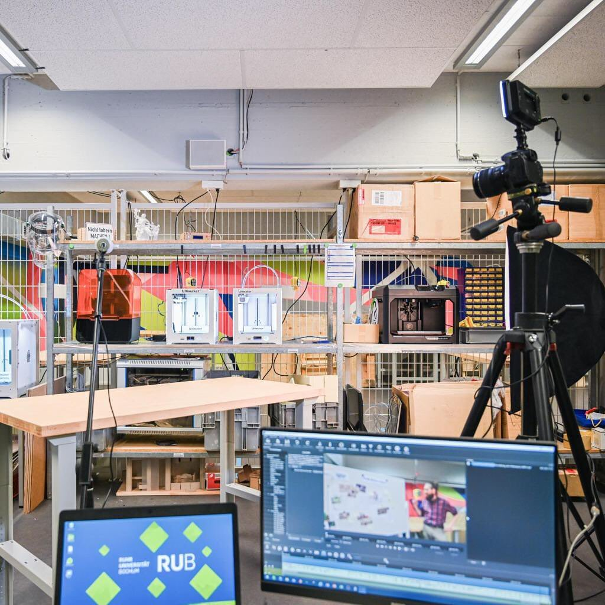

---
hide:
  - toc
date: "2020-12-07"  
authors: "LS"
---

# Maker-Talk: 1. Episode auf unserem Youtube-Kanal

Die [1. Episode des Maker-Talks](https://www.youtube.com/watch?v=df6fDPacFrg) ist live. Wie sieht eigentlich ein Makerspace aus und was kann man da machen? Schaut vorbei auf unserem Youtube Kanal [RUB Makerspace](https://www.youtube.com/@rubmakerspace4214) und gewinnt einen kleinen Einblick in das ehemalige MakerForum und die zukünftigen Möglichkeiten des Makerspace.

{ width="45%" } 
