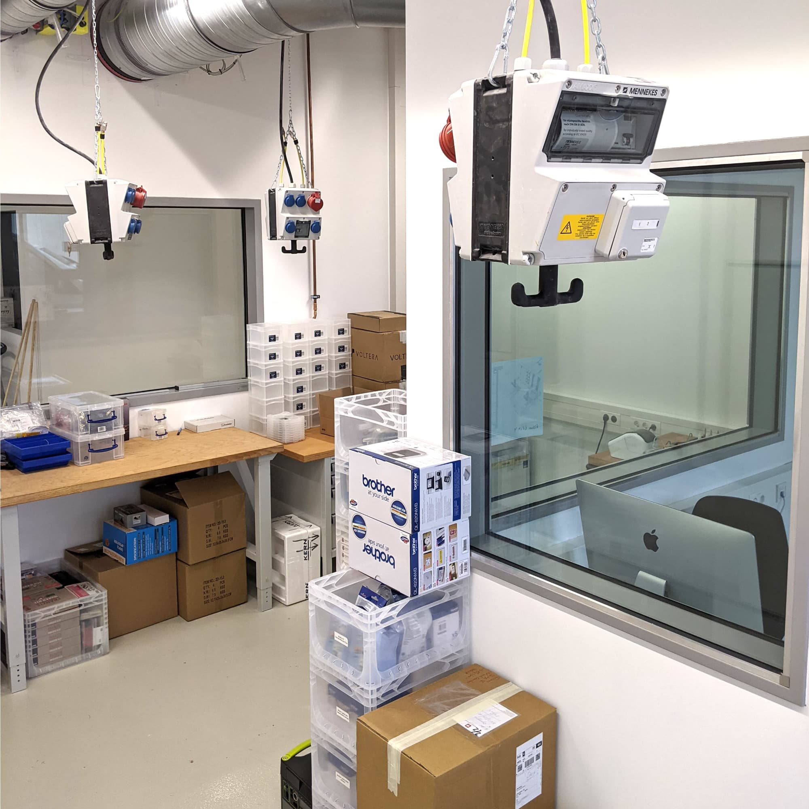
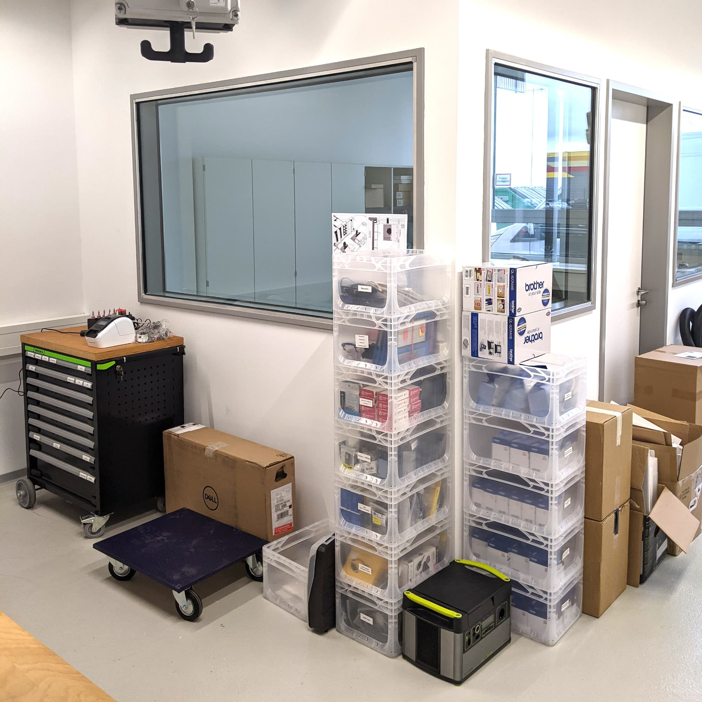

---
hide:
  - toc
date: "2020-12-19"  
---

# Das Digitallabor im Aufbau

Hier werdet ihr alles rund um das Thema Elektrotechnik lernen und umsetzen können! Egal ob mit Lötkolben, Arduino oder Raspberry Pi.

{ width="45%" } { width="45%" }