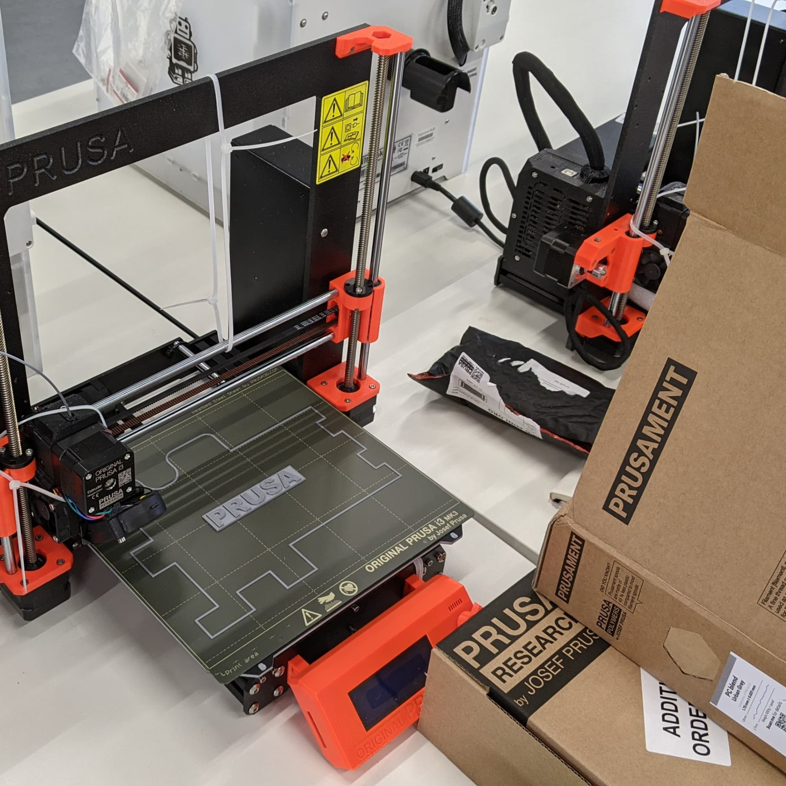
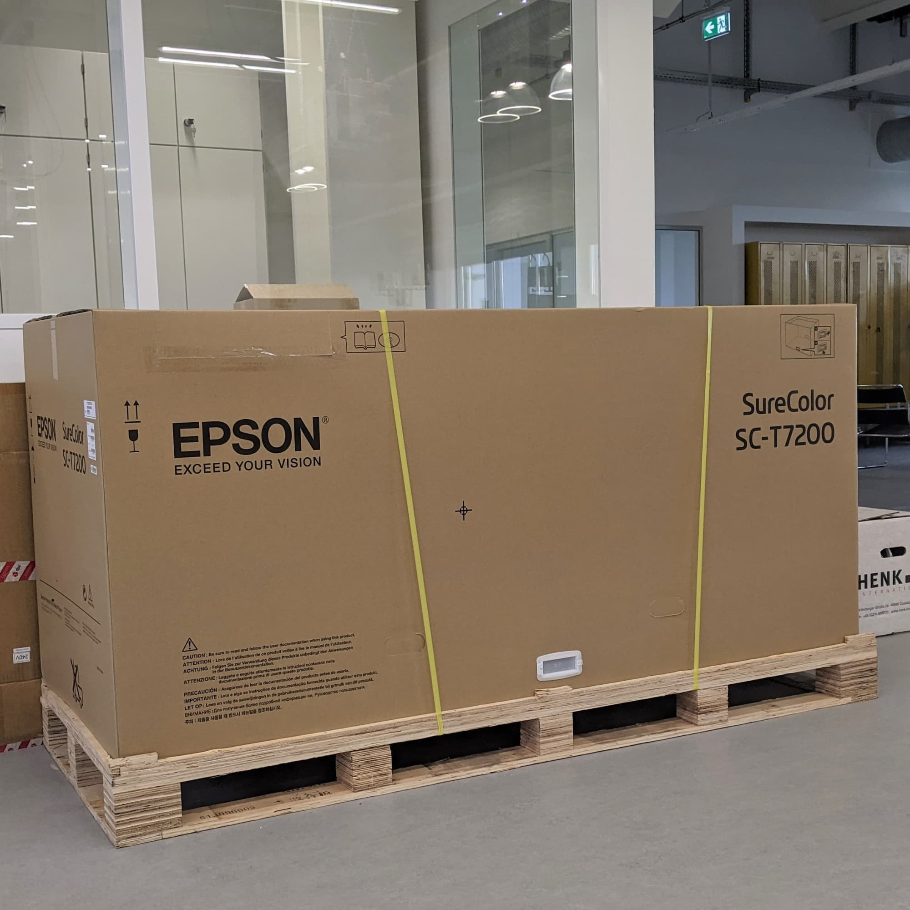
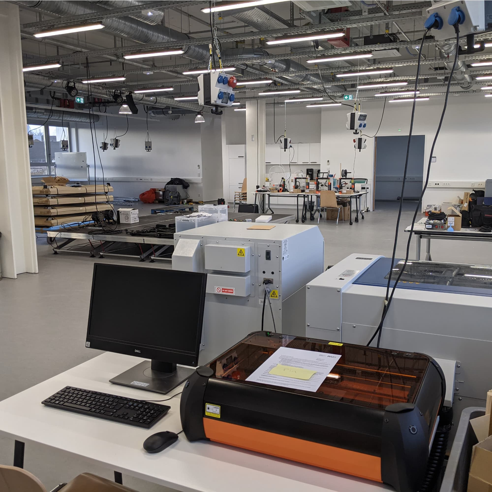

---
hide:
  - toc
date: "2020-12-23"  
---

# Design- und Medienlabor im Aufbau

Unser Bereich für Design und Medien wird voll mit 3D-Druckern, Lasercuttern, VR- und AR-Brillen, Textilbearbeitungsmaschinen, Robotern und mobiler Ausstattung!
Hier werdet ihr die Möglichkeit haben, eure Ideen methodisch und zielgerichtet weiterzuentwickeln, Prototypen zu testen und an der Präsentation eurer Produkte zu arbeiten!

{ width="45%" } { width="45%" } { width="45%" }