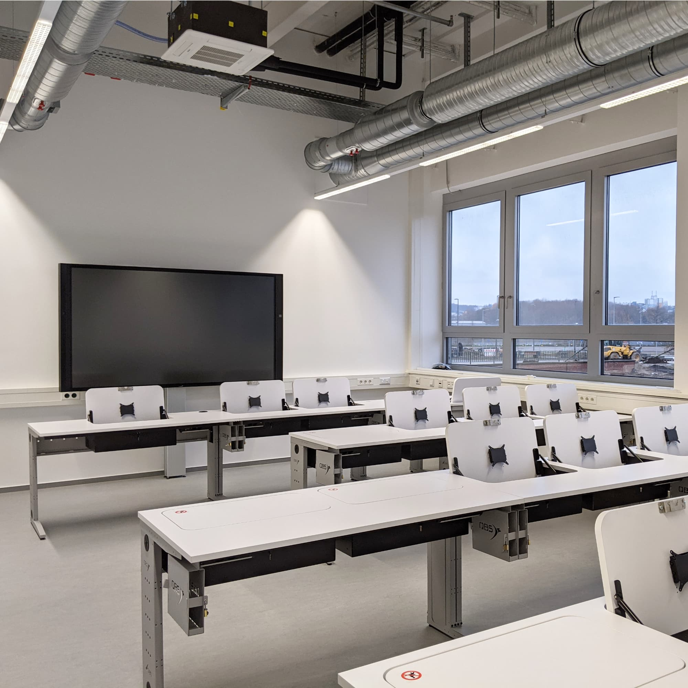

---
hide:
  - toc
date: "2021-01-15"  
---

# Schwimmen im Makerspace!

...werdet ihr zwar nicht können. Dafür bekommt ihr die Möglichkeit in jede Menge Software einzutauchen, zum Beispiel für CAD, Grafik oder zum Coden mit SDKs. Bleibt gespannt!

{ width="45%" } 