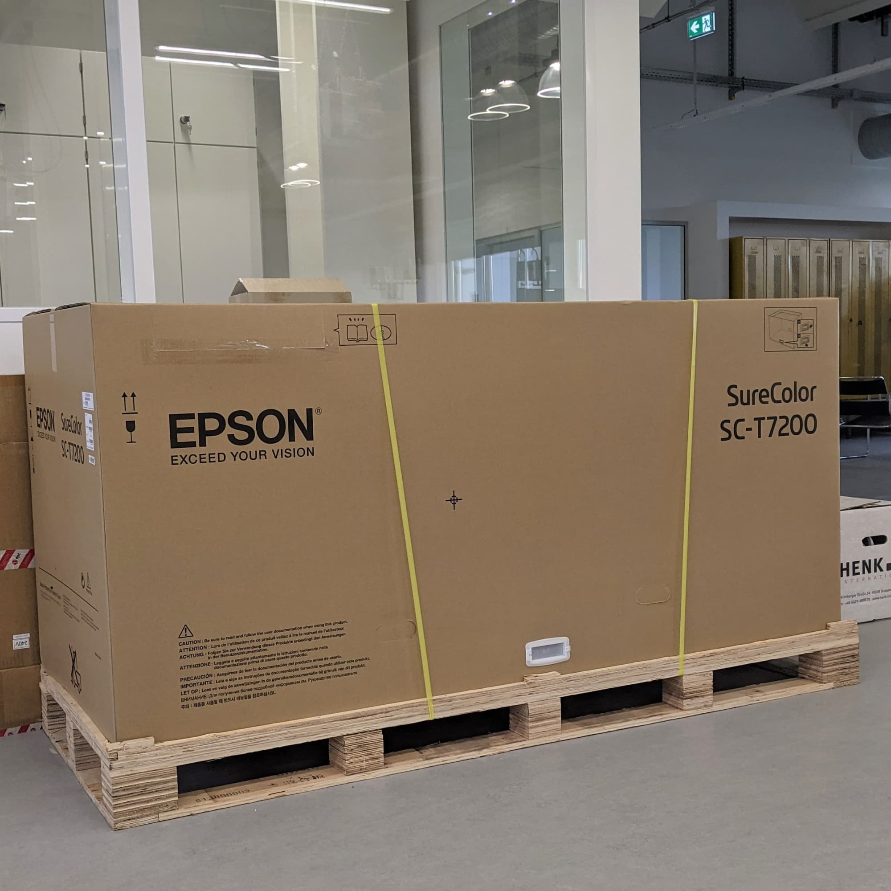
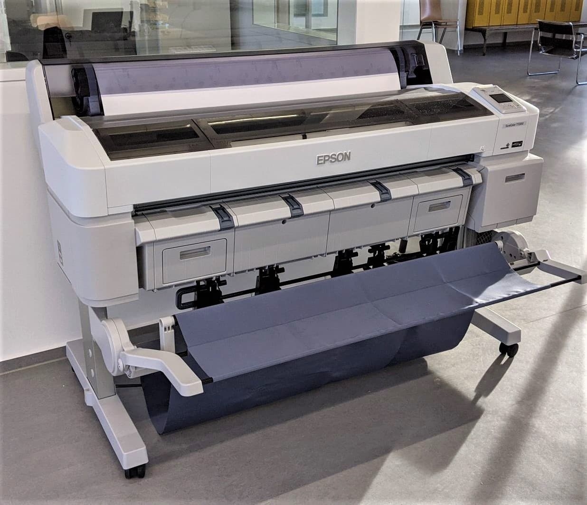

---
hide:
  - toc
date: "2021-01-21"  
---

# Poster im Großformat?

Für den 4-Farb-Großformatdrucker von EPSON kein Problem! Mit seiner PostScript-Unterstützung und dem 1,6-GHz-Dual-Core-CPU ermöglicht er das schnelle und direkte Drucken umfangreicher Dateien aus gängigen Design- und CAD-Programmen.

Bleibt dran und seid gespannt, welche Geräte wir noch für den Design und Medien Bereich des Makerspace enthüllen!

{ width="45%" } { width="45%" }