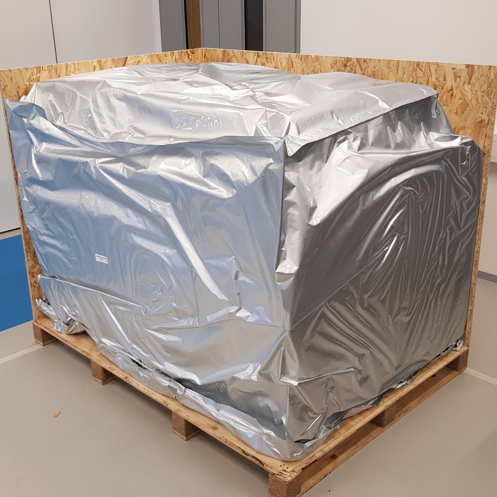
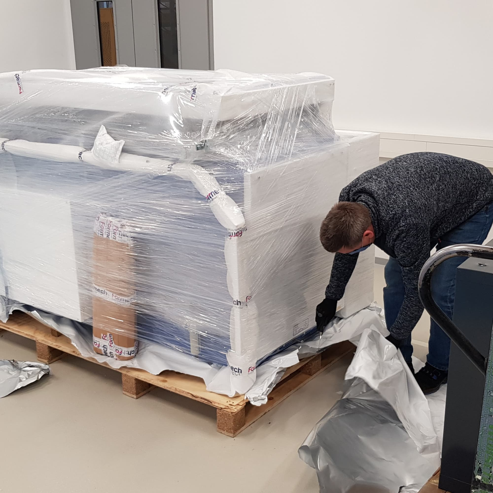
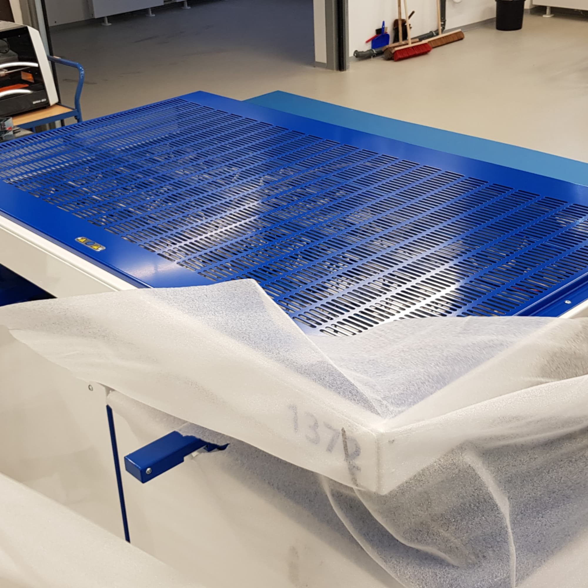
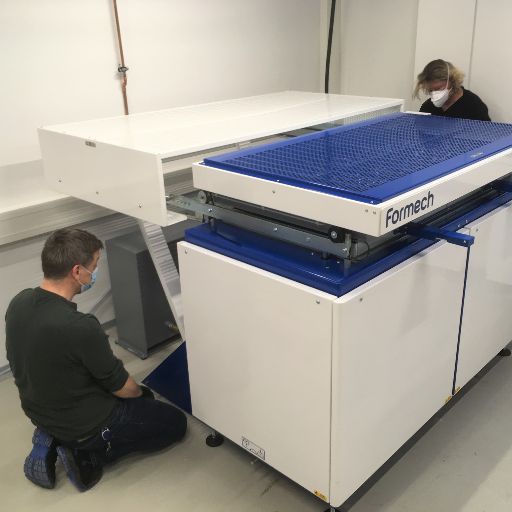

---
hide:
  - toc
date: "2021-01-29"  
---

# Post aus dem All?

Nein, sondern von der Firma Formech. Schicht für Schicht wurde das Paket gespannt ausgepackt und zum Vorschein kam eine Tiefziehmaschine für unsere Kunststoffwerkstatt.
Welche coolen Projekte man damit wohl umsetzen kann? Bleibt gespannt!

{ width="45%" } { width="45%" } { width="45%" } { width="45%" }