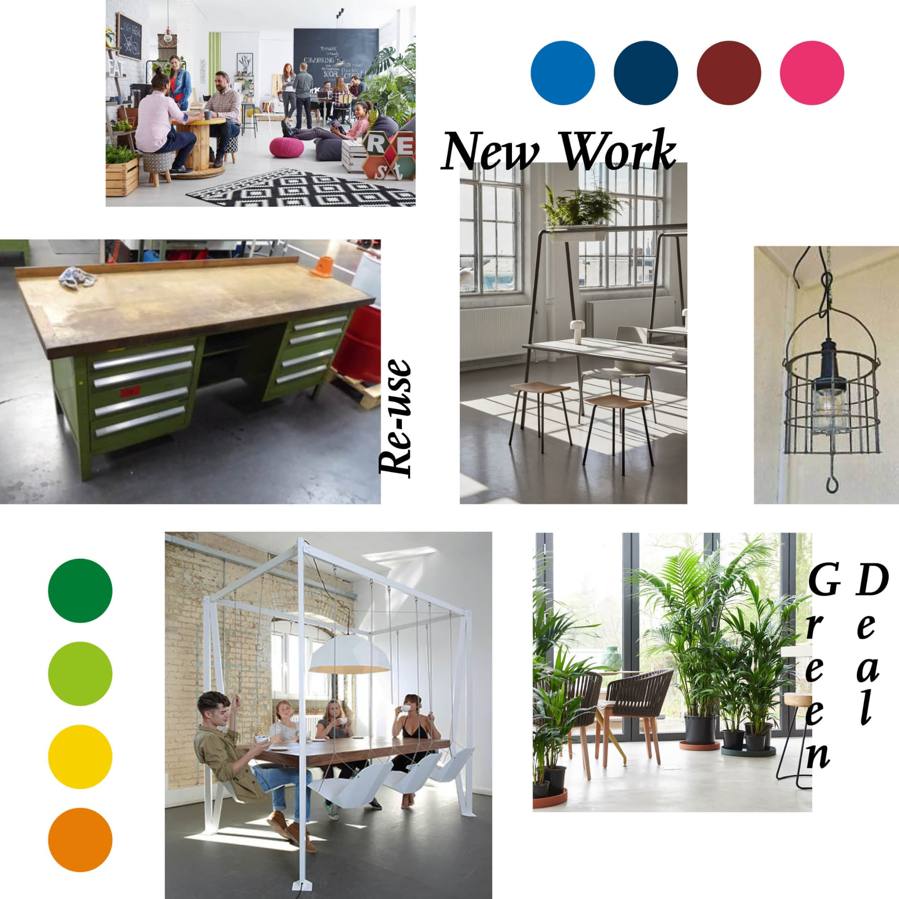
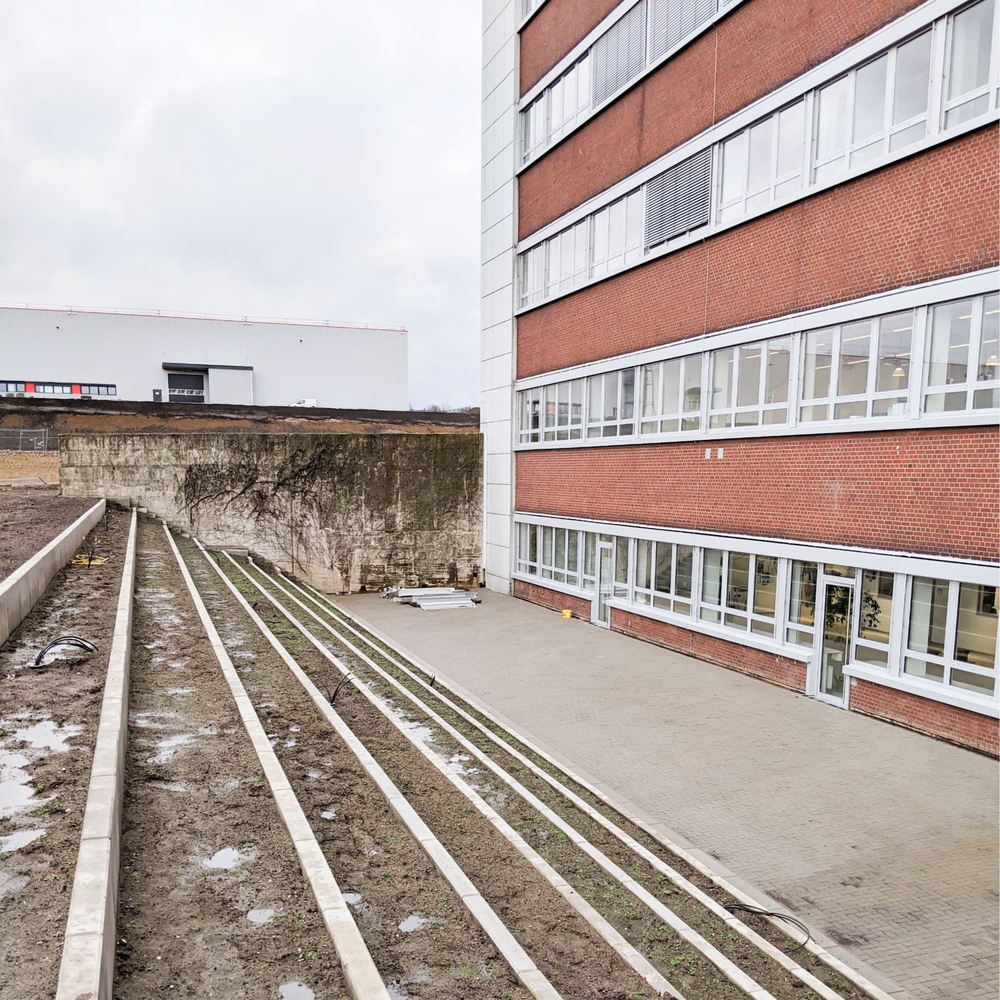
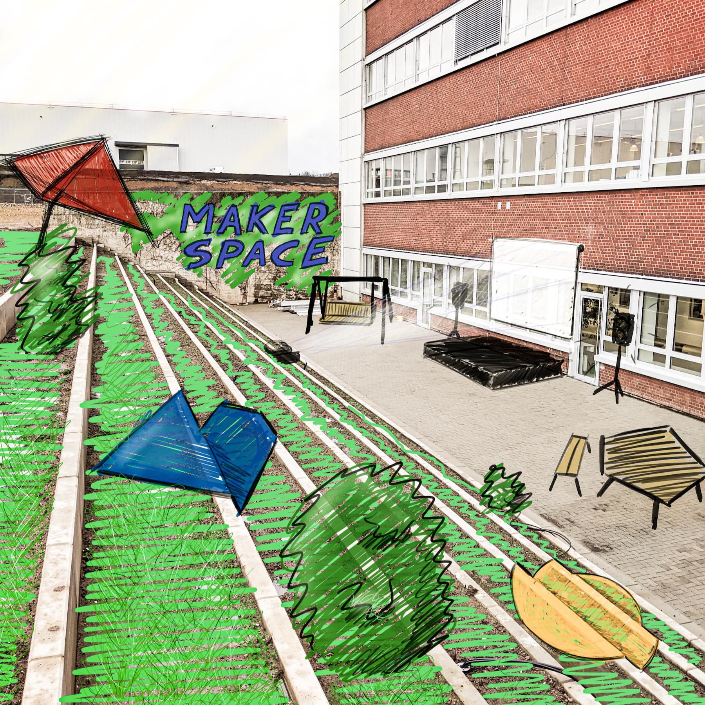

---
hide:
  - toc
date: "2021-02-11"  
---

# Gestaltungsphase des Makerspace

Wie soll der fertige Makerspace nach der Gestaltungsphase aussehen?

Mit dieser Frage beschäftigen sich momentan viele kreative Köpfe und entwerfen Konzepte in unterschiedlichste Richtungen. Wir sind gespannt und können das Ergebnis kaum erwarten! 

Was darf auf gar keinen Fall im RUB Makerspace fehlen?

{ width="45%" } 

{ width="45%" } { width="45%" }