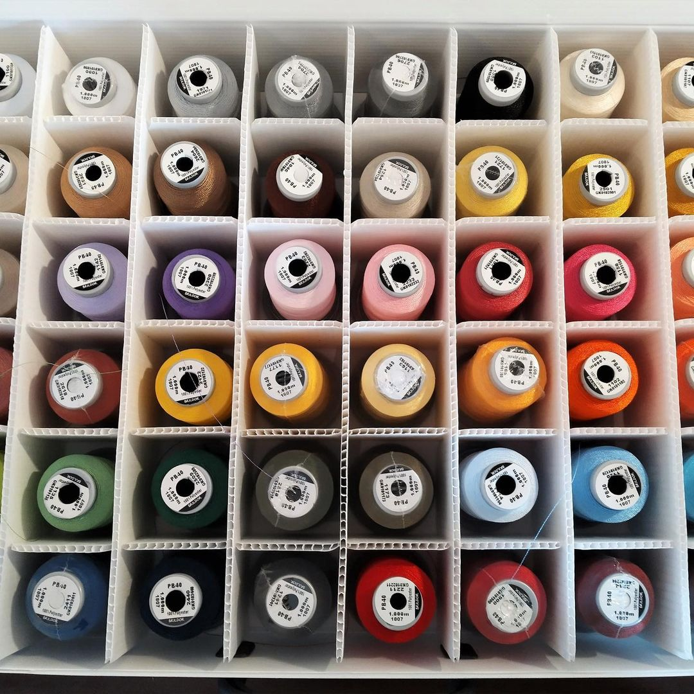
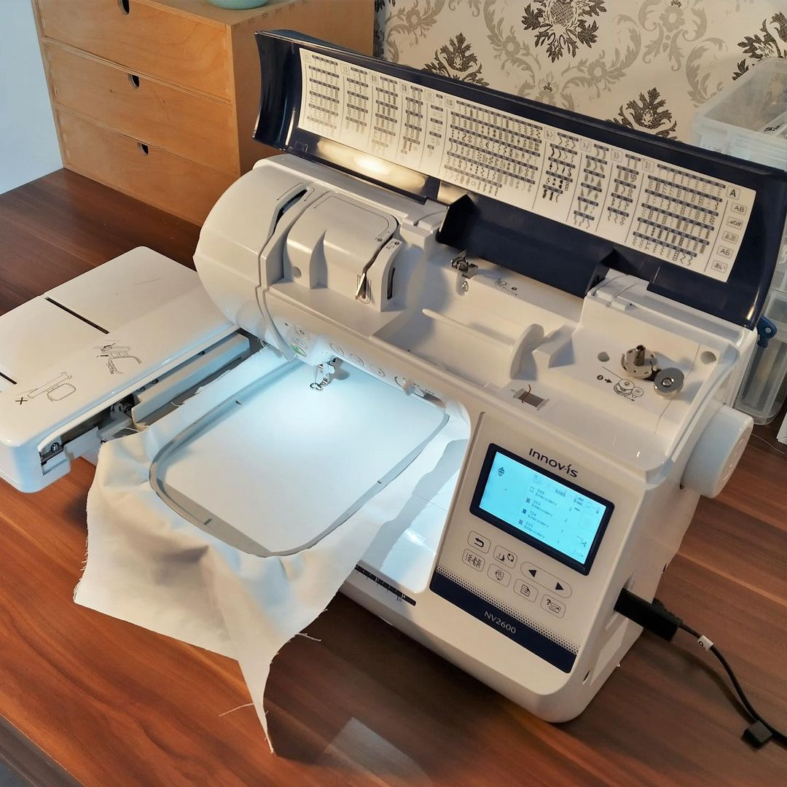
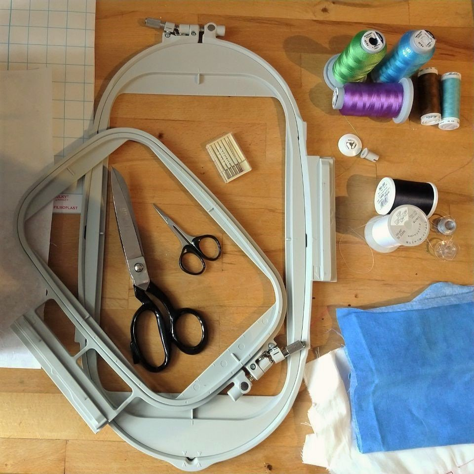

---
hide:
  - toc
date: "2021-02-18"  
authors: "LS"
---

# Update Textilwerkstatt: Stickmaschine

Neuigkeiten aus dem Designlabor 

Auch wir befinden uns, so oft es möglich ist, im Home-Office. Doch Langeweile kommt da nie auf. So beschäftigt sich eine Teamkollegin ausführlich mit unserer Stickmaschine und der dazugehörigen Software, damit ihr später, in Workshops oder auch alleine, die Nadel zum Glühen bringen könnt.

{ width="45%" }
{ width="45%" }  
{ width="45%" } 