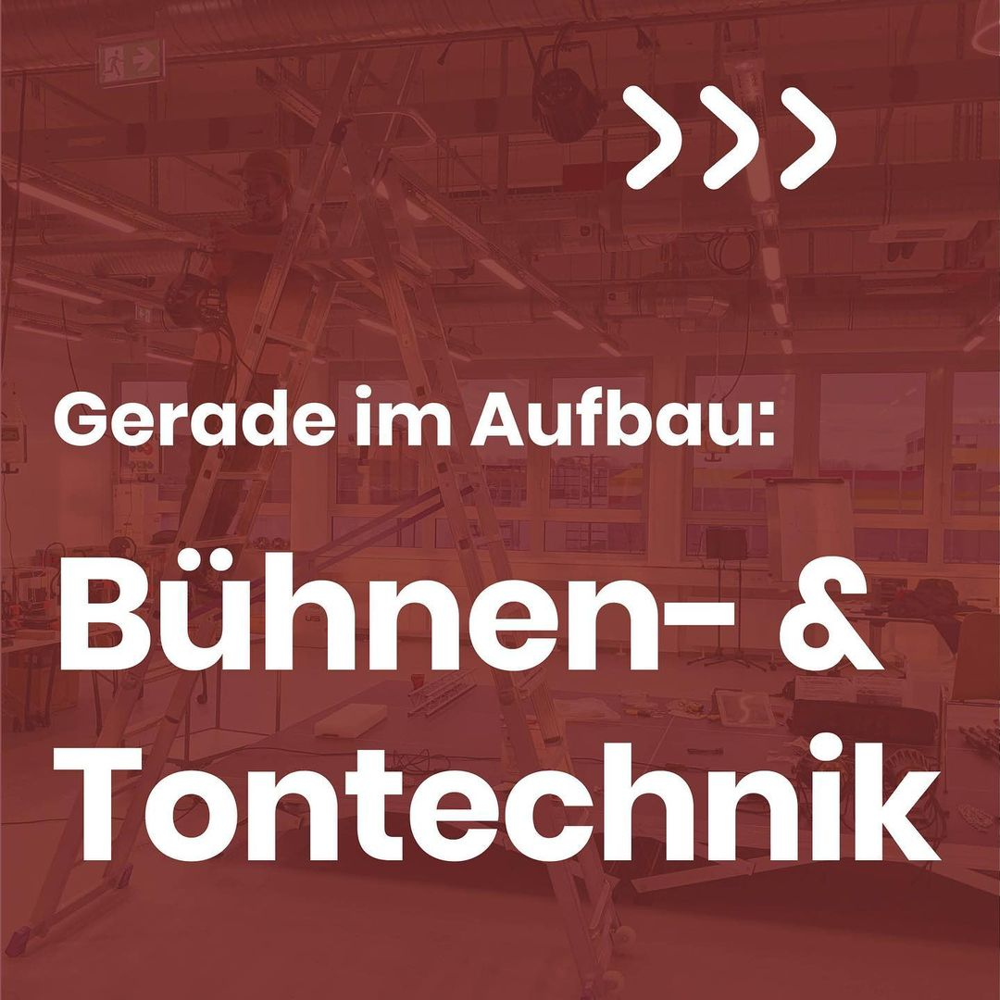
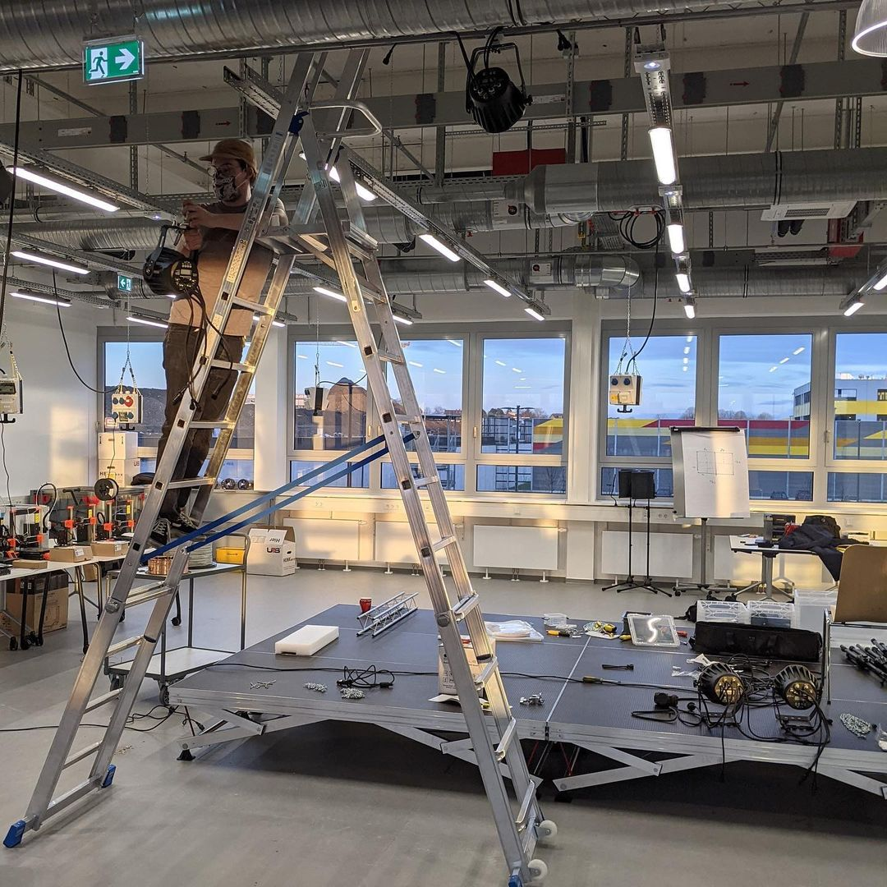
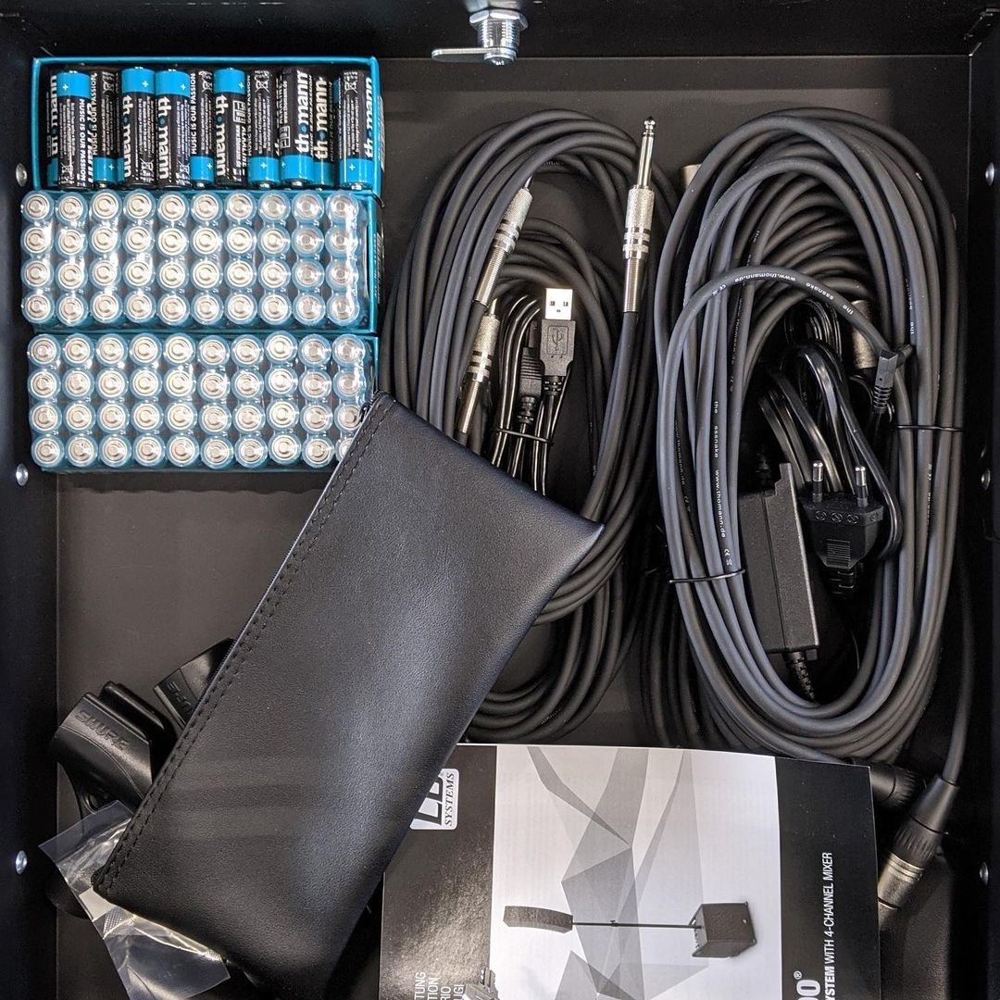
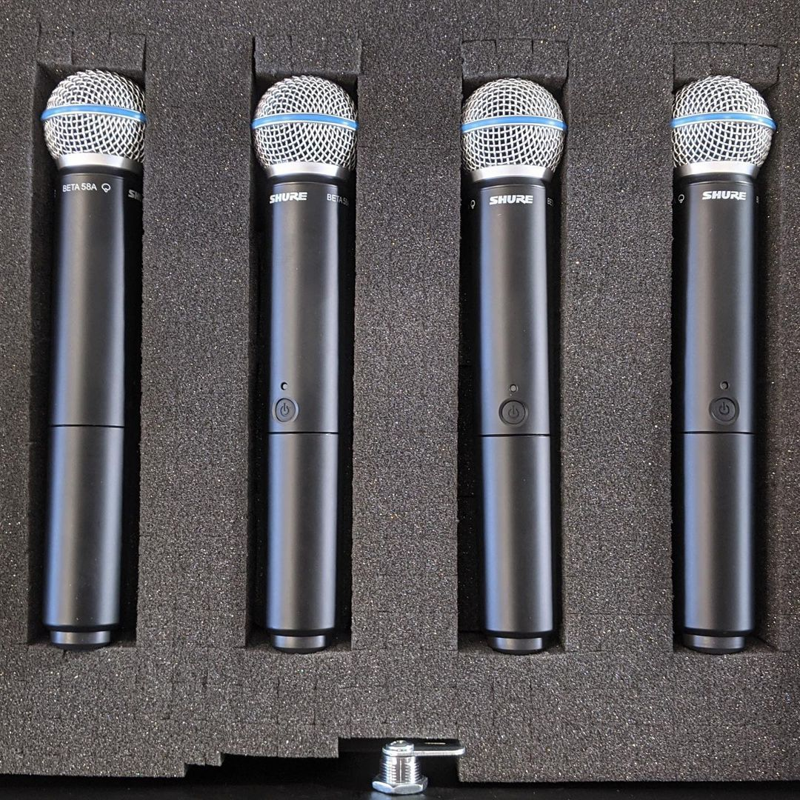

---
hide:
  - toc
date: "2021-02-25"  
authors: "LS"
---

# Im Aufbau: Bühnen- und Tontechnik

New Stuff! 
Nicht nur unsere Lichttechnik wird weiterhin aufgebaut, sondern auch das Soundsystem wird erweitert. So haben wir vor kurzem neue Mikrofone, für unsere Veranstaltungszone, erhalten und freuen uns schon sehr darauf in Zukunft viele Gäste auf unserer Bühne begrüßen zu dürfen!

{ width="45%" } 
{ width="45%" } 
{ width="45%" } 
{ width="45%" } 