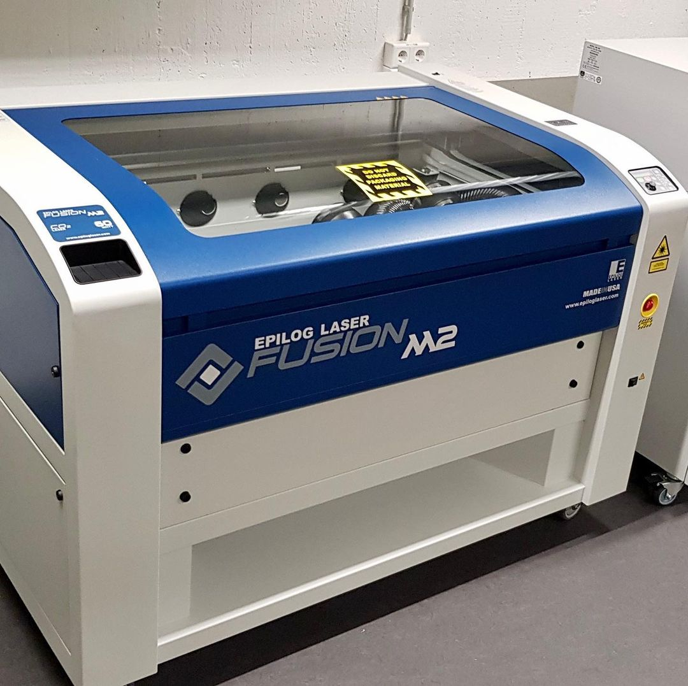
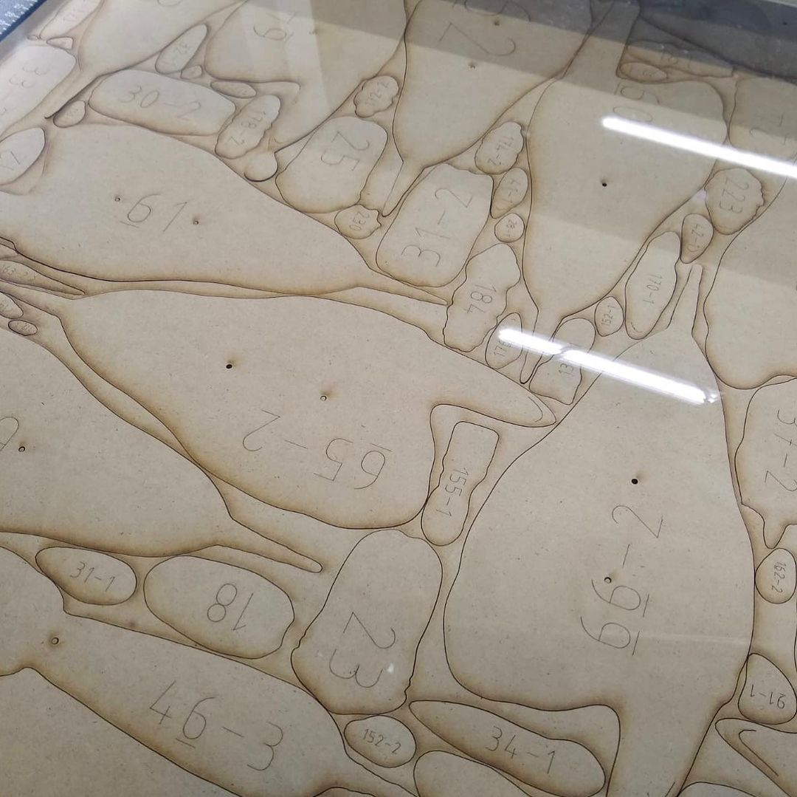
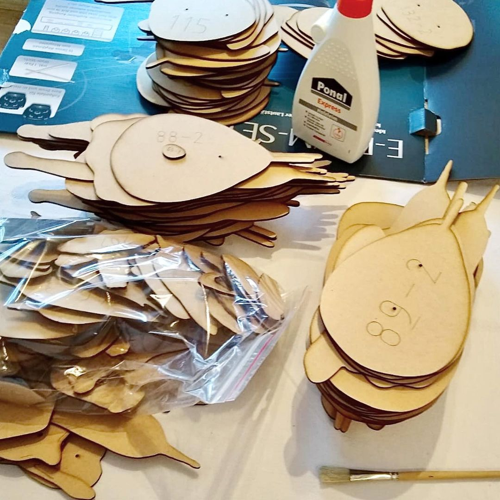

---
hide:
  - toc
date: "2021-03-04"  
authors: "LS"
---

# Unser Lasercutter

Voll LASER wie der abgeht!

Mit unserem CO2-Lasercutter Fusion M2 40 von Epilog können unterschiedlichste Materialien mittels Ablation geschnitten und/ oder graviert werden. Von der Herstellung von Bauteilen bis hin zu kreativen Skulpturen ist alles möglich.

Wir sind gespannt auf eure Ideen!

{ width="45%" } 
{ width="45%" } 
{ width="45%" } 
