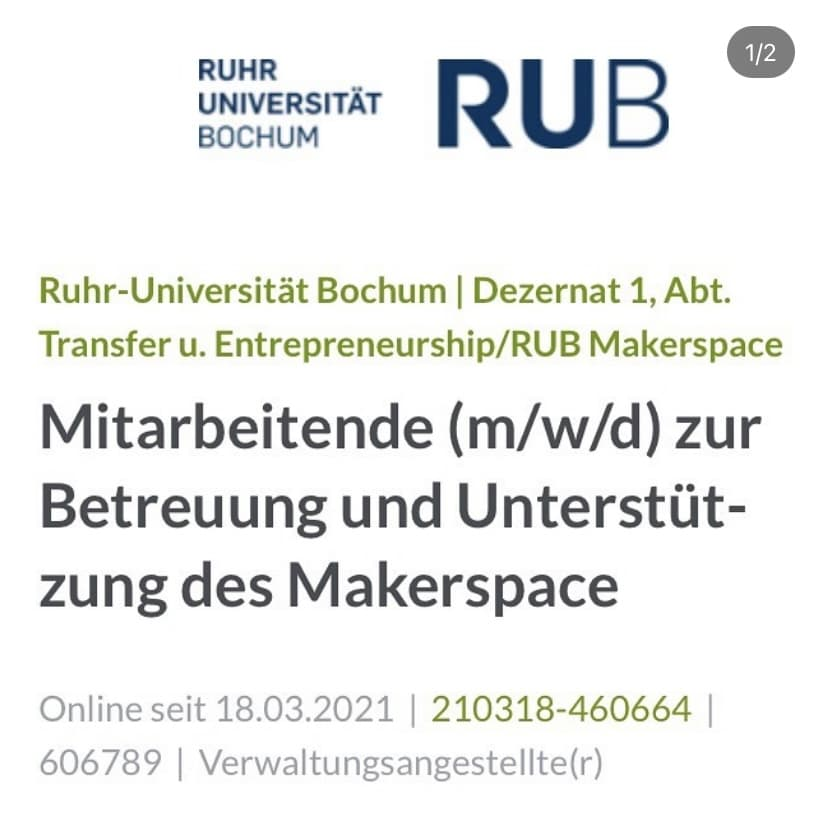
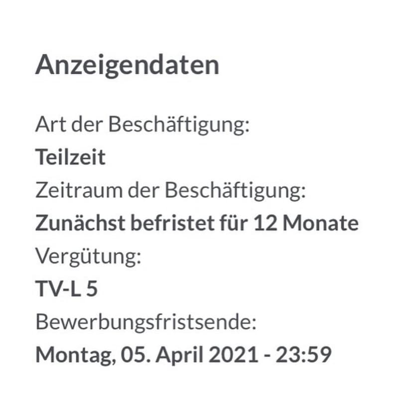

---
hide:
  - toc
date: "2021-03-18"  
---

# Wir suchen Verstärkung!

Wir suchen zum nächstmöglichen Zeitpunkt bis zu 4 neue Mitarbeitende (m/w/d) in Teilzeit (circa 15h/Woche) für unser Team.

Du bist technikinteressiert, hast eine schnelle Auffassungsgabe, kannst Dich für neue Dinge begeistern und hast Spaß daran Dein Wissen mit anderen zu teilen? Dann könnte ein Job bei uns genau das Richtige für Dich sein!

Neben einer sehr großen Bandbreite an Maschinen, Geräten und Materialien werden bei uns auch größere Kreativ-, Multifunktions- und Veranstaltungsräume sowie Projekträume und eine bespielbare Außenfläche vorhanden sein. Wir möchten noch in diesem Jahr eröffnen und suchen deshalb begeisterte und tatkräftige Unterstützung bei Aufbau und Betreuung des Makerspace.

Werde Teil unseres interdisziplinären und hoch-motivierten Teams und lerne viele tolle Menschen und neue Bereiche kennen.

{ width="45%" } { width="45%" }