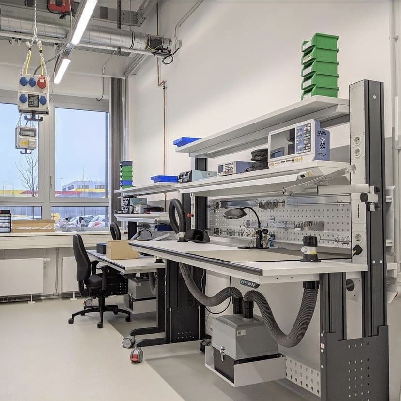

---
hide:
  - toc
date: "2021-03-26"  
---

# Update Digitallabor

Die Einrichtung unserer Räume läuft stetig weiter und das Digitallabor hat nun neue Arbeitsplätze bekommen, an denen man beispielsweise Platinen verlöten oder Microcontroller programmieren kann.
Wir freuen uns schon darauf, wenn wir euch mit euren Projekten bei uns begrüßen dürfen! 

{ width="45%" } 