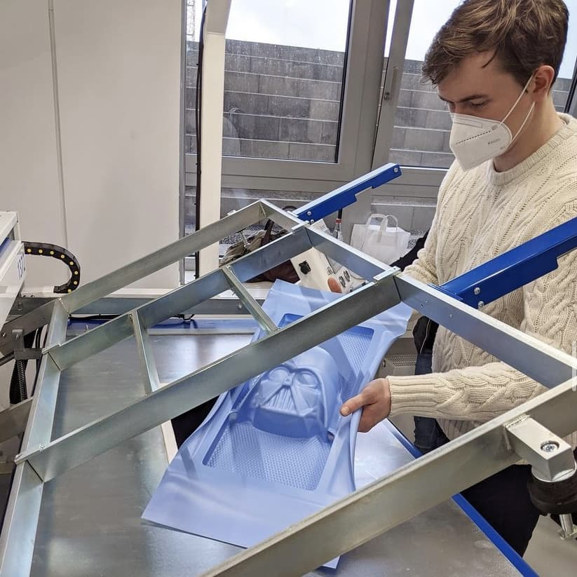

---
hide:
  - toc
date: "2021-04-30"  
---

# Interne Weiterbildung im Makerspace 

Wir sind mit viel Engagement dabei den Makerspace für euch aufzubauen. Damit ihr später auch alle Geräte nutzen und in Workshops den Umgang mit diesen und ihren unzähligen Einsatzmöglichkeiten lernen könnt, stehen auch bei uns gerade Weiterbildungen auf dem Plan.

Vor kurzem durften wir eine Weiterbildung zur Tiefziehmaschine der Firma Formech genießen und wir waren begeistert, wie viele Möglichkeiten dieses Verfahren bietet.
Wir sind gespannt darauf, welche Projekte ihr später bei uns verwirklichen werdet! 

{ width="45%" } 