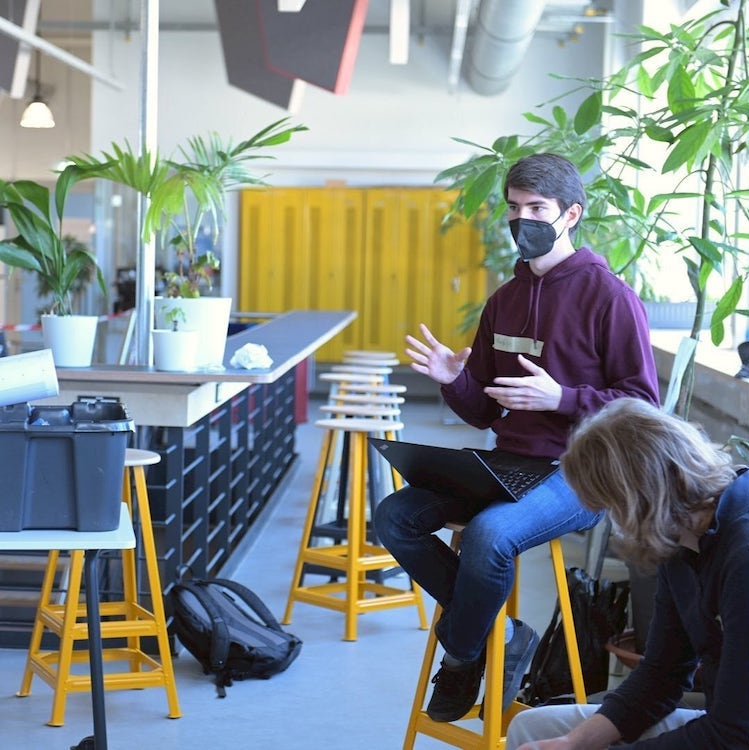
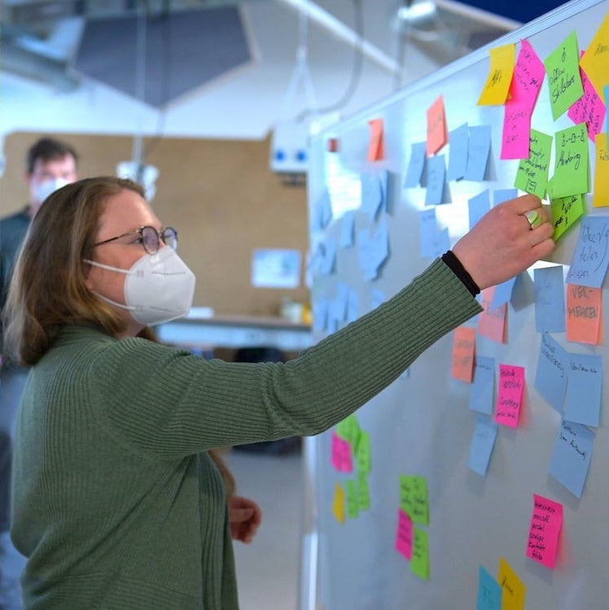
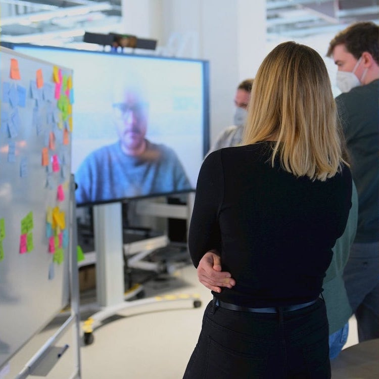
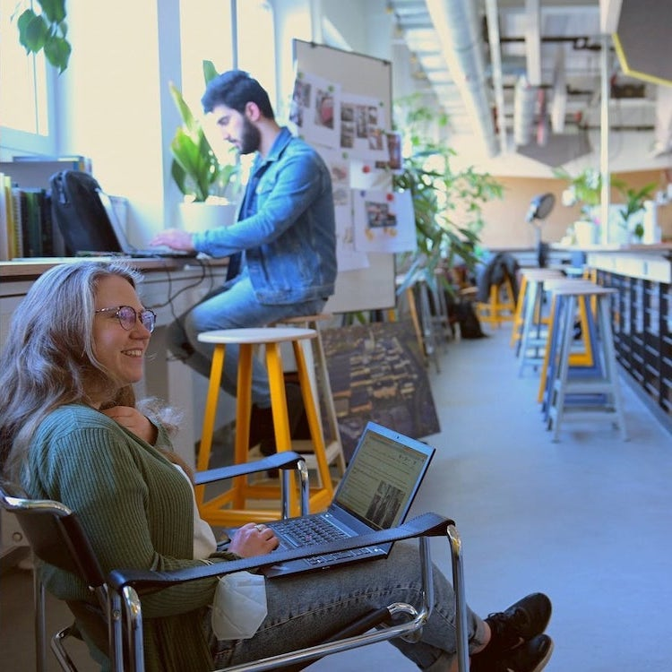

---
hide:
  - toc
date: "2021-05-21"
authors: "LS"
---
# Rückblick 21.05.2021

Im März trafen sich hier bei uns im RUB Makerspace, unter Leitung von Martin Ebel vom Lehrstuhl Industral Sales and Service Engineering, Marie-Christin Barton und Florian Krohm vom Makerspace, 10 kreative Menschen, um in zwei Teams zu dem Thema "brightness we share" ein neues Produkt oder einen neuen Service zu entwickeln, welcher einen Mehrwert für die Gesellschaft hat.

Daraus entstanden sind zum einen "Sustainactivity", ein Spiel bei dem, durch kleine Challenges, das Bewusstsein für Nachhaltigkeit gefördert wird und zum anderen entwickelten die Teilnehmenden eine Onlineplattform für generationsübergreifendes Skillsharing.

Vielen Dank an alle Teilnehmenden, die diese zwei Tage voll Brainstorming, Prototyping und Kreativität so schön gemacht haben! 
Wir freuen uns schon auf das nächste Mal! 

{ width="45%" } { width="45%" } { width="45%" } { width="45%" }