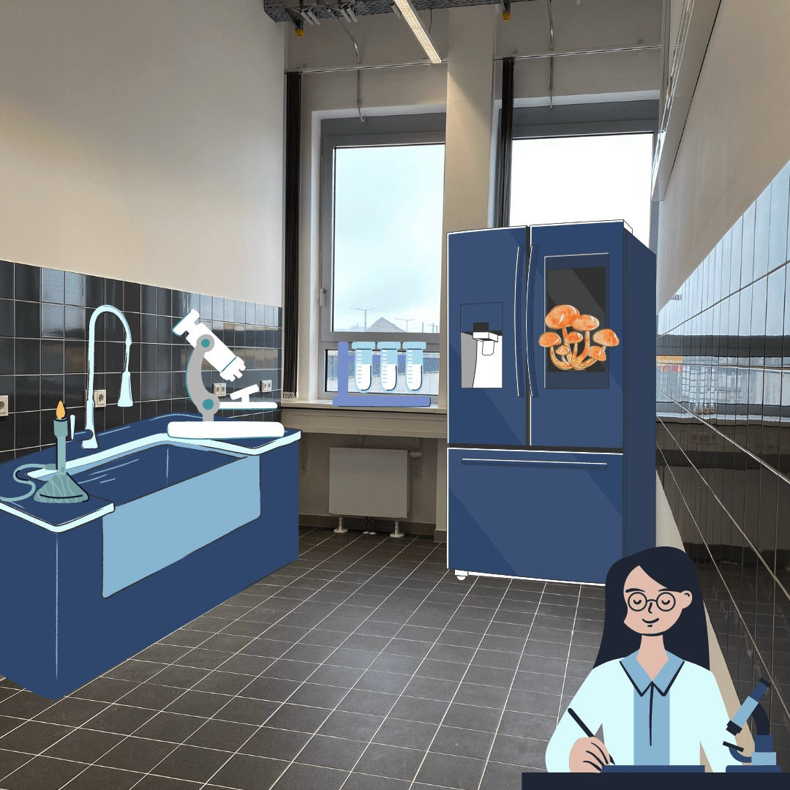
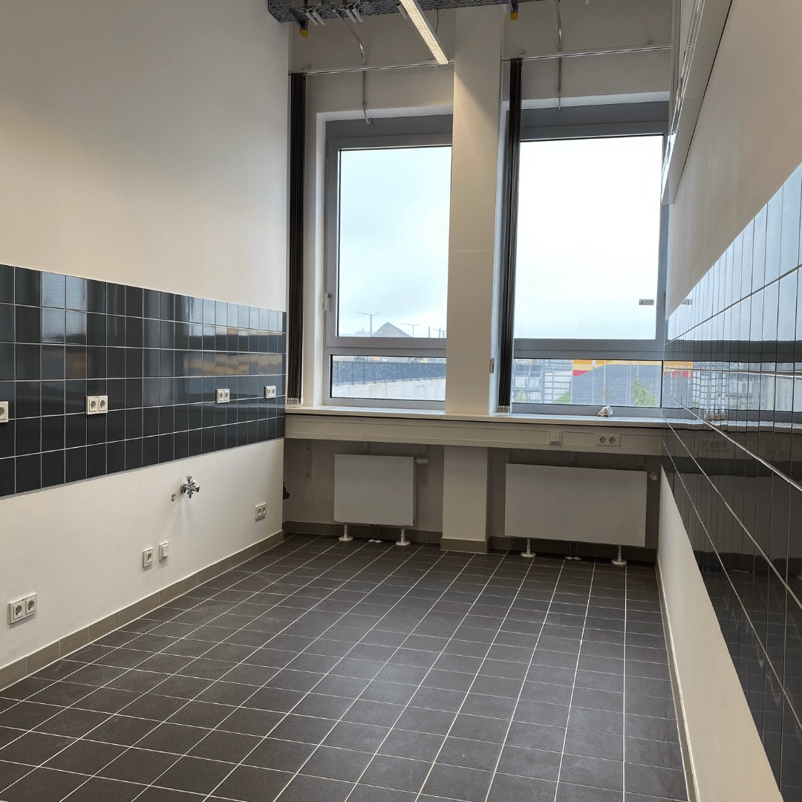

---
hide:
  - toc
date: "2021-06-25"  
---

# Unser Lebensmittellabor ist ebenfalls in Planung!

Was wünscht ihr euch in einer kreativen Küche, in der man mit verschiedenen organischen Substanzen experimentieren kann?

{ width="45%" } { width="45%" }