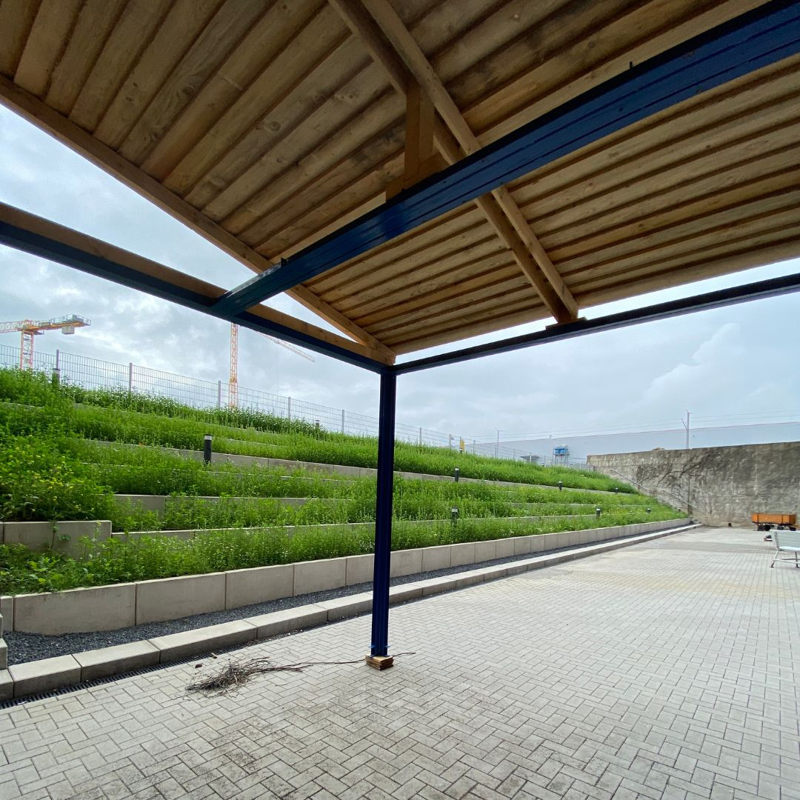
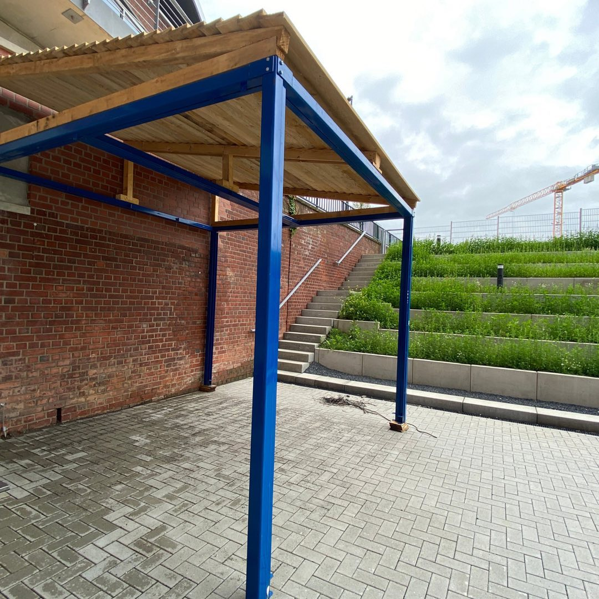

---
hide:
  - toc
date: "2021-07-08"  
---

# Auch in unserem Innenhof tut sich etwas!

Es wird immer grüner auf unseren Rängen und auch ein Dach als Unterstellmöglichkeit wurde in den letzten Tagen aufgebaut.
Es ist noch viel zu tun, aber wir arbeiten mit Hochdruck daran auch den Außenbereich zu verschönern, um eine tolle Arbeits- und Ausgleichsatmosphäre für Euch zu schaffen!

Seid gespannt und bleibt dran!

{ width="45%" } { width="45%" }