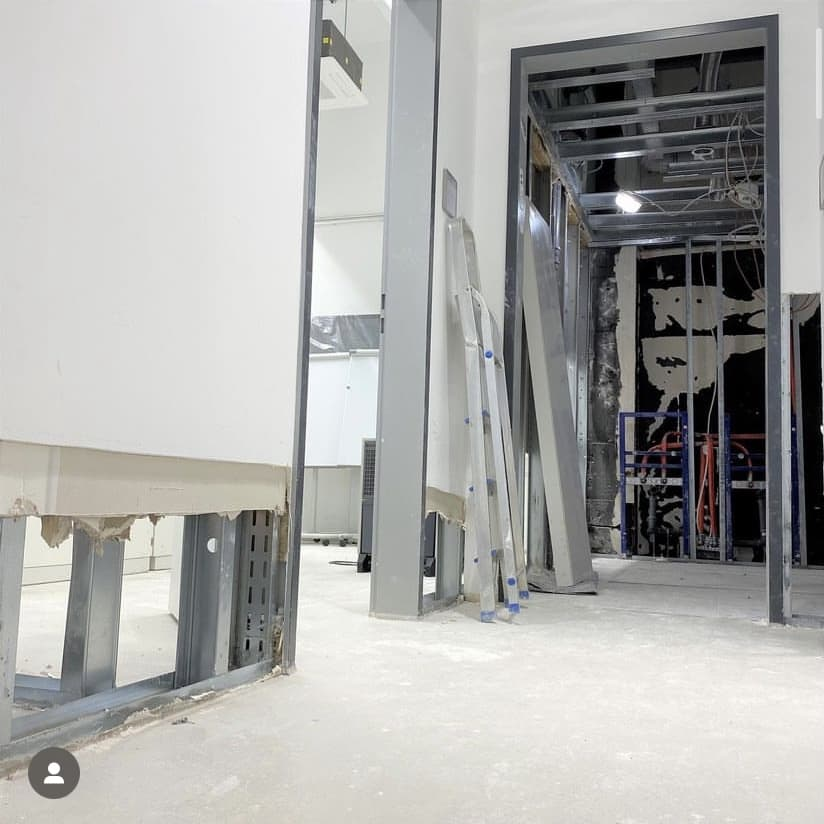

---
hide:
  - toc
date: "2021-07-15"  
---

# Hochwasser

Auch wir wurden leider nicht verschont von den Regenmassen, die die letzten Wochen vieles überflutet haben. ⁠
Das volle Ausmaß des Schadens können wir erst in den nächsten Tagen abschätzen, aber unser Aufbau und die Inbetriebnahme von Maschinen wird sich zwangsweise noch nach hinten verschieben. ⁠
⁠
Wir arbeiten trotz des Rückschlages mit vereinten Kräften daran, alles so schnell wie möglich wieder in Ordnung zu bringen!⁠
⁠
Wie es nun weiter geht, erfahrt ihr demnächst, also bleibt dran!
⁠
Euer Team vom RUB-Makerspace.

{ width="45%" } 