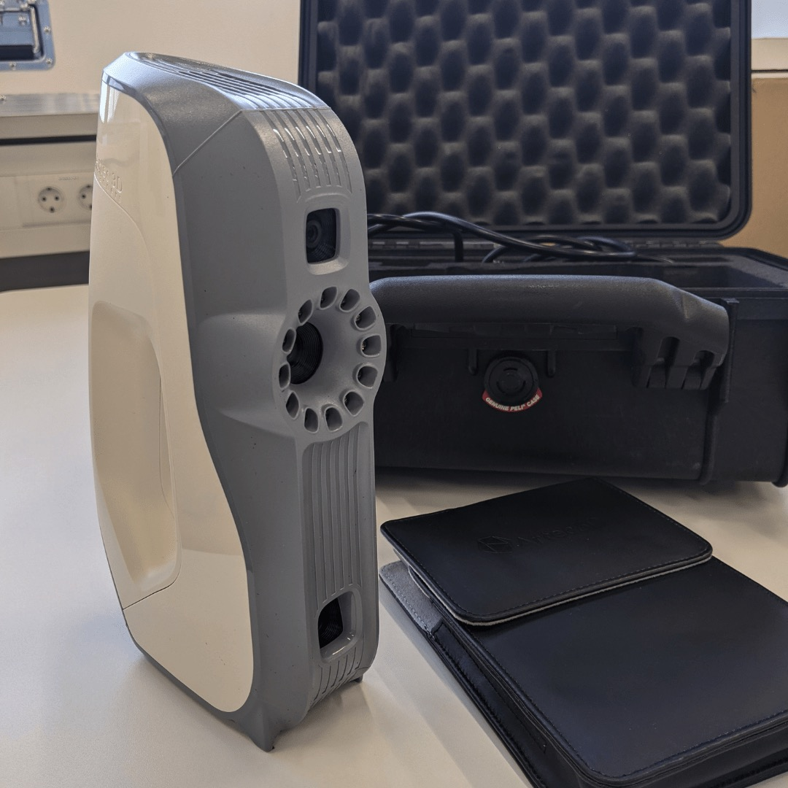

---
hide:
  - toc
date: "2021-07-22"  
---

# 3D-Scanner

Mit unseren mobilen 3D-Scannern, Artec Space Spider und Artec Eva, könnt ihr hochpräzise Aufnahmen von kleinen Objekten und feinen Details großer Projekte in brillanten Farben machen.

Die Technologie von Artec ermöglicht Euch komplexe Geometrien, scharfe Kanten und feine Rippungen zu erfassen.

Wir sind gespannt für welche Projekte ihr die zwei 3D-Scanner einsetzen möchtet!

{ width="45%" } { width="45%" }